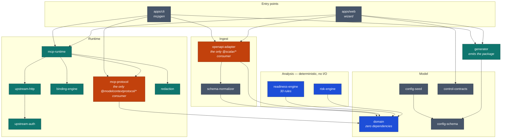

# Architecture

Sixteen packages and two apps. This is the map, and — more usefully — the reasoning behind
the boundaries between them, because several exist to make a specific class of mistake
impossible rather than merely unlikely.

## The shape of it

## The pipeline

An OpenAPI document becomes a running MCP server in one direction, and every stage has a
package that owns it:

1. **Import** — `openapi-adapter` parses and dereferences, then converts to a canonical model.
   Parser types never escape it ([ADR-0003](adr/0003-parser-types-never-escape-adapter.md)).
2. **Normalize** — `schema-normalizer` converts OAS schemas to JSON Schema 2020-12, which is
   what MCP publishes.
3. **Analyse** — `readiness-engine` scores the API against 30 deterministic rules;
   `risk-engine` classifies each operation. Neither does I/O, and neither may see the parser
   or the SDK ([ADR-0007](adr/0007-deterministic-readiness-before-ai.md)).
4. **Curate** — a human enables tools, names them, binds parameters. Output is
   `mcp.config.json` ([`CONFIG.md`](CONFIG.md)).
5. **Execute or emit** — `mcp-runtime` builds a tool registry and serves it through
   `mcp-protocol`; or `generator` emits a redistributable package that does the same.

## What each package is for

| Package | Responsibility |
|---|---|
| `domain` | The canonical model. **Zero runtime dependencies**, enforced. |
| `openapi-adapter` | Parse, dereference, canonicalize. Owns safe remote fetch and the SSRF guard. |
| `schema-normalizer` | OAS schema → JSON Schema 2020-12. |
| `readiness-engine` | 30 deterministic agent-readiness rules. |
| `risk-engine` | Operation risk classification. |
| `config-schema` | The zod definition of `mcp.config.json`. The compatibility contract. |
| `config-seed` | Derives a starting config from a spec. |
| `binding-engine` | Resolves bindings to values; builds the HTTP request shape. |
| `upstream-auth` | Plane B credentials: api key, bearer, basic, client credentials, token exchange. |
| `upstream-http` | Executes the upstream call: retry, timeouts, response limits. |
| `redaction` | Scrubs secrets from logs, traces and tool responses. |
| `mcp-protocol` | The MCP SDK adapter. Owns Plane A authorization. |
| `mcp-runtime` | Tool registry and startup validation. |
| `generator` | Emits the generated package and its README. |
| `control-contracts` | Shared types between the web UI and the engine. |
| `test-fixtures` | The E2E harness: fixture API, fixture identity provider. |

## The rules that are actually enforced

Eight boundaries are checked by [`tooling/scripts/boundaries.mjs`](../tooling/scripts/boundaries.mjs)
on every push — against both declared dependencies *and* actual import statements, because a
transitive import bypasses a manifest check and a phantom dependency bypasses an import check.

| Rule | What it prevents |
|---|---|
| `domain-pure` | The canonical model acquiring a dependency and stopping being portable. |
| `parser-confined` | `@scalar/*` types leaking into the rest of the system (ADR-0003). |
| `sdk-confined` | `@modelcontextprotocol/*` outside the adapter (ADR-0004). |
| `analysis-pure` | Readiness or risk depending on the SDK, parser or UI (ADR-0007). |
| `contracts-pure` | Shared contracts pulling in React. |
| `auth-planes-separate` | `upstream-auth` importing `mcp-protocol` (ADR-0005). |
| `apps-are-leaves` | A package importing from an app. |
| `modern-era-only` | `McpServer#connect()`, which silently serves the *previous* protocol era (ADR-0009). |

The last one is worth dwelling on, because it is the least obvious. The MCP SDK exposes two
entry points with identical-looking signatures; one serves protocol revision 2026-07-28 and
the other silently serves 2025-11-25. The wrong one works, passes tests, and is wrong. So
there is a lint ban on it *and* an E2E test that asserts the negotiated revision on the wire,
because comparing against the SDK's own `LATEST_PROTOCOL_VERSION` constant would pass while
the server was misbehaving.

## Two authentication planes

The single most important structural decision. `mcpAccess` governs who may call the MCP
server; `upstreamAuthentication` is the credential the server presents to the API. They are
separate keys, separate packages, and separate lifetimes — and `upstream-auth` is forbidden
from importing `mcp-protocol` so the two cannot be confused by accident
([ADR-0005](adr/0005-separate-auth-planes.md), [ADR-0010](adr/0010-token-exchange-not-passthrough.md)).

See [`OAUTH.md`](OAUTH.md) for how they work, and
[`examples/oauth-sandbox/`](../examples/oauth-sandbox/) for a running demonstration.

## Testing

Six vitest projects plus Playwright, split by what they cost and what they prove:

| Project | What it covers |
|---|---|
| `unit` | Colocated with source. The bulk of the suite. |
| `golden` | Snapshot fixtures for parse and readiness output. |
| `integration` | Real Route Handlers against real packages and a real temp disk store. |
| `security` | SSRF, secret leakage, both auth planes, token passthrough. |
| `e2e` | Spawns the real CLI and drives it with a real MCP client. |
| Playwright | Real browser, desktop and mobile, including axe on every route. |

The `security` and `e2e` projects are where the claims that matter get checked. A test that
asserts "the inbound token never reaches the upstream" is only meaningful if it inspects
bytes on the wire, so those suites run real processes rather than mocks.

## Reading further

- [`CONFIG.md`](CONFIG.md) — the artifact all of this produces
- [`adr/`](adr/) — ten decision records; eight are mandatory
- [`TECHNICAL-PLAN.md`](TECHNICAL-PLAN.md) — the full engineering record (long)
- [`RISKS.md`](RISKS.md) — the maintained risk register
