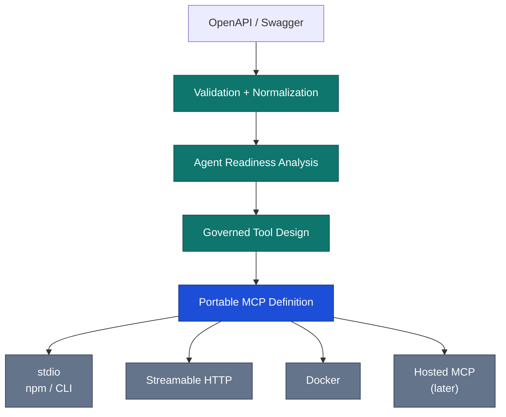

# Business Requirements Document

## Agent-Ready API Governance & OpenAPI-to-MCP Platform

| Field | Value |
|---|---|
| Document version | **1.1** |
| Supersedes | 1.0 (2026-08-17) |
| Status | Product baseline / implementation input |
| Date | 2026-08-17 |
| Working product name | TBD — see [OQ-02](#37-open-questions-register) |
| Primary positioning | Agent Readiness and Governance Layer for APIs |
| Initial delivery | OpenAPI/Swagger → governed MCP tool surface → runnable stdio/HTTP package |
| Companion document | [TECHNICAL-PLAN.md](TECHNICAL-PLAN.md) |

### About version 1.1

Sections 1–27 retain the numbering of v1.0 so existing cross-references (for example "BRD §14.3")
still resolve. Enhancement is **additive**: nothing from v1.0 was removed. New material is in
§28–§37, plus a small number of new requirement IDs flagged **(new in 1.1)** inline.

Changes in 1.1:

- Added glossary (§28), assumptions and dependencies (§29), user stories with acceptance criteria
  (§30), requirement index with release and priority (§31), success metric targets (§32), data
  handling and privacy (§33), compliance posture (§34), accessibility/i18n/browser support (§35),
  consolidated non-goals by release (§36), open questions register (§37).
- Recorded the decision that the **generated package's name and scope are the platform user's
  choice** (`FR-PKG-006`, `FR-PKG-007`, `BR-011`).
- Added requirements arising from verification of the MCP 2026-07-28 specification that v1.0 did
  not cover: `x-mcp-header` parameter mirroring (`FR-BIND-007`), mandatory Streamable HTTP request
  metadata headers (`FR-HTTP-MCP-006`), and confirmation via MRTR/elicitation (`FR-POL-005`).
- Flagged that the official MCP TypeScript SDK does not yet support the targeted protocol
  revision (`OQ-01`) — a blocker, not a detail.

---

## 1. Executive Summary

Organizations already have large investments in REST APIs described through Swagger/OpenAPI. AI
agents can technically call those APIs when they are exposed as tools, but direct endpoint-to-tool
conversion creates a weak production surface:

- too many tools,
- ambiguous names,
- poor descriptions,
- unsafe write/delete operations,
- missing parameter semantics,
- complex authentication,
- secrets embedded in configuration,
- environment-specific headers and URLs,
- duplicated or overlapping operations,
- unstable behavior when OpenAPI changes,
- poor visibility into what agents can invoke.

This product will transform API specifications into curated, governed, agent-ready MCP tool
surfaces.

The primary artifact is not generated TypeScript source. The primary artifact is a **portable MCP
definition and governance configuration** describing:

- which API operations are exposed,
- what each MCP tool is called,
- how inputs map to the underlying API,
- which values come from tool input, environment configuration, secrets, or static policy,
- authentication rules,
- safety classification,
- runtime behavior,
- confirmation/approval requirements,
- response handling,
- transport/deployment options.

From that single configuration, the platform can produce:



The initial product will support local one-command execution such as:

```bash
npx @acme/customer-api-mcp
```

and remote execution through Streamable HTTP from the same generated MCP definition.

The long-term product is a control plane for how enterprise APIs are exposed to AI agents.

---

## 2. Business Context

### 2.1 Current State

API teams commonly maintain Swagger 2.0 specifications, OpenAPI 3.x specifications, API gateways,
OAuth/API-key authentication, environment-specific configurations, CI/CD pipelines, and internal
API catalogs.

Agent teams increasingly need access to these APIs through tool protocols such as MCP.

Without a governance layer, teams typically:

1. manually write MCP servers,
2. expose too many endpoints,
3. copy OpenAPI descriptions without checking semantic quality,
4. hard-code runtime assumptions,
5. implement authentication inconsistently,
6. create one-off deployments,
7. fail to update MCP servers when APIs change.

### 2.2 Business Opportunity

The product can sit between:

```text
Enterprise APIs
      ↓
Agent Readiness + Governance
      ↓
Approved Tool Surfaces
      ↓
MCP Clients / AI Agents
```

This makes MCP generation one output of a broader governance process rather than the whole product.

---

## 3. Product Vision

> **Transform enterprise APIs into governed, agent-ready capabilities through continuous analysis,
> configuration, and control — not just code generation.**

The product is not primarily a converter from OpenAPI to MCP. It is a governance and intelligence
layer for making APIs usable by AI agents in production environments.

At its core, the platform ensures that APIs are not only exposed to agents, but are:

- **understood** — semantic and structural analysis,
- **safe** — risk classification and policy enforcement,
- **usable** — agent-optimized tool design,
- **maintainable** — version-aware configuration and diffing,
- **governed** — centralized control over exposure and behavior.

Instead of treating MCP generation as the end goal, MCP becomes a runtime representation of a
curated, validated, and agent-optimized API surface.

Long term:

```text
OpenAPI · GraphQL · gRPC · Internal services · Databases · Legacy APIs
        ↓
Agent Readiness Layer
        ↓
Governance + Policy Engine
        ↓
MCP Runtime Surfaces
```

The strategic question becomes:

> **Which parts of our API ecosystem should agents be allowed to use, and how should they safely
> use them?**

---

## 4. Product Positioning

### 4.1 Positioning to Avoid

Do not lead with: Swagger → MCP generator; OpenAPI → MCP code generator; REST-to-MCP converter;
TypeScript MCP scaffolder.

Those are useful features but weak product categories, because conversion is easy to reproduce.

### 4.2 Primary Positioning

> **An Agent Readiness and Governance Layer for APIs**

### 4.3 Core Value Proposition

> **Turn raw APIs into governed, agent-ready tool surfaces that are safe, optimized, testable, and
> production-grade.**

### 4.4 Developer Message

> **Import OpenAPI. Configure once. Run MCP anywhere.**

### 4.5 Enterprise Message

> **Control which APIs AI agents can use, how they use them, and how that access evolves over
> time.**

---

## 5. Strategic Differentiators

**D1. Configuration-first instead of generation-first.** The durable artifact is a portable
configuration model. Generated source can be recreated.

**D2. Agent Readiness Analyzer.** The platform analyzes whether an API is actually suitable for
agent consumption. It does not assume `100 API operations = 100 good MCP tools`. It may conclude:

```text
100 operations
→ 48 recommended
→ 16 ambiguous
→ 10 duplicated/overlapping
→  9 administrative
→  7 destructive
→ 10 needing documentation improvement
```

**D3. Guided Tool Designer.** A step-by-step process controls inclusion, naming, descriptions,
input mappings, output mappings, security, retries, timeouts, risk classification, confirmation
requirements, and environment bindings.

**D4. Intelligent Tool Reduction.** The system recommends fewer, clearer tools instead of blindly
increasing tool count.

**D5. Secure runtime binding.** Every request value can come from MCP tool input, a normal
environment variable, a secret environment variable / secret provider, static configuration, or
(later) derived runtime context.

**D6. Two distinct security planes.** The product explicitly separates MCP client → MCP server
authorization from MCP server → upstream API authentication. These must not be conflated.

**D7. One definition, multiple runtimes.** From one MCP definition: stdio, npm package, local CLI,
Streamable HTTP, Docker, and later a hosted runtime.

**D8. Built-in MCP-to-REST debugger.** Users can see MCP tool input → parameter binding → outbound
HTTP request → sanitized response → MCP structured output.

**D9. OpenAPI change synchronization.** Existing configuration survives API evolution where
possible.

**D10. Governance lifecycle.** Long term: `Draft → Reviewed → Approved → Published → Deprecated →
Retired` for agent-accessible API surfaces.

**D11. Policy-as-configuration.** The MCP tool surface can encode destructive-operation policy,
environment restrictions, timeout and retry limits, tool allow/deny, confirmation requirements, and
audit requirements.

**D12. Evidence-based readiness improvement.** Execution telemetry can eventually feed back into
tool quality scoring: tool-selection failures, validation failures, upstream 4xx/5xx rates,
parameter mistakes, repeated retries, timeouts.

---

## 6. Goals

**G1. Fast conversion with intentional design.** A developer should move from a valid OpenAPI
document to a successfully executed MCP tool without manually implementing MCP scaffolding.

**G2. Safe defaults.** Potentially destructive, privileged, ambiguous, or poorly described API
operations must not be silently exposed as normal tools.

**G3. Portable configuration.** A project must be regenerable without repeating configuration.

**G4. Local-first usability.** A generated MCP must be runnable as a local stdio package.

**G5. Remote-ready architecture.** The same definition must support Streamable HTTP.

**G6. Secrets must remain outside generated source.** Sensitive runtime configuration must be bound
through secret references/environment variables.

**G7. Preserve user intent across API versions.** OpenAPI updates should not erase manually curated
MCP metadata.

**G8. Strong deterministic core.** The product must remain useful without an LLM. AI optimization is
an optional augmentation.

---

## 7. Non-Goals for Initial Release

The MVP will not attempt to:

- replace enterprise API gateways,
- become an LLM orchestration platform,
- implement autonomous agents,
- generate GraphQL/gRPC/database MCPs,
- provide full enterprise IAM,
- provide Kubernetes orchestration,
- become an API design IDE,
- automatically infer business authorization from undocumented APIs,
- silently modify API semantics using an LLM,
- host third-party secrets without explicit user consent.

See §36 for non-goals consolidated by release.

---

## 8. Target Personas

### 8.1 API Developer

**Need:** expose an existing REST API to MCP quickly.
**Pain points:** MCP boilerplate, schema mapping, auth integration, packaging.
**Value:** import, configure, generate, run.

### 8.2 AI / Agent Developer

**Need:** turn an API owned by another team into reliable agent tools.
**Pain points:** poor OpenAPI descriptions, too many endpoints, unclear parameter usage.
**Value:** readiness analysis, tool recommendations, playground.

### 8.3 Platform / Architecture Team

**Need:** standardize how internal APIs are exposed to agents.
**Pain points:** inconsistent MCP implementations, unmanaged credentials, no lifecycle/governance.
**Value:** standard definition, policy controls, versioning, future catalog.

### 8.4 Security Team

**Need:** prevent uncontrolled agent access.
**Pain points:** raw tool exposure, secrets in source, token misuse, destructive actions.
**Value:** classification, environment constraints, auditability, secret references, separate auth
planes.

### 8.5 SaaS Provider

**Need:** ship MCP support for an existing public API.
**Value:** npm/CLI package, Docker, remote MCP deployment, regeneration on API change.

---

## 9. User Journey

```text
 1. Create Project
 2. Import OpenAPI
 3. Validate
 4. Resolve / inspect references
 5. Analyze API
 6. Review readiness score
 7. Configure API defaults
 8. Configure upstream authentication
 9. Select operations
10. Optimize MCP tool names/descriptions
11. Configure parameter bindings
12. Configure safety
13. Configure runtime
14. Test in playground
15. Review generated manifest
16. Generate package/source
17. Run stdio or HTTP
18. Later: re-import newer API version
19. Review diff
20. Reconcile changes
21. Regenerate
```

Testable acceptance criteria for these steps are in §30.

---

## 10. Functional Requirements

### 10.1 Project Management

**FR-PROJ-001** The system shall allow users to create a project representing one agent-ready API
surface.

**FR-PROJ-002** A project shall maintain: source API metadata, imported specification versions,
normalized API model version, MCP configuration version, generated artifact history, readiness
reports.

**FR-PROJ-003** The system shall support project cloning in a later release.

**FR-PROJ-004** Project status shall support at minimum `Draft`, `Ready`, `Generated`; and later
`Review Requested`, `Approved`, `Published`, `Deprecated`, `Retired`.

### 10.2 OpenAPI Import

**FR-IMP-001** Support Swagger/OpenAPI 2.0, OpenAPI 3.0.x, OpenAPI 3.1.x, OpenAPI 3.2.x.

**FR-IMP-002** Input formats: JSON, YAML.

**FR-IMP-003** Input methods: paste, upload, URL. Later: GitHub repository, Git ref, API catalog
connector.

**FR-IMP-004** The platform shall reject unsupported non-HTTP API descriptions with an actionable
error.

**FR-IMP-005** The system shall store the original imported document separately from the normalized
internal representation.

**FR-IMP-006** The original document must remain immutable for audit/diff purposes.

### 10.3 Import Safety

Remote URL import and external `$ref` resolution create SSRF risk.

**FR-SEC-IMP-001** Remote fetch shall only support explicit allowed schemes, initially HTTPS and
optionally HTTP for localhost development.

**FR-SEC-IMP-002** The service shall block private/link-local/loopback addresses unless explicitly
running in trusted local mode.

**FR-SEC-IMP-003** The service shall enforce request timeout, maximum document size, maximum
redirects, maximum reference depth, maximum total referenced bytes, and maximum number of remote
references.

**FR-SEC-IMP-004** DNS must be revalidated after redirects.

**FR-SEC-IMP-005** Remote referenced content shall be treated as untrusted input.

### 10.4 Validation

**FR-VAL-001** The platform shall validate the imported document against the declared OpenAPI
version.

**FR-VAL-002** Validation findings shall be classified `Error`, `Warning`, `Recommendation`,
`Informational`.

**FR-VAL-003** Validation shall identify at least: invalid document structure, duplicate operation
IDs, missing operation IDs, broken `$ref`, circular references, missing schemas, unsupported
schemas, malformed security schemes, missing response definitions, invalid parameter locations,
unsupported content types.

**FR-VAL-004** The platform shall distinguish (1) OpenAPI validity, (2) MCP-generation
compatibility, (3) agent-readiness quality. A syntactically valid OpenAPI document can still have
poor agent readiness.

### 10.5 Normalization

**FR-NORM-001** All supported OpenAPI versions shall be transformed into an internal canonical API
model.

**FR-NORM-002** The canonical model shall not depend directly on any third-party parser's AST
types.

**FR-NORM-003** Normalization shall preserve source pointers back to the original document for
diagnostics.

**FR-NORM-004** Normalization shall retain: operation ID, path, method, tags, summary, description,
path parameters, query parameters, header parameters, cookie parameters where supported, request
body, response schemas, media types, examples, deprecation flag, server/base URL metadata, security
requirements.

### 10.6 Agent Readiness Analysis

**FR-ARA-001** The platform shall produce an overall readiness score from 0–100.

**FR-ARA-002** The score shall contain component scores rather than a black-box single number.
Suggested dimensions:

| Dimension | Weight | Examples |
|---|---:|---|
| Discoverability | 15 | operation IDs, unique names |
| Semantic clarity | 20 | descriptions, parameter descriptions |
| Schema usability | 15 | bounded complexity, discriminators |
| Tool-set quality | 15 | duplicates, overlap, tool count |
| Safety | 15 | destructive/privileged operations |
| Authentication readiness | 10 | clear auth requirements |
| Runtime completeness | 5 | servers, media types |
| Response quality | 5 | structured response schemas |

Weights must be configurable in future versions.

**FR-ARA-003** Each finding must include rule ID, severity, affected operation, reason, recommended
remediation, and whether auto-fix is available.

**FR-ARA-004** The analyzer shall detect at minimum: missing operation ID, non-unique operation ID,
missing summary, missing description, missing parameter description, generic parameter names,
extremely large request schemas, extremely large response schemas, destructive operations,
deprecated operations, likely internal/admin endpoints, nearly duplicate operations, conflicting
tool names after normalization, endpoints whose names do not communicate intent, schemas with
excessive nesting, open-ended object structures that reduce tool predictability.

**FR-ARA-005** AI-enhanced recommendations may be offered, but deterministic findings remain
available without AI.

> The authoritative rule list satisfying FR-ARA-004 is the readiness rule registry in the technical
> plan (§85), which reconciles this list with TIP §14.4 and the "20–30 rules" Phase 3 commitment.

### 10.7 Endpoint Selection

**FR-SEL-001** Users shall enable/disable operations individually.

**FR-SEL-002** Bulk selectors shall support HTTP method, tag, path prefix, risk classification,
deprecated status, readiness threshold.

**FR-SEL-003** Quick actions should include: Select recommended, Select read-only, Exclude DELETE,
Exclude deprecated, Exclude admin/internal candidates.

**FR-SEL-004** An excluded endpoint remains in the project model so it can be re-enabled later.

### 10.8 MCP Tool Naming

**FR-NAME-001** Every exposed operation must map to a unique MCP tool name.

**FR-NAME-002** The system shall support original operation ID, deterministic normalized name, user
override, AI suggestion.

**FR-NAME-003** Tool-name validation shall follow the MCP protocol rules supported by the selected
protocol adapter.

**FR-NAME-004** Tool name collisions must block generation until resolved.

**FR-NAME-005** The system shall preserve user-overridden names through source OpenAPI updates
whenever the operation can be matched reliably.

### 10.9 Tool Descriptions

**FR-DESC-001** The default description shall derive from OpenAPI summary/description.

**FR-DESC-002** The product may generate a deterministic fallback description from
method/path/schema.

**FR-DESC-003** AI-generated descriptions must be labeled as suggestions, require user acceptance,
not silently change semantics, and retain provenance.

**FR-DESC-004** Descriptions should favor: what the operation does, when the agent should use it,
important constraints, important side effects.

### 10.10 Parameter Binding

**FR-BIND-001** Every upstream request value must have a source binding. Supported binding types:
`tool-input`, `environment`, `secret`, `static`, `runtime-context` (later), `derived` (later).

**FR-BIND-002** Binding shall support path parameter, query parameter, header, cookie, request-body
fields, and server/base URL variables where practical.

**FR-BIND-003** A sensitive value shall never be rendered as a literal in generated source.

**FR-BIND-004** Users shall be able to rename the MCP-facing input without renaming the underlying
API parameter. Example: MCP input `customer_id` → API path parameter `customerIdentifier`.

**FR-BIND-005** The system shall support constants/static values for fields such as API version,
application identifier, fixed tenant ID, default locale.

**FR-BIND-006** Required MCP inputs shall be derived from binding and schema requirements.

**FR-BIND-007 (new in 1.1)** Where a tool input must also be mirrored into an HTTP header for
intermediary routing, the platform shall support the MCP `x-mcp-header` schema annotation on that
input, and shall enforce the specification's constraints on it: primitive types only (`integer`,
`string`, `boolean`; `number` is not permitted), statically reachable from the schema root through
`properties` keys only, case-insensitively unique within the `inputSchema`, non-empty, and a valid
HTTP field-name token. Annotations violating these constraints must be rejected at configuration
time rather than emitted into a generated artifact.

> Rationale: MCP 2026-07-28 mirrors annotated tool parameters into `Mcp-Param-{Name}` request
> headers, and conforming clients **must** exclude tools whose annotations are invalid. Emitting an
> invalid annotation would silently remove the tool from `tools/list` at runtime.

### 10.11 Runtime Configuration

**FR-CFG-001** The user shall choose whether a value is fixed, environment-configurable, or
secret-bound.

**FR-CFG-002** Every runtime variable definition shall contain name, description, type, required
flag, sensitive flag, optional default, validation constraints, usage references.

**FR-CFG-003** The platform shall show a runtime configuration summary before generation.

**FR-CFG-004** Generated runtime shall fail fast when mandatory configuration is missing or invalid.

### 10.12 Secrets

**FR-SEC-001** `mcp.config.json` must contain secret references, not secret values.

**FR-SEC-002** `.env.example` may contain variable names and safe defaults, but never real secrets.

**FR-SEC-003** Generated `.gitignore` shall exclude local secret files.

**FR-SEC-004** Logs and playground traces must redact secret values.

**FR-SEC-005** If a hosted playground accepts a real secret, storage policy must be explicit. MVP
recommendation: keep playground secrets in process/session memory where possible; otherwise encrypt
with short TTL; never persist unless the user explicitly opts into a secure credential store.

### 10.13 Upstream API Authentication

**FR-AUTH-UP-001** Auto-detect authentication from OpenAPI `securitySchemes`.

**FR-AUTH-UP-002** V1 shall support: none, API key in header, API key in query, HTTP bearer, HTTP
basic.

**FR-AUTH-UP-003** V1.5/V2 shall support OAuth2 client credentials, OAuth2 authorization code, PKCE
where applicable, custom token acquisition.

**FR-AUTH-UP-004** Authentication can be inherited from API default, overridden by group/tag, or
overridden by operation.

**FR-AUTH-UP-005** The generated runtime shall treat upstream API tokens separately from MCP server
access tokens.

### 10.14 MCP Server Authorization

**FR-AUTH-MCP-001** stdio execution does not require a network authorization layer by default
because the client launches the subprocess.

**FR-AUTH-MCP-002** Remote HTTP mode shall support standards-compliant MCP authorization
independently from upstream API auth.

**FR-AUTH-MCP-003** The architecture shall prohibit arbitrary token passthrough from MCP client
credentials to upstream API credentials.

**FR-AUTH-MCP-004** Hosted environments shall support proper access-token audience validation.

> Verified 2026-08-17 — this is normative, not stylistic. MCP 2026-07-28 authorization security
> considerations state: *"If the MCP server makes requests to upstream APIs, it may act as an OAuth
> client to them. The access token used at the upstream API is a separate token, issued by the
> upstream authorization server. The MCP server **MUST NOT** pass through the token it received
> from the MCP client."* Servers **MUST** also reject tokens that do not include them in the
> audience claim.

### 10.15 Configuration Inheritance

**FR-INH-001** Configuration hierarchy: Project → API defaults → Tag/group → Operation.

**FR-INH-002** Lower levels override higher levels.

**FR-INH-003** The UI shall show whether a value is inherited or overridden.

**FR-INH-004** Users shall be able to reset an override to the inherited value.

### 10.16 Tool Risk Classification

**FR-RISK-001** Each tool shall have one of `READ_ONLY`, `WRITE`, `DESTRUCTIVE`, `PRIVILEGED`,
`UNKNOWN`.

**FR-RISK-002** Initial classification shall be rule-based.

**FR-RISK-003** Users can override classification.

**FR-RISK-004** Risk classification must affect generation defaults. Example: `DELETE` → default
disabled or warning.

**FR-RISK-005** Tool annotations supported by MCP may be generated where appropriate but shall not
be treated as an authorization boundary.

> The specification agrees explicitly: *"descriptions of tool behavior such as annotations should be
> considered untrusted, unless obtained from a trusted server."*

### 10.17 Safety Policy

**FR-POL-001** Per-tool policy fields should support enabled, allowed environments, confirmation
requirement, retry eligibility, maximum timeout, audit requirement.

**FR-POL-002** Destructive actions should default to safer settings.

**FR-POL-003** Retry defaults shall distinguish idempotent from potentially non-idempotent
operations.

**FR-POL-004** The runtime shall not automatically retry non-idempotent writes unless explicitly
configured.

**FR-POL-005 (new in 1.1)** Where a tool is configured to require confirmation, the runtime shall
implement it using the protocol's Multi Round-Trip Request mechanism — returning an
`InputRequiredResult` carrying an elicitation input request, and completing the operation only when
the client returns matching `inputResponses`. The runtime shall not treat an unconfirmed call as
confirmed if the client does not support elicitation; it shall fail closed.

> Rationale: v1.0 specified a confirmation requirement (FR-POL-001) without a protocol mechanism.
> In 2026-07-28 servers cannot send independent requests to clients; server-initiated interaction is
> carried in `InputRequiredResult`. Without this, "requiresConfirmation" would be unimplementable
> and would silently degrade to no confirmation.

### 10.18 HTTP Request Construction

**FR-HTTP-001** The generated runtime shall construct outbound HTTP requests from normalized
operation metadata and bindings.

**FR-HTTP-002** It shall support path substitution, query serialization, headers, JSON request
bodies; form content later; multipart later.

**FR-HTTP-003** Content type must be explicit.

**FR-HTTP-004** Timeout and cancellation must propagate where possible.

**FR-HTTP-005** Error responses shall be normalized into safe MCP error output without leaking
secrets.

### 10.19 Response Mapping

**FR-RESP-001** The system shall derive MCP structured output from upstream response schemas when
reliable.

**FR-RESP-002** Users may choose structured JSON, selected fields, raw text, or summarized output
later.

**FR-RESP-003** Large responses must support configured truncation/limits.

**FR-RESP-004** Binary responses are out of MVP scope unless mapped to a safe resource/link
representation.

**FR-RESP-005** Generated output schema must match the protocol version's supported JSON Schema
behavior.

### 10.20 MCP stdio Runtime

**FR-STDIO-001** Every generated project must be runnable through stdio.

**FR-STDIO-002** Default local command: `npx @scope/package-name` or equivalent local binary.

**FR-STDIO-003** stdio runtime must read MCP messages from stdin, write **only** protocol messages
to stdout, write operational logging to stderr / an observability sink, and exit with meaningful
non-zero codes for startup/configuration failures.

**FR-STDIO-004** stdio must share all tool/runtime implementation with HTTP mode.

> Verified 2026-08-17: *"The server **MUST NOT** write anything to its `stdout` that is not a valid
> MCP message."* Messages are newline-delimited and **MUST NOT** contain embedded newlines. Servers
> **SHOULD** exit promptly when stdin is closed or reads return EOF.

### 10.21 Streamable HTTP Runtime

**FR-HTTP-MCP-001** The generated runtime shall support Streamable HTTP.

**FR-HTTP-MCP-002** Transport implementation shall be behind a protocol/transport adapter.

**FR-HTTP-MCP-003** Local HTTP default must bind to `127.0.0.1`, not all interfaces, unless the user
explicitly chooses otherwise.

**FR-HTTP-MCP-004** Origin validation must be implemented.

**FR-HTTP-MCP-005** HTTP transport must expose health/readiness endpoints separately from the MCP
endpoint if deployed as a service.

**FR-HTTP-MCP-006 (new in 1.1)** The Streamable HTTP runtime shall implement the revision's request
metadata contract: require `MCP-Protocol-Version`, `Mcp-Method`, and `Mcp-Name` headers where
applicable; validate that header values match the corresponding request body values; and reject
mismatches with HTTP `400` and JSON-RPC error `-32020` (`HeaderMismatch`). It shall respond `405
Method Not Allowed` to GET/DELETE on the MCP endpoint, ignore `Mcp-Session-Id`, and ignore
`Last-Event-ID`.

> Rationale: v1.0 correctly noted that sessions were removed but did not capture the header
> mirroring and validation contract that replaced them, which is mandatory for compliance and is a
> security control — it prevents intermediaries and the server from acting on different sources of
> truth.

### 10.22 Package Generation

**FR-PKG-001** Generated package shall include `src/`, `package.json`, `tsconfig.json`,
`mcp.config.json`, `.env.example`, `.gitignore`, `README.md`, `Dockerfile`.

**FR-PKG-002** Package shall expose a CLI binary.

**FR-PKG-003** CLI options: `--transport stdio|http`, `--config <path>`, `--port <port>`,
`--host <host>`, `--log-level <level>`.

**FR-PKG-004** stdio shall be default unless package configuration explicitly specifies otherwise.

**FR-PKG-005** Generated package should support `npx` without a global installation.

**FR-PKG-006 (new in 1.1)** The generated package's name, scope, binary name, version, and license
are **the platform user's choice**, supplied as generation inputs. The platform shall not derive
them from platform branding and shall not apply a house-scope default.

**FR-PKG-007 (new in 1.1)** The platform shall validate the user-supplied package name against npm
naming rules (length ≤ 214, lowercase, optional `@scope/` prefix, no leading dot or underscore, URL-
safe characters) and the binary name against POSIX-portable command-name characters, rejecting
invalid values with an actionable `GENERATION` category error rather than silently rewriting them.

### 10.23 Generated Source

**FR-GEN-001** V1 source language: TypeScript.

**FR-GEN-002** Source generation must be deterministic for a given generator version, normalized
API, and MCP configuration.

**FR-GEN-003** Generated files shall contain a manifest recording generator/schema/protocol
versions.

**FR-GEN-004** Generated code shall not contain platform-specific UI dependencies.

**FR-GEN-005** The generator engine shall be separated from the web application.

### 10.24 Docker

**FR-DKR-001** A Dockerfile shall be generated.

**FR-DKR-002** Container should run remote HTTP mode by default.

**FR-DKR-003** Container shall run as a non-root user where feasible.

**FR-DKR-004** Secrets must be injected at runtime.

### 10.25 MCP Playground

**FR-PLAY-001** The user shall select a generated tool and provide tool arguments.

**FR-PLAY-002** The playground shall validate inputs before execution.

**FR-PLAY-003** The trace shall show MCP tool, validated arguments, effective bindings, upstream
method, URL, sanitized headers, sanitized request body, response status, response duration,
sanitized response, and generated MCP output.

**FR-PLAY-004** Secrets shall display as masked.

**FR-PLAY-005** The playground shall support mock/dry-run mode.

**FR-PLAY-006** Dangerous operations should require an explicit acknowledgement before live
execution.

### 10.26 Dry-Run Request Preview

**FR-DRY-001** Users shall be able to preview the outbound HTTP request without sending it.

**FR-DRY-002** Preview should identify unresolved runtime variables.

**FR-DRY-003** Preview shall mask secrets.

### 10.27 OpenAPI Version Diff

**FR-DIFF-001** Users shall be able to import a newer API spec into an existing project.

**FR-DIFF-002** The system shall classify changes: added operation, removed operation, renamed
operation candidate, parameter added/removed/changed, request schema changed, response schema
changed, authentication changed, server changed, description-only change.

**FR-DIFF-003** Potentially breaking changes must be highlighted.

### 10.28 Configuration Reconciliation

**FR-REC-001** Existing user customization should be preserved using stable operation identity.

**FR-REC-002** If identity is ambiguous, the user must choose the mapping.

**FR-REC-003** Deleted operations shall be marked orphaned rather than silently removed from
history.

**FR-REC-004** The platform shall preview reconciliation before applying it.

### 10.29 Versioning

**FR-VER-001** Version independently: source OpenAPI, normalized model schema, MCP configuration
schema, generator version, MCP protocol adapter, generated artifact.

**FR-VER-002** Every generated artifact shall be reproducible from recorded inputs.

### 10.30 AI-assisted Optimization

**FR-AI-001** AI assistance is optional.

**FR-AI-002** Candidate capabilities: tool-name suggestions, description improvements, operation
grouping, ambiguity detection, duplicate-intent detection, readiness remediation suggestions.

**FR-AI-003** AI must not directly alter production configuration without explicit acceptance.

**FR-AI-004** The prompt shall contain the minimum API information necessary.

**FR-AI-005** Enterprise deployments must be able to disable external AI processing.

---

## 11. Agent Readiness Model

### 11.1 Purpose

Readiness must answer:

> Is this API operation structurally and semantically suitable to expose directly to an AI agent?

It is not equivalent to OpenAPI validity.

### 11.2 Rule Categories

**Identity** — operation ID present, operation ID unique, generated MCP name unique.

**Semantic clarity** — summary present, operation description specific, parameter descriptions
present, enums described, ambiguous generic verbs detected.

**Input complexity** — maximum nesting, required-field count, large unions, free-form objects,
ambiguous `oneOf`/`anyOf` patterns.

**Output complexity** — unbounded responses, huge object graphs, binary payloads, multiple unrelated
media types.

**Tool-set quality** — semantic duplication, overlapping list/search endpoints, excessive tools
within one category, admin/internal endpoints.

**Safety** — writes, deletes, bulk modifications, privileged/admin operations, endpoints suggestive
of irreversible action.

**Authentication** — clear scheme, explicit scopes, operation-specific requirements.

### 11.3 Scoring Philosophy

Do not pretend the score is absolute truth. The UI shall show component scores with actionable
findings:

```text
Overall 78/100
Semantic clarity   62
Safety             91
Schema usability   74
Tool-set quality   68
Authentication    100
```

---

## 12. Business Rules

**BR-001** No generated tool may reference an unresolved operation.

**BR-002** Every enabled MCP tool name must be unique.

**BR-003** Every required upstream value must resolve from a defined binding.

**BR-004** A secret binding may never have a literal value inside exported configuration.

**BR-005** A generated package must fail validation before generation if required bindings are
unresolved.

**BR-006** Potentially destructive operations must never be auto-enabled solely because they exist
in the source API.

**BR-007** MCP access authorization and upstream API authentication are separate configurations.

**BR-008** Inbound MCP access tokens must not be forwarded directly as upstream API credentials.

**BR-009** stdio stdout is protocol-only.

**BR-010** Generated code is derived output; manual user intent belongs in the portable
configuration model.

**BR-011 (new in 1.1)** The generated package's identity (name, scope, binary name, license) is
user-supplied. The platform shall never default it to a platform-owned scope, and platform branding
shall not appear in the portable configuration schema.

---

## 13. Non-Functional Requirements

### NFR-SEC — Security

Secrets redacted; secure defaults; SSRF protection; no token passthrough; origin validation for
HTTP; dependency scanning; generated-code security checks; no arbitrary evaluation of imported
specs; file/path sanitization.

### NFR-PERF — Performance

Baseline product targets:

- 5 MB OpenAPI document parsed interactively.
- 1,000 operations analyzable without blocking the UI.
- Background processing used for large imports.
- Tool generation deterministic and parallelizable.
- Runtime per-call overhead small relative to upstream API latency.

Later stress tier: 25 MB specs, 5,000+ operations.

### NFR-SCALE

Control plane and generated runtime scale independently. The generated stdio runtime requires no
SaaS dependency by default.

### NFR-AVAIL

Local generated artifacts must continue to work even if the SaaS control plane is unavailable.

### NFR-PORT

Generated TypeScript package should run on supported Node LTS platforms.

### NFR-OBS

All core pipeline phases shall produce structured diagnostics.

### NFR-ACCESS

Web interface should target WCAG 2.1 AA where practical. Concrete target and browser matrix: §35.

### NFR-PRIVACY

OpenAPI documents may reveal private API structures and must be treated as confidential customer
data. Enterprise future: regional storage, private deployment, configurable retention, no-training
guarantees for AI enhancements. Concrete policy: §33.

### NFR-REPRO

Generation must be reproducible.

---

## 14. Security and Threat Model

### 14.1 Imported specification threats

Malicious YAML/JSON; decompression/size bombs; recursive `$ref`; external-reference SSRF; path
traversal from local reference packages; malicious descriptions designed to affect downstream LLM
behavior.

**Controls:** safe parser; size/depth limits; no code execution; remote fetch policy; content
normalization; source provenance.

### 14.2 Generated runtime threats

Secret leakage; unsafe retries; unrestricted URL construction; header injection; excessive response
size; command injection through package configuration; arbitrary local-file access.

**Controls:** typed configuration; no `eval`; URL validation; output size limits; static code
templates; generated-code security tests.

### 14.3 MCP HTTP threats

DNS rebinding; unauthorized access; token audience confusion; token passthrough; cross-origin
requests; request flooding.

**Controls:** origin validation; localhost binding locally; MCP authorization; rate limiting on
hosted deployments; proper audience validation.

### 14.4 Agent/tool threats

Destructive action selected accidentally; ambiguous tool use; excessive tool exposure; malicious API
descriptions influencing agent behavior; high-risk operation invoked with malformed parameters.

**Controls:** readiness findings; policy metadata; confirmation where supported/appropriate; tool
selection; schema validation; audit.

---

## 15. Product UX

### 15.1 Wizard

| Step | Screen | Content |
|---:|---|---|
| 1 | Import | paste/upload/URL, format detection, version detection |
| 2 | Validation | errors, warnings, references, unsupported constructs |
| 3 | Agent Readiness | score, findings, recommendations |
| 4 | API Defaults | base URL, timeout, retry, headers, environment strategy |
| 5 | Authentication | detected scheme, secret bindings, overrides |
| 6 | Tool Selection | endpoint inventory, bulk filters, risk indicators |
| 7 | Tool Design | names, descriptions, groups, schemas |
| 8 | Parameter Binding | tool input, environment, secret, static |
| 9 | Safety | risk, retry, confirmation, environment policy |
| 10 | Test | dry run, live execution, MCP output |
| 11 | Generate | stdio package, TypeScript source, Docker, HTTP server |

---

## 16. Configuration Preview

Before generation:

```text
Runtime configuration

CUSTOMER_API_BASE_URL
type: url
required: yes
sensitive: no
used by: all tools

CUSTOMER_API_KEY
type: string
required: yes
sensitive: yes
used by: 42 tools

API_VERSION
type: string
default: 2026-01
sensitive: no
used by: 19 tools
```

Generation blockers must be clearly visible.

---

## 17. Portable MCP Definition

The format name can change, but the conceptual contract should be stable.

```json
{
  "schemaVersion": "1.0",
  "source": {
    "openapiVersion": "3.2.0",
    "fingerprint": "sha256:..."
  },
  "api": {
    "id": "customer-api",
    "baseUrl": {
      "source": "environment",
      "name": "CUSTOMER_API_URL"
    }
  },
  "upstreamAuthentication": {
    "type": "apiKey",
    "in": "header",
    "name": "X-API-Key",
    "value": {
      "source": "secret",
      "name": "CUSTOMER_API_KEY"
    }
  },
  "tools": {
    "get_customer": {
      "enabled": true,
      "sourceOperation": {
        "method": "GET",
        "path": "/customers/{customerId}",
        "operationId": "GetCustomer"
      },
      "risk": "READ_ONLY",
      "bindings": {
        "customerId": {
          "source": "tool-input",
          "toolInput": "customer_id"
        }
      }
    }
  }
}
```

Requirements: versioned schema; JSON Schema validation; migration support; no secret literal
storage; protocol-independent where possible; language-independent; source operation provenance.

---

## 18. Generated Artifact Requirements

### 18.1 TypeScript source

```text
src/
  cli.ts
  server/
    create-server.ts
  transports/
    stdio.ts
    streamable-http.ts
  runtime/
    tool-registry.ts
    executor.ts
    response-mapper.ts
  http/
    client.ts
    serializer.ts
  auth/
    upstream-auth.ts
  config/
    load.ts
    validate.ts
  generated/
    manifest.ts
    tools.ts
mcp.config.json
package.json
tsconfig.json
.env.example
.gitignore
Dockerfile
README.md
```

### 18.2 CLI

```bash
my-api-mcp
my-api-mcp --transport stdio
my-api-mcp --transport http --port 3000
my-api-mcp validate-config
my-api-mcp print-config
```

### 18.3 Runtime behavior

Same tool registry for both transports; protocol version negotiation delegated to the MCP
adapter/SDK; no cloud dependency required; runtime configuration resolved at startup.

---

## 19. Business Model

**Free / Community** — OpenAPI import, validation, deterministic readiness checks, manual
configuration, TypeScript generation, stdio, Streamable HTTP, Docker, local playground.
*Goal: maximize adoption and GitHub/npm visibility.*

**Pro** — project persistence, source version history, AI optimization, advanced readiness, OpenAPI
diff/reconciliation, Git integration, analytics.

**Team** — shared projects, role-based project access, environments, approval workflow, audit logs.

**Enterprise** — SSO, private deployment, secret stores, policy engine, API catalog,
organization-wide readiness dashboards, governance workflows, custom retention, support.

---

## 20. Success Metrics

**Product activation** — percentage of imports that reach first successful MCP test; median
import-to-first-successful-tool execution; generation completion rate.

**Quality** — percentage of generated projects that pass runtime validation; tool-call validation
failure rate; user acceptance rate of readiness recommendations; average tool reduction ratio.

**Retention** — projects regenerated after API changes; repeat project creation; active generated
packages.

**Enterprise** — APIs under governance; approved agent tool count; percentage of API changes
reconciled automatically; audit coverage.

Targets and measurement method: §32.

---

## 21. Competitive Positioning

| Capability | Basic generator | Proposed platform |
|---|---|---|
| Endpoint-to-tool conversion | Yes | Yes |
| OpenAPI validation | Often | Yes |
| Tool reduction | Limited | Core |
| Readiness scoring | Rare | Core |
| Security classification | Limited | Core |
| Config/secret binding model | Variable | Core |
| Portable governance manifest | Rare | Core |
| stdio package | Sometimes | Core |
| Remote MCP | Sometimes | Core |
| API change reconciliation | Rare | Strategic |
| Governance lifecycle | No | Strategic |
| Execution telemetry feedback | No | Strategic |

---

## 22. Scope by Release

**MVP** — Import: OpenAPI 2.0/3.0/3.1/3.2, JSON/YAML, file/paste/URL. Core: validation,
normalization, deterministic readiness findings, operation inventory, selection, naming,
descriptions, parameter bindings, environment/secret/static sources, API key/bearer/basic upstream
auth, risk classification. Runtime: TypeScript, stdio, Streamable HTTP, npm-ready package,
Dockerfile. Test: dry-run, live tool playground, sanitized HTTP trace. Export: portable config,
source zip.

**V1.5** — AI optimization; OAuth client credentials; OpenAPI diff; config reconciliation; GitHub
export; richer readiness scoring; semantic duplicate detection.

**V2** — hosted MCP; MCP HTTP authorization; team workspaces; RBAC; environments; audit; project
versioning; secret providers; analytics.

**V3** — enterprise API catalog; approval workflow; policy-as-code; organization readiness
dashboard; GraphQL/gRPC adapters; gateway mode.

---

## 23. Complexity Assessment

Scale: **S** straightforward/isolated · **M** moderate domain logic · **L** significant edge cases ·
**XL** architectural/high-risk.

| Area | Complexity | Why |
|---|---|---|
| File/paste import | S | Standard parsing flow |
| Remote URL import | L | SSRF, redirects, external refs |
| OAS 3.0/3.1 parsing | M | Mature tooling |
| OAS 3.2 support | M/L | Newer ecosystem support |
| Swagger 2 normalization | L | Schema/body/security differences |
| `$ref` resolution | L | Circular/external refs and limits |
| Canonical model | XL | Foundational compatibility contract |
| JSON Schema normalization | XL | OAS 3.0 vs 3.1/3.2 differences |
| Endpoint inventory UI | M | Mostly presentation/state |
| Tool-name rules | M | Deterministic transformation/collisions |
| Readiness engine | XL | Core differentiated IP |
| Risk classifier | L | Heuristics + overrides |
| Parameter binding model | L | Multiple locations and inheritance |
| Secret model | L | Security-sensitive |
| Upstream API key/bearer/basic | M | Bounded scope |
| OAuth upstream | XL | Flows, state, token storage |
| stdio runtime | M | Protocol/packaging/logging discipline |
| Streamable HTTP runtime | L | Protocol evolution/security |
| npm packaging | M | CLI/build/package metadata |
| Docker generation | S/M | Deterministic template |
| Playground | L | Execution/security/debug trace |
| OpenAPI diff | XL | Semantic identity and breaking changes |
| Reconciliation | XL | Preserving user intent safely |
| AI recommendations | M/L | Easy to call a model; hard to evaluate |
| Hosted MCP | XL | Tenancy, auth, secrets, scale |
| Enterprise governance | XL | RBAC/policy/audit/workflow |

---

## 24. Risks and Mitigations

**R1 — Commodity perception.** Users see it as another converter. *Mitigation:* lead with readiness
and governance, not source generation.

**R2 — Bad OpenAPI produces bad tools.** *Mitigation:* readiness findings, guided remediation,
explicit unsupported states.

**R3 — Protocol changes.** *Mitigation:* versioned MCP adapter; generated manifest records protocol
compatibility.

**R4 — Parser dependency lock-in.** *Mitigation:* canonical domain model independent of parser
types.

**R5 — Security incident through URL import.** *Mitigation:* dedicated safe fetch layer with SSRF
protection.

**R6 — Secret leakage.** *Mitigation:* secret references, redaction, no raw values in the generated
manifest.

**R7 — Overpromising AI optimization.** *Mitigation:* deterministic core, AI as recommendation only.

**R8 — Large API UX becomes unusable.** *Mitigation:* grouping, filters, bulk actions, readiness
sorting.

**R9 — Generated code becomes hard to maintain.** *Mitigation:* runtime library + thin generated
manifest rather than thousands of bespoke source files. Prefer data-driven runtime execution over
generating unique HTTP code for every endpoint unless users explicitly request fully expanded
source.

The full technical risk register, including risks discovered during 1.1 verification, is in
[RISKS.md](RISKS.md).

---

## 25. Acceptance Criteria for MVP

A release is MVP-ready when all of the following are true:

1. A valid Swagger 2.0 or OpenAPI 3.x file can be imported.
2. Broken documents return useful diagnostics.
3. The product generates a normalized operation inventory.
4. Users can exclude operations.
5. Users can rename and describe tools.
6. Users can bind parameters to tool input/environment/secret/static values.
7. API key, bearer, and basic upstream auth work.
8. The product prevents raw secret values from appearing in exported config.
9. Risk classification is visible.
10. The user can dry-run request mapping.
11. At least one live tool can be executed from the playground.
12. A TypeScript project can be exported.
13. The exported project runs via stdio.
14. It can run via Streamable HTTP.
15. stdio writes only MCP protocol messages to stdout.
16. Missing environment configuration fails fast.
17. Docker build succeeds.
18. Tool schemas are validated.
19. Generated project passes integration tests against representative APIs.
20. Generated artifacts record schema/generator/protocol versions.

---

## 26. Research and Standards Baseline

This BRD was aligned to the standards landscape current on 2026-08-17. The **verified** baseline,
including one v1.0 claim that did not hold, is in the technical plan §2. Sources:

- MCP 2026-07-28 specification — https://modelcontextprotocol.io/specification/2026-07-28
- MCP tools — https://modelcontextprotocol.io/specification/2026-07-28/server/tools
- MCP stdio binding — https://modelcontextprotocol.io/specification/2026-07-28/basic/transports/stdio
- MCP Streamable HTTP — https://modelcontextprotocol.io/specification/2026-07-28/basic/transports/streamable-http
- MCP authorization security considerations — https://modelcontextprotocol.io/specification/2026-07-28/basic/authorization/security-considerations
- MCP elicitation — https://modelcontextprotocol.io/specification/2026-07-28/client/elicitation
- OpenAPI 3.2.0 — https://spec.openapis.org/oas/v3.2.0.html
- OpenAPI 3.1.1 — https://spec.openapis.org/oas/v3.1.1.html
- OpenAPI 2.0 — https://spec.openapis.org/oas/v2.0.html
- Official MCP TypeScript SDK — https://github.com/modelcontextprotocol/typescript-sdk
- Scalar OpenAPI parser — https://github.com/scalar/scalar/tree/main/packages/openapi-parser
- AutoMCP research — https://arxiv.org/abs/2507.16044
- Agent-readiness / documentation-smell research — https://arxiv.org/abs/2605.14312

---

## 27. Final Product Definition

> **We do not merely generate MCP servers from APIs. We design, govern, test, and operationalize how
> APIs become safe and effective tools for AI agents.**

Core principle:

> **Configure once. Govern intentionally. Run anywhere.**

---
---

# Additions in version 1.1

## 28. Glossary

The documents use these as terms of art. They are load-bearing and previously undefined.

| Term | Definition |
|---|---|
| **Source document** | The imported OpenAPI/Swagger file, byte-for-byte immutable, retained for audit and diff (FR-IMP-005/006). |
| **Canonical API model** | The platform's internal, parser-independent representation of an API. The permanent business domain model. Not an OpenAPI object graph. |
| **Canonical schema** | A source schema normalized toward JSON Schema 2020-12 semantics, retaining its source dialect and any conversion warnings. |
| **Portable MCP definition** / **portable config** | `mcp.config.json`. The versioned, language- and protocol-independent description of the agent-facing surface. **The product's durable artifact.** |
| **Tool surface** | The set of MCP tools a project exposes — deliberately a subset of the API's operations. |
| **Agent readiness** | Whether an operation is structurally and semantically *suitable* for an agent to use. Answers "can an agent use this well?" |
| **Risk classification** | What damage invoking an operation could cause. Answers "what happens if it goes wrong?" Distinct from readiness; kept in a separate engine. |
| **Binding** | The declared source of a single upstream request value: tool input, environment, secret, static, or (later) runtime context / derived. |
| **Value binding vs. value** | A binding is a *reference*. For secrets it never carries a literal (BR-004). |
| **Plane A / MCP access** | Authorization between MCP client and MCP server. |
| **Plane B / upstream auth** | Authentication between MCP server and the upstream REST API. A separate credential (BR-007, BR-008). |
| **Operation identity** | The stable internal ID that survives OpenAPI renames, enabling reconciliation. Not `operationId`, which teams rename. |
| **Diff** | Structural and semantic comparison of two canonical API versions. |
| **Reconciliation** | Re-applying an existing project config onto a new canonical API, preserving user intent and surfacing conflicts. |
| **Orphaned tool** | A configured tool whose source operation no longer exists in the new spec (FR-REC-003). |
| **Readiness finding** | A single rule result: rule ID, severity, location, explanation, remediation, optional auto-fix. |
| **Schema budget** | Configured limits on depth/properties/union branches/ref expansions, exceeding which produces a warning rather than silent truncation. |
| **Generated artifact** | The emitted package: thin generated manifest plus a dependency on the shared runtime. Derived output, regenerable. |
| **Protocol adapter** | The single package permitted to know MCP protocol-revision specifics. |
| **MRTR** | Multi Round-Trip Request. The 2026-07-28 mechanism by which a server requests input from a client via `InputRequiredResult` instead of sending its own request. |
| **Dry run** | Rendering the outbound HTTP request without sending it. |
| **Trace** | A redacted record of one tool execution, from MCP input through upstream response. |

## 29. Assumptions and Dependencies

### 29.1 Assumptions

| ID | Assumption | If false |
|---|---|---|
| A1 | Users possess an OpenAPI/Swagger document, however imperfect. | The readiness engine still adds value, but import becomes the bottleneck; spec authoring is out of scope (§7). |
| A2 | Upstream APIs are HTTP and predominantly JSON. | Form/multipart/binary are deferred (FR-HTTP-002, FR-RESP-004); non-HTTP is rejected (FR-IMP-004). |
| A3 | MCP clients used by customers speak a protocol revision the runtime supports. | Version negotiation and the compatibility matrix (TIP §27) absorb the mismatch; unsupported versions fail explicitly. |
| A4 | A human curates the tool surface. The product is assistive, not autonomous. | Auto-selection would violate G2/BR-006. |
| A5 | Operations are individually meaningful. Multi-call workflows are out of MVP. | Workflow-level tools become a differentiator later (TIP §77), not a gap now. |
| A6 | Deterministic analysis carries the product; AI is augmentation (G8). | Cost and trust degrade, and enterprise AI-disable (FR-AI-005) becomes a blocker rather than a setting. |
| A7 | Users can supply upstream credentials via environment or a secret provider. | Live playground and generated runtime cannot execute; dry-run still works. |

### 29.2 External dependencies

| Dependency | Used for | Risk if it moves |
|---|---|---|
| MCP specification | The entire runtime contract | High — revision changes are frequent; mitigated by the protocol adapter (ADR-0004) and realized already, see OQ-01 |
| Official MCP TypeScript SDK v2 (`@modelcontextprotocol/{core,server,client}`) | Protocol/transport implementation, tool input validation, Origin validation, MRTR primitives | **Low** — v2.0.0 serves the target 2026-07-28 revision (verified). Residual risk is release cadence, absorbed by the adapter (ADR-0004/0009). Do **not** use the legacy `@modelcontextprotocol/sdk` package. |
| `@scalar/openapi-parser` | Parsing 2.0/3.0/3.1/3.2 | Medium — isolated behind the adapter (ADR-0003), so replaceable |
| OpenAPI specifications | Input contract | Low — versioned and stable; 3.2.0 finalized 2025-09-19 |
| Node.js LTS | Runtime for generated packages and control plane | Low |
| AI provider (Azure OpenAI / OpenAI) | Optional optimization only | Low — must be disableable (FR-AI-005) |
| npm registry | Distribution of runtime and user-published packages | Low — the platform does not publish on the user's behalf at MVP |

## 30. User Stories with Acceptance Criteria

Format: Given / When / Then. Each story names the requirements it satisfies. These are the source
for the acceptance tests in the technical plan's test matrix (§86).

### US-01 — Import a specification (API Developer)

**As** an API developer, **I want** to import my OpenAPI document, **so that** I can start building
an MCP surface without hand-writing a server.

- **Given** a valid OpenAPI 3.1 document, **when** I paste, upload, or supply its URL, **then** the
  platform detects the format and version, stores the original immutably, and produces a normalized
  operation inventory. *(FR-IMP-001/002/003/005/006, FR-NORM-001)*
- **Given** a document with a broken `$ref`, **when** I import it, **then** I get an `Error`-severity
  diagnostic naming the JSON pointer, and any operations that did parse are still listed.
  *(FR-VAL-002/003, FR-NORM-003)*
- **Given** a URL pointing at `169.254.169.254` or an RFC1918 address, **when** I import it,
  **then** the fetch is blocked with a security diagnostic and no request leaves the egress boundary.
  *(FR-SEC-IMP-002)*
- **Given** a URL that redirects from a public host to a private IP, **when** I import it, **then**
  DNS is revalidated at each hop and the redirect is refused. *(FR-SEC-IMP-004)*
- **Given** a gRPC or AsyncAPI document, **when** I import it, **then** I get an actionable
  rejection naming the unsupported format. *(FR-IMP-004)*

### US-02 — Understand whether the API is fit for agents (AI/Agent Developer)

**As** an agent developer working with someone else's API, **I want** a readiness assessment,
**so that** I know which endpoints will actually work as tools.

- **Given** an imported API, **when** analysis completes, **then** I see an overall 0–100 score
  **and** per-dimension component scores. A single opaque number is a defect. *(FR-ARA-001/002)*
- **Given** an operation with no summary and no description, **when** I view findings, **then** a
  finding names the operation, its severity, the reason, and a remediation. *(FR-ARA-003/004)*
- **Given** AI assistance is disabled, **when** analysis runs, **then** deterministic findings are
  still produced in full. *(FR-ARA-005, FR-AI-001/005, G8)*
- **Given** two operations that normalize to the same MCP tool name, **when** I view findings,
  **then** the collision is reported before I reach generation. *(FR-ARA-004, FR-NAME-004)*

### US-03 — Curate the tool surface (Platform Team)

**As** a platform engineer, **I want** to expose a deliberate subset, **so that** agents get fewer,
clearer tools.

- **Given** 100 operations, **when** I apply "Select read-only", **then** only `GET`/`HEAD`-classified
  read-only candidates are enabled. *(FR-SEL-002/003, FR-RISK-001/002)*
- **Given** a `DELETE` operation, **when** I import, **then** it is **not** auto-enabled, regardless
  of readiness score. *(BR-006, FR-RISK-004, G2)*
- **Given** I disable an operation, **when** I later re-import or revisit, **then** it is still
  present in the model and can be re-enabled. *(FR-SEL-004)*

### US-04 — Bind values safely (Security Team)

**As** a security engineer, **I want** every request value to have a declared source, **so that** no
credential is embedded in code.

- **Given** a detected `apiKey` security scheme, **when** I configure auth, **then** the platform
  proposes a **secret** binding, not a static value. *(FR-AUTH-UP-001/002, FR-SEC-001)*
- **Given** I attempt to enter a literal value for a secret binding, **when** I save, **then** the
  configuration is rejected. *(BR-004, FR-BIND-003)*
- **Given** a configured project, **when** I export the portable config, **then** it contains secret
  *references* only, and a scan for secret-shaped literals finds none. *(FR-SEC-001, BR-004)*
- **Given** an infrastructure header such as `X-Tenant-ID`, **when** I reach binding, **then** the
  platform recommends environment/static/secret rather than exposing it as a tool input.
  *(FR-BIND-005; TIP §45)*
- **Given** a required upstream value with no binding, **when** I attempt generation, **then**
  generation is blocked with the unresolved binding named. *(BR-003, BR-005, FR-CFG-004)*

### US-05 — Verify before shipping (API Developer)

**As** an API developer, **I want** to see exactly what HTTP request a tool will make, **so that** I
trust it before exposing it.

- **Given** a configured tool, **when** I dry-run it, **then** I see method, URL, headers, and body
  with secrets masked, and no upstream request is sent. *(FR-DRY-001/003, FR-PLAY-005)*
- **Given** an unresolved environment variable, **when** I dry-run, **then** the preview names it
  rather than rendering an empty string. *(FR-DRY-002)*
- **Given** credentials are present, **when** I execute live, **then** I see the full redacted trace
  from MCP input through MCP output. *(FR-PLAY-001/002/003/004)*
- **Given** a `DESTRUCTIVE` tool, **when** I execute live, **then** I must explicitly acknowledge
  first. *(FR-PLAY-006)*

### US-06 — Run it anywhere (SaaS Provider)

**As** a SaaS provider, **I want** one definition to run locally and remotely, **so that** I do not
maintain two servers.

- **Given** a generated package and required env vars, **when** I run `npx <my-package>`, **then** an
  MCP client can list and call tools over stdio. *(FR-STDIO-001/002, FR-PKG-005)*
- **Given** the server is running over stdio, **when** I inspect stdout, **then** it contains only
  newline-delimited JSON-RPC messages with no embedded newlines, and all logs went to stderr.
  *(FR-STDIO-003, BR-009)*
- **Given** a missing required secret, **when** I start, **then** the process writes a diagnostic to
  **stderr**, exits non-zero, and writes **nothing** to stdout. *(FR-CFG-004, BR-009)*
- **Given** the same `mcp.config.json`, **when** I start with `--transport http`, **then** the same
  tools are served over Streamable HTTP, bound to `127.0.0.1` by default, with Origin validated.
  *(FR-HTTP-MCP-001/003/004, FR-STDIO-004)*
- **Given** an MCP client sends a header that disagrees with the request body, **when** the server
  validates, **then** it returns HTTP 400 with JSON-RPC `-32020`. *(FR-HTTP-MCP-006)*
- **Given** I supply my own package name `@acme/customer-mcp`, **when** I generate, **then** that
  exact name is used and no platform scope appears anywhere in the artifact.
  *(FR-PKG-006, BR-011)*

### US-07 — Survive an API change (Platform Team)

**As** a platform engineer, **I want** my curation to survive an OpenAPI update, **so that** I do not
redo the work each release.

- **Given** a project and a newer spec, **when** I re-import, **then** I see a classified diff with
  potentially breaking changes highlighted. *(FR-DIFF-001/002/003)*
- **Given** an operation whose `operationId` was renamed but whose method and path are unchanged,
  **when** I reconcile, **then** my tool name, description, and bindings are preserved.
  *(FR-REC-001, FR-NAME-005, G7)*
- **Given** an ambiguous rename, **when** I reconcile, **then** I am asked to choose the mapping and
  nothing is auto-mapped. *(FR-REC-002)*
- **Given** a removed operation, **when** I reconcile, **then** its tool is marked orphaned, not
  silently deleted. *(FR-REC-003)*
- **Given** a parameter that disappeared, **when** I reconcile, **then** its binding becomes
  unresolved and generation is blocked until I fix it. *(BR-003, BR-005)*

## 31. Requirement Index — Release and Priority

Priority: **MUST** (release blocker) · **SHOULD** (expected, degradable) · **COULD** (opportunistic).

| Requirement family | IDs | Release | Priority | Exceptions |
|---|---|---|---|---|
| Project management | FR-PROJ-001…004 | MVP | SHOULD | FR-PROJ-003 → V1.5 / COULD. FR-PROJ-004 statuses beyond `Draft/Ready/Generated` → V3 |
| OpenAPI import | FR-IMP-001…006 | MVP | MUST | FR-IMP-003 Git/catalog connectors → V1.5 / SHOULD |
| Import safety | FR-SEC-IMP-001…005 | MVP | MUST | — |
| Validation | FR-VAL-001…004 | MVP | MUST | — |
| Normalization | FR-NORM-001…004 | MVP | MUST | — |
| Readiness analysis | FR-ARA-001…005 | MVP | MUST | FR-ARA-005 AI path → V1.5 / SHOULD. Configurable weights → V1.5 |
| Endpoint selection | FR-SEL-001…004 | MVP | MUST | — |
| Tool naming | FR-NAME-001…005 | MVP | MUST | FR-NAME-002 AI suggestion → V1.5. FR-NAME-005 → V1.5 (needs reconciliation) |
| Tool descriptions | FR-DESC-001…004 | MVP | MUST | FR-DESC-003 → V1.5 / SHOULD |
| Parameter binding | FR-BIND-001…007 | MVP | MUST | `runtime-context`/`derived` in FR-BIND-001 → V2 / COULD |
| Runtime configuration | FR-CFG-001…004 | MVP | MUST | — |
| Secrets | FR-SEC-001…005 | MVP | MUST | — |
| Upstream auth | FR-AUTH-UP-001…005 | MVP | MUST | FR-AUTH-UP-003 OAuth client credentials — **done**, ahead of its V1.5 slot (`upstream-auth`, `OAuthTokenProvider`; works against any RFC 6749-compliant token endpoint, including Microsoft Entra ID app registrations — see TIP §19). Auth-code / user-delegated grant stays V2, out of scope |
| MCP authorization | FR-AUTH-MCP-001…004 | MVP | MUST | FR-AUTH-MCP-002/004 full authorization server integration → V2 |
| Config inheritance | FR-INH-001…004 | MVP | SHOULD | FR-INH-003/004 are UI, → MVP with the wizard |
| Risk classification | FR-RISK-001…005 | MVP | MUST | — |
| Safety policy | FR-POL-001…005 | MVP | MUST | Environment restrictions in FR-POL-001 → V2. FR-POL-005 → MVP if client elicitation available, else V1.5 |
| HTTP construction | FR-HTTP-001…005 | MVP | MUST | Form/multipart in FR-HTTP-002 → V1.5 |
| Response mapping | FR-RESP-001…005 | MVP | MUST | FR-RESP-002 summarized output → V2 / COULD. FR-RESP-004 binary → V1.5 |
| stdio runtime | FR-STDIO-001…004 | MVP | MUST | — |
| Streamable HTTP | FR-HTTP-MCP-001…006 | MVP | MUST | — |
| Package generation | FR-PKG-001…007 | MVP | MUST | — |
| Generated source | FR-GEN-001…005 | MVP | MUST | — |
| Docker | FR-DKR-001…004 | MVP | SHOULD | — |
| Playground | FR-PLAY-001…006 | MVP | MUST | — |
| Dry run | FR-DRY-001…003 | MVP | MUST | — |
| Diff | FR-DIFF-001…003 | V1.5 | MUST | — |
| Reconciliation | FR-REC-001…004 | V1.5 | MUST | — |
| Versioning | FR-VER-001…002 | MVP | MUST | — |
| AI optimization | FR-AI-001…005 | V1.5 | SHOULD | FR-AI-005 disable switch → whenever AI ships / MUST |
| Business rules | BR-001…011 | MVP | MUST | None. Business rules are invariants, not features. |

**All eleven business rules are MVP/MUST.** They are enforced invariants; a release that violates
one is not shippable regardless of feature completeness.

## 32. Success Metrics — Targets

Metrics without targets do not drive decisions. Where no honest target exists yet, that is stated
rather than invented.

| Metric | Target | Measurement | Notes |
|---|---|---|---|
| Imports reaching a first successful MCP tool call | ≥ 60% | Product analytics funnel `spec_imported` → `playground_execution_completed` | Primary activation metric |
| Median import → first successful tool execution | ≤ 15 min | Timestamp delta, same funnel | Tests whether the wizard is a path or a maze |
| Generation completion rate | ≥ 90% of projects reaching Generate | `artifact_generated` / `project_created` | Below this, generation blockers are mis-specified |
| Generated projects passing runtime validation | 100% | CI on the fixture corpus; a failure is a defect, not a metric | Non-negotiable |
| Fixture corpus import success rate | ≥ 95% across all four OAS families | Corpus test suite (TIP §48.5) | Baseline to be established at P1 |
| Tool reduction ratio | Report, do not target | Enabled tools ÷ total operations | A target would create pressure to over-prune; the right ratio is API-specific |
| Readiness recommendation acceptance rate | ≥ 50% | Accepted ÷ surfaced | Below this, rules are noise; used to prune rules |
| Tool-call validation failure rate in the field | ≤ 5% | Runtime metrics from opted-in telemetry | Baseline to be established post-MVP |
| Projects regenerated after an API change | ≥ 40% within V1.5 cohort | Repeat `source_versions` events | The retention thesis for the diff/reconcile feature |
| APIs under governance (enterprise) | Baseline to be established | Control-plane count | No credible target pre-V2 |
| Audit coverage (enterprise) | 100% of mutating control-plane actions | Audit event assertions in tests | Coverage, not volume |

## 33. Data Handling and Privacy

OpenAPI documents reveal private API structure and are treated as **confidential customer data**
(NFR-PRIVACY). This section makes that operational.

### 33.1 Data classification

| Data | Classification | Notes |
|---|---|---|
| Source OpenAPI document | Confidential | May expose internal architecture, hostnames, business logic |
| Canonical model / readiness report | Confidential | Derived from the above |
| Portable config | Confidential | Contains structure and env var *names*, never secret values |
| Secret values | Restricted | Never persisted by default; see 33.3 |
| Execution traces | Confidential, redacted before storage | Redaction happens **before** persistence or logging, never after |
| Product analytics events | Internal | Event names and counts only; never specs, arguments, or secrets |

### 33.2 Retention

| Artifact | MVP (local/no-account) | Hosted (V2+) |
|---|---|---|
| Source documents | Session/browser-local where possible | Retained for project lifetime; deleted on project deletion |
| Normalized snapshots | Transient | Retained per project revision |
| Readiness reports | Transient | Retained per snapshot |
| Execution traces | In-memory, session only | Default 30 days, configurable; enterprise-configurable retention |
| Analytics events | — | 13 months |
| Deleted projects | n/a | Hard-deleted within 30 days of deletion request, including object storage |

### 33.3 Secret handling

- Secrets are **references** in all persisted artifacts (BR-004, FR-SEC-001).
- The live playground may accept a real credential. Default policy: hold in process/session memory
  only. If that is impossible, encrypt at rest with a short TTL. Never persist unless the user
  explicitly opts into a credential store. *(FR-SEC-005)*
- Secrets are excluded from logs, traces, spans, analytics, and error messages by the redaction
  engine, using both known secret bindings and sensitive-name matching — not name heuristics alone.

### 33.4 AI processing

- AI is **opt-in** and must be disableable per deployment (FR-AI-005).
- Prompts carry the minimum necessary operation context; unrelated API definitions are not sent
  (FR-AI-004, TIP §14.6).
- The platform will not send raw full specifications to an AI provider.
- Hidden model reasoning is not stored (TIP §42).
- Any commercial offering must state a no-training commitment for customer data before charging for
  AI features. **Open:** provider contract terms — OQ-06.

### 33.5 Residency

Regional storage is an enterprise requirement (V2+), not an MVP capability. Until then the hosted
tier must state its processing region plainly rather than implying choice.

## 34. Compliance Posture

Stated so that no external claim outruns reality.

| Item | MVP | V2 (Team/hosted) | V3 (Enterprise) |
|---|---|---|---|
| Formal certification | **None claimed** | None claimed | SOC 2 Type II direction |
| SSO / SAML / OIDC | No | No | Yes |
| RBAC | No | Yes (project roles) | Yes (org policy) |
| Audit log | No | Mutating control-plane actions | Full, exportable, retention-configurable |
| Data residency choice | No | No | Yes |
| Private/self-hosted deployment | Local CLI only | No | Yes |
| DPA / sub-processor list | Required before any paid hosted tier | Required | Required |
| Pen test | Internal security test suite only | Third-party recommended | Third-party required |

The MVP is a local-first developer tool and should be described as such. "Enterprise-ready" is not
a claim available at MVP.

## 35. Accessibility, Internationalization, Browser Support

**Accessibility target — WCAG 2.1 Level AA**, replacing "where practical". Specifically:

- All wizard steps operable by keyboard alone, including the endpoint inventory and binding tables.
- Visible focus indicators; logical tab order; skip-to-content.
- Readiness severity and risk classification never communicated by colour alone — always paired with
  text or an icon. This matters directly: risk is a safety signal.
- Contrast ≥ 4.5:1 for body text, ≥ 3:1 for large text and UI boundaries.
- Monaco editor regions given accessible labels and an accessible-mode affordance.
- Automated axe checks in CI plus a manual keyboard/screen-reader pass per release on the wizard.

**Internationalization** — MVP ships English only, but: no concatenated user-facing strings, all
copy externalized, dates/numbers locale-formatted, and UTF-8 correctness throughout (relevant to
tool names and header value encoding). Full localization is V3+.

**Browser support** — last two major versions of Chrome, Edge, Firefox, and Safari on desktop.
Local-first browser processing (TIP §52) depends on modern APIs, so no legacy browser support and no
IE. Mobile browsers: readable, not a target for the wizard.

## 36. Non-Goals by Release

Consolidates §7 and §22 so scope creep is visible in one place.

| Capability | MVP | V1.5 | V2 | V3 |
|---|---|---|---|---|
| Replace an API gateway | No | No | No | Gateway *mode* explored |
| LLM orchestration platform | No | No | No | No |
| Autonomous agents | No | No | No | No |
| GraphQL / gRPC / database sources | No | No | No | Adapters |
| Workflow / composite tools (Arazzo) | No | No | No | Explored |
| Full enterprise IAM | No | No | RBAC only | SSO + policy |
| Kubernetes orchestration | No | No | No | No |
| API design IDE | No | No | No | No |
| Inferring authorization from undocumented APIs | No | No | No | No |
| Silent LLM modification of semantics | **Never** | Never | Never | Never |
| Hosting third-party secrets without consent | **Never** | Never | Never | Never |
| Publishing user packages to npm on their behalf | No | No | Opt-in, user-owned token/OIDC | Opt-in |
| Request-body flattening | No | No | User-configurable mapping | Same |
| Binary request/response payloads | No | Link/resource representation | Same | Same |
| Multi-tenant shared MCP runtime | No | No | Per-deployment container | Explored |

Two rows are marked **Never** deliberately: they are trust boundaries, not backlog items.

## 37. Open Questions Register

Each item has an owner and the phase by which it must be answered. Anything blocking P0 is called
out as such.

| ID | Question | Owner | Needed by | Status |
|---|---|---|---|---|
| **OQ-01** | ~~The official MCP TypeScript SDK does not support 2026-07-28.~~ | Architecture | P0 | **Dissolved 2026-08-17.** The premise was wrong: `@modelcontextprotocol/sdk@1.30.0` is the *legacy* distribution. The v2 scoped packages `@modelcontextprotocol/{core,server,client}@2.0.0` serve 2026-07-28 via the `serveStdio` factory path — confirmed on the wire (`supportedVersions: ["2026-07-28"]`). See [ADR-0009](adr/0009-mcp-sdk-v2-and-modern-era.md) and [`research/sdk-v2-api-notes.md`](research/sdk-v2-api-notes.md). No gap to bridge. |
| OQ-02 | Working product name and npm scope for the platform's own packages. Does **not** affect generated packages (FR-PKG-006). | Product | P1 | Open. `@mcpgen/*` used as an explicit placeholder. |
| OQ-03 | Which readiness rules are open source vs. commercial? TIP §71 flags this as needing a deliberate decision; if the rules are the moat, giving them away is strategy, not licensing detail. | Product + Architecture | P3 (before the readiness engine ships) | Open |
| OQ-04 | Hosted MCP isolation model: container-per-deployment vs. logically isolated multi-tenant runtime. TIP §58 recommends per-deployment first. | Architecture | P6 | Leaning per-deployment |
| OQ-05 | Playground live-execution secret policy: session memory only, or short-TTL encrypted storage? Determines whether the hosted playground can support async/long-running calls. | Security | P4 | Open |
| OQ-06 | AI provider contract terms — specifically a no-training commitment for customer data, required before selling AI features. | Product + Legal | P3 | Open |
| OQ-07 | Default license for *generated* packages when the user does not specify one: omit the file, or require an explicit choice? TIP §30 leaves this as `LICENSE?`. | Product | P5 (generator) | Recommend: require explicit choice, emit nothing by default |
| OQ-08 | Do we support legacy MCP protocol revisions in generated servers, and if so which? TIP §27 sets `legacyMode: "disabled"` for MVP — do not promise what is untested. The SDK *can* serve the legacy era and ships `classifyInboundRequest` / `legacyStatelessFallback` for it, so enabling it is a config change plus a test-matrix expansion, not a rewrite. | Architecture | P1 | Open — MVP answer is "no" |
| OQ-09 | Response projection/pagination for oversized responses (TIP §23) — needed at MVP or deferrable? Rejecting oversized responses is safe but may make real APIs unusable. | Product | P1 | Leaning: reject at MVP, project at V1.5 |
