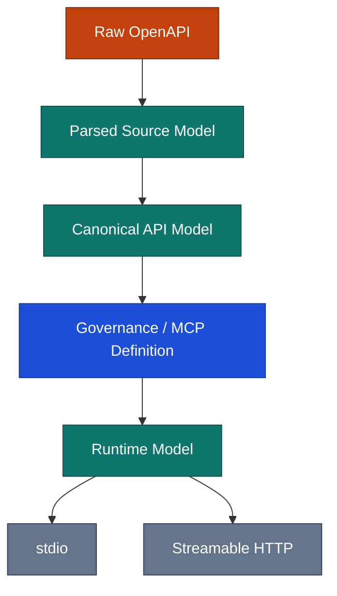
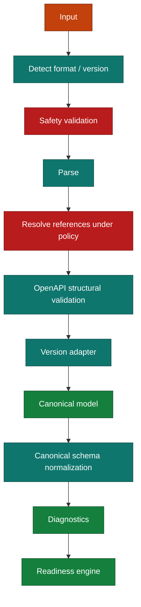
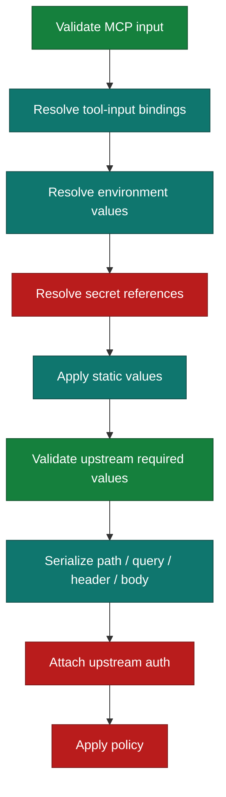
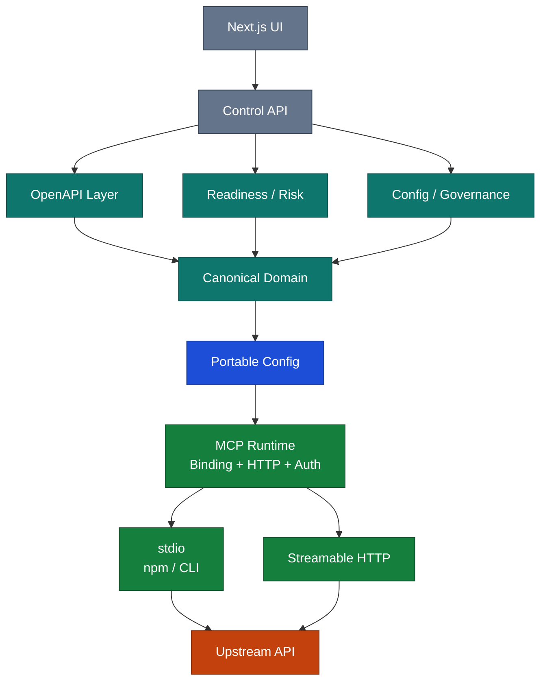
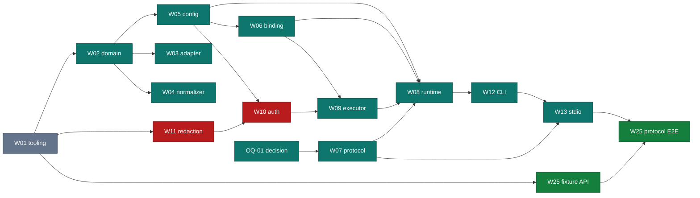
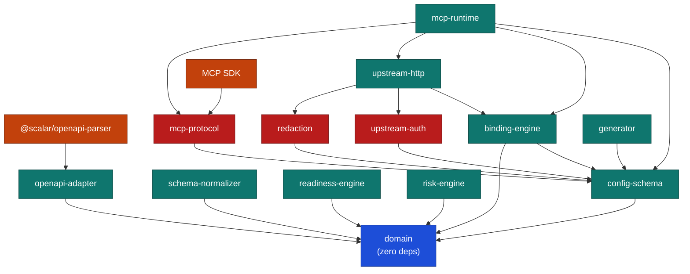

# Technical Implementation Plan

## Agent-Ready API Governance & OpenAPI-to-MCP Platform

| Field | Value |
|---|---|
| Document version | **1.1** |
| Supersedes | 1.0 (2026-08-17) |
| Date | 2026-08-17 |
| Audience | Architecture, engineering, security, product |
| Initial stack | TypeScript / Node.js / Next.js |
| Core strategy | Canonical intermediate model + portable MCP definition + shared runtime |
| Companion document | [BRD.md](BRD.md) |

### About version 1.1

Sections 1–82 retain v1.0 numbering so existing cross-references still resolve. Enhancement is
**additive**; nothing was removed. New material is §83–§93.

Changes in 1.1:

- **§2 rewritten as a verified baseline.** Every standards claim in v1.0 was checked against source
  on 2026-08-17. Nine claims held. **One did not:** the official MCP TypeScript SDK does not support
  the targeted protocol revision.
- Added: Work Breakdown Structure (§83), per-phase Definition of Done (§84), readiness rule registry
  (§85), test matrix (§86), traceability matrix (§87), error code catalog (§88), observability spec
  (§89), local development setup and repo conventions (§90), enforced package dependency graph
  (§91), protocol features v1.0 did not capture (§92), and a consistency reconciliation log (§93).
- Pinned every "recommended" technology choice that is now decidable, with resolved versions.

---

## 1. Technical Objectives

Build a platform that:

1. ingests Swagger/OpenAPI,
2. validates and normalizes heterogeneous API specifications,
3. analyzes agent readiness,
4. lets users curate a safe MCP tool surface,
5. maps request values to tool inputs/config/secrets,
6. generates a portable MCP configuration,
7. executes the same configuration over stdio or Streamable HTTP,
8. packages it as an npm-runnable server,
9. preserves user intent when the OpenAPI contract changes,
10. creates a foundation for hosted governance later.

The most important architecture decision is:

> **Do not compile OpenAPI directly into MCP source code.**

Use an intermediate model:



---

## 2. Standards Baseline — verified 2026-08-17

Every claim in v1.0 §2 was checked against primary sources. **Access date for all rows:
2026-08-17.** Re-review cadence: **every 8 weeks, and immediately on any MCP revision
announcement** — §78 rates protocol change as high-probability/high-impact, and it has already
materialized once.

| # | Claim (v1.0) | Verdict | Evidence |
|---|---|---|---|
| 1 | OpenAPI 3.2.0 is a current OAS revision | **Confirmed** | spec.openapis.org/oas/v3.2.0.html — v3.2.0, published 2025-09-19, finalized release, not draft |
| 2 | MCP 2026-07-28 defines modern stdio and Streamable HTTP behavior | **Confirmed** | modelcontextprotocol.io/specification/2026-07-28 — authoritative, based on schema/2026-07-28/schema.ts |
| 3 | stdio uses newline-delimited JSON-RPC; non-protocol output must not go to stdout | **Confirmed, verbatim** | *"Messages are delimited by newlines, and **MUST NOT** contain embedded newlines."* / *"The server **MUST NOT** write anything to its `stdout` that is not a valid MCP message."* |
| 4 | Modern Streamable HTTP is POST-based and drops the 2025-era session mechanism | **Confirmed, verbatim** | *"Revision 2026-07-28 changed the behavior of Streamable HTTP … Removal of the GET stream endpoint. Removal of protocol-level sessions."* |
| 5 | Tool schemas support JSON Schema 2020-12 | **Confirmed** | OAS 3.2 references JSON Schema Draft 2020-12; MCP tool schemas are JSON Schema |
| 6 | MCP authorization and upstream authorization are separate boundaries | **Confirmed** | Authorization security considerations, "Access Token Privilege Restriction" |
| 7 | Token passthrough to an upstream API is forbidden | **Confirmed as normative MUST NOT** | *"If the MCP server makes requests to upstream APIs, it may act as an OAuth client to them. The access token used at the upstream API is a separate token, issued by the upstream authorization server. The MCP server **MUST NOT** pass through the token it received from the MCP client."* |
| 8 | Scalar OpenAPI parser supports Swagger 2.0 + OAS 3.0/3.1/3.2 | **Confirmed** | `@scalar/openapi-parser@0.28.14` ships `dist/schemas/{v2.0,v3.0,v3.1,v3.2}` |
| 9 | Node.js LTS is the runtime target | **Confirmed** | Local toolchain Node v22.23.2 (LTS) |
| 10 | *"Use the official SDK where it correctly supports the targeted protocol revision"* (§26.1) | **Confirmed — via the v2 packages and the modern entry point** | `@modelcontextprotocol/{core,server,client}@2.0.0` (2026-07-27). `server/discover` on the wire returns `supportedVersions: ["2026-07-28"]`. See §2.1. |
| 11 | Which SDK package to depend on | **Corrected** | `@modelcontextprotocol/sdk@1.30.0` is the **legacy** single package, capped at 2025-11-25. The v2 **scoped** packages are current. An earlier pass inspected the legacy package and wrongly concluded the target revision was unsupported. |
| 12 | Swagger 2.0 / OAS 3.0 support requires a per-family adapter (original P1-W03-T01/T02 sizing: L+L) | **Corrected** | Row 8 already showed Scalar ships schemas for all four families, but that was never connected end to end. Empirically, `upgrade(document)` converts Swagger 2.0 → OAS 3.0 → OAS 3.1 in one call — verified against hand-built 2.0 (`host`/`basePath`/`schemes`/`securityDefinitions`) and 3.0 (`nullable`) documents, both re-validating as fully valid 3.1. One normalization call ahead of the existing 3.1 pipeline covers both families; no second adapter. OAS 3.2 (0% real-world adoption, see §3.5) stays deferred. Real-world coverage (APIs.guru directory, 2,529 public APIs / 3,992 spec versions, queried 2026-08-17): Swagger 2.0 54.9%, OAS 3.0.x 42.7%, OAS 3.1.x 2.4%, OAS 3.2.x ~0%. OAS-3.1-only covered ~2.4% of real specs; 2.0+3.0+3.1 covers ~99.6%. |

### 2.1 SDK v2, and the two eras

Full empirical findings: [`research/sdk-v2-api-notes.md`](research/sdk-v2-api-notes.md), probed
2026-08-17 by installing the packages, enumerating runtime exports, running a real server and client
over stdio, and driving the raw JSON-RPC wire.

**The target revision is available today.** Two facts make it non-obvious:

1. **There are two distributions.** `@modelcontextprotocol/sdk` (1.30.0) is legacy and caps at
   2025-11-25. `@modelcontextprotocol/{core,server,client}` (2.0.0) is current and implements
   2026-07-28. We depend on the latter only.

2. **`LATEST_PROTOCOL_VERSION` is still `"2025-11-25"` in v2** — because it names the latest
   *legacy-era* version, not the capability ceiling. The SDK models `ProtocolEra = 'legacy' | 'modern'`
   and holds `MODERN_WIRE_REVISION = "2026-07-28"` internally, unexported.

**Which era you serve depends on how you start the server, and the type signature does not warn you:**

```js
// LEGACY — answers initialize with 2025-11-25; server/discover → -32601
await new McpServer(info).connect(new StdioServerTransport());

// MODERN — server/discover → supportedVersions: ["2026-07-28"]
serveStdio(() => { const s = new McpServer(info); s.registerTool(/* ... */); return s; });
```

Both confirmed on the wire. This is a **silent-downgrade hazard**: the legacy path works, passes
naive tests, and serves the wrong revision. Hence the mandatory wire assertion in ADR-0009, rather
than a constant comparison — comparing against `LATEST_PROTOCOL_VERSION` would fail while the server
is correct.

Decision recorded in [ADR-0009](adr/0009-mcp-sdk-v2-and-modern-era.md): v2 scoped packages, modern
factory path, `fromJsonSchema` for tool schemas, track the latest SDK, never fork transports.

**OQ-01 is dissolved, not resolved** — there was no gap. Consequences: no in-house transport work, so
the conditional 10–18 dev-day row in §63 is void and the MVP band stays 100–150; `FR-BIND-007`,
`FR-HTTP-MCP-006` and `FR-POL-005` are implementable now and stay MVP/MUST; risk R12 closes.

**ADR-0004 still earned its keep.** The false alarm was contained to one package's worth of decision
precisely because protocol knowledge lives in `mcp-protocol` alone. Had it been scattered, a wrong
premise would have propagated through the generator before anyone checked it.

### 2.2 Responsibility boundary — what the SDK already owns

Verified before writing adapter code, which is the operational point of ADR-0004. Full table in
§8 of the research notes.

| The SDK owns | We own |
|---|---|
| Tool input validation against JSON Schema (returns `isError: true`, **not** a throw) | Upstream HTTP execution, binding, retry, response limits |
| JSON Schema → published tool schema (`fromJsonSchema`, verbatim round-trip) | `x-mcp-header` constraint validation (SDK passes annotations through unchecked) |
| Origin / Host validation (`validateOriginHeader`, `localhostAllowedOrigins`, …) | Canonical model, readiness, risk, generation |
| Era classification and legacy fallback (`classifyInboundRequest`, `isLegacyRequest`) | Secret resolution and redaction |
| MRTR primitives (`inputRequired`, `inputResponse`, `isInputRequiredResult`) | Config schema, inheritance, migrations |
| Modern `_meta` keys, subscriptions, Tasks, bearer auth, protocol error types | Tool naming, descriptions, provenance |

Two planned responsibilities are **removed** by this: input validation and Origin validation. The
runtime's `ExecutionContext` begins after arguments are already valid.

### 2.3 Architecture rule (unchanged from v1.0)

All MCP protocol-specific behavior must be isolated behind a versioned adapter.

```text
Application/tool runtime
        ↓
McpProtocolAdapter
        ↓
Official MCP SDK / protocol implementation
```

Do not scatter protocol-revision assumptions through the generator.

---

## 3. Technology Stack — pinned

Versions resolved from npm on 2026-08-17. Pin exact majors in `package.json`; renovate on a schedule.

### 3.1 Monorepo

| Choice | Version | Status |
|---|---|---|
| pnpm workspaces | 11.22.0 | **Pinned** via `packageManager` + corepack |
| Turborepo | 2.10.10 | **Pinned** (chosen over Nx: lighter, sufficient task graph) |
| TypeScript | **6.0.3** | **Pinned.** Strict, plus `noUncheckedIndexedAccess`, `exactOptionalPropertyTypes`, `verbatimModuleSyntax`, `module: nodenext`. **Not 7.0.2** — `typescript-eslint` 8.67.0 hard-refuses TS 7.0, and lint is a blocking gate carrying the `no-console` (BR-009) and `connect()` (ADR-0009) enforcement. Revisit when typescript-eslint supports TS ≥ 7.1. Evidence: research notes §9. |
| ESLint | 10.8.1 + typescript-eslint 8.67.0 | **Pinned** |
| Node.js | 22 LTS (22.23.2 local) | **Pinned** via `.nvmrc` + `engines` |

Why one language across UI, parser pipeline, runtime, CLI, and generator: shared types and schemas,
easy package boundaries, one toolchain.

### 3.2 Web

Next.js (App Router, Server Components by default), React, TypeScript, Tailwind, shadcn/ui, Monaco
Editor for raw JSON/YAML, TanStack Query for server state, and a lightweight reducer/state machine
for wizard state. Wizard state is explicitly a state machine, not ad-hoc `useState` — eleven steps
with inheritance and validation gates is not a form.

### 3.3 API / Control Plane — corrected, single Next.js app (no separate Fastify service)

**v1.1 specified a separate Fastify 5.12.0 Control API** alongside Next.js, reasoning that
remote-`$ref` resolution can be slow, playground calls need strict egress controls, and future
background jobs are easier with a dedicated service. None of those actually require a second
*service* — they're properties of the code being called (`createSafeFetch`, already SSRF-hardened
in `openapi-adapter`), not of which HTTP framework hosts the route, and Next.js Route Handlers run
under a full Node.js runtime capable of `node:fs`/`node:dns`/`node:net` — everything `generateProject`
and the safe-fetch layer need. "Future background jobs" was speculative; nothing in the backend needs
a queue or worker today.

**Corrected (web UI plan, `apps/web`):** one Next.js app. Server Components and Route Handlers call a
`src/server/*` business-logic layer directly (same process, no network hop) for anything the backend
needs to do; the browser calls same-origin `app/api/*/route.ts` handlers. One deployment unit, one
container, no internal-service URL, no CORS. Revisit a separate service only if a concrete need for
independent scaling or genuine background-job processing shows up — not before.

### 3.4 MCP Runtime — pinned

| Package | Version | Role |
|---|---|---|
| `@modelcontextprotocol/core` | 2.0.0 | Shared protocol types and schemas |
| `@modelcontextprotocol/server` | 2.0.0 | `McpServer`, `serveStdio`, HTTP transports, `fromJsonSchema` |
| `@modelcontextprotocol/client` | 2.0.0 | **devDependency only** — drives protocol E2E; never a runtime dep of a generated server |
| `zod` | 4.4.3 | Runtime config validation (`config-schema`). Not used for tool input schemas. |

Do **not** depend on `@modelcontextprotocol/sdk` — it is the legacy distribution (§2.1).

Node.js 22 LTS, transport adapter layer, native `fetch`/Undici-compatible HTTP client.

**Ajv is no longer a direct dependency.** The SDK validates tool input itself and ships pluggable
validator providers (`@modelcontextprotocol/server/validators/ajv`, `.../validators/cf-worker`) via
`ServerOptions.jsonSchemaValidator`. Use the SDK's provider rather than wiring our own Ajv instance.

### 3.5 OpenAPI Parsing

Primary parser: **`@scalar/openapi-parser` 0.28.14** — verified to ship schemas for v2.0, v3.0, v3.1,
v3.2.

**Version support: Swagger 2.0, OAS 3.0, OAS 3.1 — done.** `parseOpenApi()` detects the source
version via `validate()`, rejects anything outside `{2.0, 3.0, 3.1}` with `IMP-001`, then runs the
document through `upgrade()` (a single call — internally composes 2.0→3.0 and 3.0→3.1) before the
existing 3.1 validate/dereference/canonicalize pipeline. No per-family adapter exists or is needed;
verified empirically against hand-built 2.0 (`host`/`basePath`/`schemes`/`securityDefinitions` →
`servers`/`components.securitySchemes`) and 3.0 (`nullable: true` → JSON Schema 2020-12 type union)
documents, and against two real third-party specs end to end through the CLI (Swagger Petstore 2.0,
OAS 3.0 Petstore). A non-3.1 source produces an `IMP-006` info diagnostic recording the original
version. OAS 3.2 stays out of scope — real-world adoption is ~0% (APIs.guru directory, 2,529 public
APIs / 3,992 spec versions, queried 2026-08-17: Swagger 2.0 54.9%, OAS 3.0.x 42.7%, OAS 3.1.x 2.4%,
OAS 3.2.x ~0%); 2.0+3.0+3.1 covers ~99.6% of that real-world sample. Revisit 3.2 once adoption is
non-trivial — `upgrade()` targets 3.1 output only, so 3.2 support would need its own path either way.

**Parser-native types must not be exposed above the adapter package** (ADR-0003).

Optional: Redocly CLI for lint/bundle/reference diagnostics; `swagger2openapi` as a fallback
compatibility/conversion utility if Scalar's `upgrade()` is ever found insufficient for a Swagger 2
edge case (none found so far).

### 3.6 Persistence

MVP operates without project accounts. When persistence is added: PostgreSQL, object storage for
source specifications/artifacts, Prisma or Drizzle ORM. Supabase acceptable if speed of SaaS delivery
matters.

### 3.7 Queue

Not required on day one. Add when imports exceed interactive limits, or for AI analysis, Git
synchronization, artifact generation, or hosted deployment. PostgreSQL-backed job queue initially;
Redis/BullMQ later if necessary.

### 3.8 Observability

OpenTelemetry, structured logs, trace IDs, metrics; Application Insights / Grafana-compatible backend
depending on hosting. Concrete span and metric names: §89.

### 3.9 Testing

**Vitest 4.1.10** across unit, golden, and integration suites. Protocol E2E drives a real MCP client
against a spawned server process — not a mocked transport.

---

## 4. Proposed Repository

```text
repo/
├── apps/
│   ├── web/
│   ├── control-api/
│   └── worker/                     # later
│
├── packages/
│   ├── domain/
│   ├── openapi-adapter/                # includes remote-fetch/ (safe $ref fetching) —
│   │                                    # no separate reference-resolver package; ADR-0003
│   │                                    # confines every @scalar/* dependency to this one
│   │                                    # package, and the safe-fetch layer needs
│   │                                    # @scalar/json-magic's bundle()/fetchUrls() plugin
│   │                                    # seam to inject a custom fetcher (§93 C18)
│   ├── schema-normalizer/
│   ├── readiness-engine/
│   ├── risk-engine/
│   ├── config-schema/
│   ├── config-migrations/
│   ├── binding-engine/
│   ├── upstream-http/
│   ├── upstream-auth/
│   ├── redaction/
│   ├── mcp-protocol/
│   ├── mcp-runtime/
│   ├── generator/
│   ├── package-template/
│   ├── diff-engine/
│   ├── reconciliation/
│   ├── playground-core/
│   └── test-fixtures/
│
├── tooling/
│   ├── eslint/
│   ├── tsconfig/
│   └── scripts/
│
└── fixtures/
    ├── openapi-2/
    ├── openapi-3.0/
    ├── openapi-3.1/
    ├── openapi-3.2/
    └── malformed/
```

`redaction/` is added in 1.1 as a first-class package: logging and traces exist from P0, and
redaction bolted on later is how secrets leak.

**Packages are created when their first task starts, not up front.** Twenty empty package stubs read
as progress and rot. §83 states which packages exist at the end of each phase.

---

## 5. Package Dependency Rules

These boundaries are important. Enforcement mechanism: §91.

**`domain`** may depend on standard TypeScript/runtime primitives only. Must not depend on Next.js,
the parser library, the MCP SDK, or a database.

**`openapi-adapter`** depends on the parser library and `domain`. Produces the canonical API model.

**`readiness-engine`** depends on `domain`. Must not depend on UI or the MCP SDK.

**`config-schema`** depends on `domain` and a schema-validation library.

**`mcp-runtime`** depends on `config-schema`, `binding-engine`, `upstream-http`, `mcp-protocol`.

**`generator`** depends on the config/runtime model and templates.

This keeps the product evolvable.

---

## 6. Core Domain Model

Do not use OpenAPI objects as the permanent business domain model.

### 6.1 Source document

```typescript
interface SourceDocument {
  id: string;
  format: "json" | "yaml";
  declaredVersion: string;
  rawFingerprint: string;
  importedAt: string;
  source:
    | { type: "upload"; fileName: string }
    | { type: "paste" }
    | { type: "url"; url: string };
}
```

### 6.2 Canonical API

```typescript
interface CanonicalApi {
  schemaVersion: string;
  source: SourceDocumentRef;
  info: ApiInfo;
  servers: CanonicalServer[];
  securitySchemes: CanonicalSecurityScheme[];
  operations: CanonicalOperation[];
  schemas: Record<string, CanonicalSchema>;
  diagnostics: Diagnostic[];
}
```

### 6.3 Canonical operation

```typescript
interface CanonicalOperation {
  id: string;                       // internal stable fingerprint/id
  sourcePointer: string;
  operationId?: string;
  method: HttpMethod;
  path: string;
  tags: string[];
  summary?: string;
  description?: string;
  deprecated: boolean;

  parameters: CanonicalParameter[];
  requestBody?: CanonicalRequestBody;
  responses: CanonicalResponse[];
  security: CanonicalSecurityRequirement[];

  sourceFingerprint: string;
}
```

### 6.4 Canonical parameter

```typescript
interface CanonicalParameter {
  id: string;
  sourceName: string;
  location: "path" | "query" | "header" | "cookie";
  required: boolean;
  description?: string;
  schema: CanonicalSchemaRef;
  serialization?: ParameterSerialization;
}
```

### 6.5 Canonical schema

Internally normalize schemas toward JSON Schema 2020-12 semantics, while preserving source
differences.

```typescript
interface CanonicalSchema {
  kind: "json-schema";
  dialect: "2020-12";
  schema: Record<string, unknown>;

  sourceDialect:
    | "swagger-2"
    | "openapi-3.0"
    | "json-schema-2020-12";

  warnings: SchemaDiagnostic[];
}
```

This is an XL complexity area. OpenAPI 3.0 schemas are not equivalent to full JSON Schema 2020-12.
OpenAPI 3.1/3.2 are much closer. Swagger 2 differs further. **Do not simply copy schemas and assume
equivalent semantics.**

---

## 7. Stable Operation Identity

Required for future diff/reconciliation. `operationId` alone is insufficient because teams rename it.

```text
strong identity:
  explicit vendor stable ID if available
then:
  operationId + method + normalized path
fallback:
  method + normalized path
reconciliation candidate:
  semantic/path/schema similarity
```

```typescript
interface OperationIdentity {
  internalId: string;
  operationId?: string;
  method: string;
  normalizedPath: string;
  sourceFingerprint: string;
  semanticFingerprint: string;
}
```

**Never auto-map ambiguous renames without user review.**

---

## 8. Import Pipeline



### 8.1 Stage result

Every stage returns:

```typescript
type StageResult<T> = {
  value?: T;
  diagnostics: Diagnostic[];
  stats: StageStats;
};
```

This avoids throwing away useful partial analysis.

---

## 9. Safe Remote Fetch / `$ref` Resolution

A security-critical subsystem.

### 9.1 Fetch policy

```typescript
interface FetchPolicy {
  allowedSchemes: ("https" | "http")[];
  allowPrivateNetworks: boolean;
  maxRedirects: number;
  maxDocumentBytes: number;
  maxTotalBytes: number;
  maxReferenceDepth: number;
  maxReferences: number;
  timeoutMs: number;
}
```

### 9.2 Protections

Block by default: `file://`, `ftp://`, `gopher://`, `localhost`, RFC1918 private addresses,
link-local, cloud metadata addresses, Unix socket tricks, mixed-scheme redirect chains.

**Resolve DNS and check the final IP for every redirect. Do not trust the hostname only.**

### 9.3 Local CLI exception

A locally installed CLI may optionally resolve local file references because it executes in the
user's environment. The SaaS must not.

### 9.4 Implementation status — done (`P1-W18-T01/T02`)

Lives in `openapi-adapter/src/remote-fetch/`, not a separate package (§93 C18). `createSafeFetch()`
implements §9.1/§9.2: scheme allowlist, `localhost`/RFC1918/link-local/loopback/cloud-metadata
blocking via `dns.lookup()` re-checked at every redirect hop (not just the first URL), an
https→http downgrade-redirect refusal, a redirect cap, a per-document byte cap, and a cumulative
byte cap shared across every fetch made through one `FetchPolicy` resolution pass.
`resolveRemoteReferences()` wires it into `@scalar/json-magic`'s `bundle()` via the `fetchUrls()`
loader plugin, ahead of the existing local-only `dereference()` call — no `$ref`-graph walker of
our own. A blocked or failed remote `$ref` is a fatal diagnostic (`SEC-IMP-00x`), not a silent gap
in the parsed API; local-only parsing without any remote fetch is available via `fetchPolicy: null`.
The local-CLI file-reference exception (§9.3) is **not implemented** — only `https://`/`http://`
`$ref`s are resolved in this pass, no `file://` support of any kind, local or otherwise.

**Known, deliberate gap:** DNS-rebinding protection is "re-resolve and check at every hop," not
connection-level IP pinning — a sufficiently well-timed rebinding attack could still race between
our validation lookup and the actual TCP connection a few milliseconds later. Closing that gap needs
a custom low-level dispatcher pinning the exact validated IP, which means adding `undici` as a
direct dependency (Node's global `fetch` doesn't expose that control without it). Deferred rather
than silently claimed as covered.

---

## 10. JSON Schema Normalization

One of the hardest pieces; engineer it explicitly.

### 10.1 Goals

Produce reliable MCP input/output schemas.

### 10.2 Challenges

**Swagger 2.0** — body parameters, `definitions`, non-body parameters, security definitions, varying
nullable conventions.

**OpenAPI 3.0** — schema dialect diverges from modern JSON Schema; `nullable`; limited keywords;
discriminator semantics.

**OpenAPI 3.1/3.2** — JSON Schema alignment, dialect declarations, `$ref` siblings, newer features.

### 10.3 Strategy

```text
Source schema → Source-aware adapter → Canonical JSON Schema 2020-12
              → MCP schema sanitizer → MCP inputSchema/outputSchema
```

### 10.4 Schema budgets

```typescript
interface SchemaBudget {
  maxDepth: number;
  maxProperties: number;
  maxUnionBranches: number;
  maxRefExpansions: number;
}
```

If exceeded: **do not silently truncate.** Produce a readiness warning; optionally create a
simplified schema with explicit review.

---

## 11. Portable Configuration Schema

Called `mcp.config.json` initially. JSON-Schema validated and versioned.

### 11.1 Top level

```typescript
interface McpProjectConfig {
  schemaVersion: string;

  project: ProjectMetadata;
  source: SourceBinding;
  api: ApiRuntimeConfig;

  defaults: RuntimeDefaults;

  upstreamAuthentication?: UpstreamAuthConfig;
  mcpAccess?: McpAccessConfig;

  groups: ToolGroupConfig[];
  tools: Record<string, ToolConfig>;

  runtime: RuntimeConfig;
  generation: GenerationConfig;
}
```

### 11.2 Value binding

```typescript
type ValueBinding =
  | ToolInputBinding
  | EnvironmentBinding
  | SecretBinding
  | StaticBinding;

interface ToolInputBinding {
  source: "tool-input";
  inputName: string;
}

interface EnvironmentBinding {
  source: "environment";
  name: string;
  required?: boolean;
  defaultValue?: string | number | boolean;
}

interface SecretBinding {
  source: "secret";
  name: string;
  provider?: "environment" | "vault-reference";
  // NOTE: no `value` field exists, by design. See ADR-0006.
}

interface StaticBinding {
  source: "static";
  value: string | number | boolean | null;
  sensitive?: false;
}
```

`SecretBinding` has **no** `value` field. `StaticBinding` must reject `sensitive: true`.

### 11.3 Generation config (new in 1.1)

```typescript
interface GenerationConfig {
  packageName: string;        // user's choice, e.g. "@acme/customer-mcp" — no house default
  binName: string;            // e.g. "customer-mcp"
  version: string;
  license?: string;           // omitted unless the user chooses — see OQ-07
  transports: ("stdio" | "http")[];
  emitDockerfile: boolean;
  mode: "thin" | "self-contained";
}
```

Validation: npm name rules (≤ 214 chars, lowercase, optional `@scope/`, no leading `.`/`_`, URL-safe)
and POSIX-portable `binName`. Invalid values raise a `GEN-*` error (§88); they are never silently
rewritten. Satisfies BRD `FR-PKG-006`, `FR-PKG-007`, `BR-011`.

---

## 12. Tool Configuration

```typescript
interface ToolConfig {
  enabled: boolean;

  sourceOperation: {
    internalOperationId: string;
    method: string;
    path: string;
    operationId?: string;
  };

  name: string;
  title?: string;
  description: string;

  inputSchemaPolicy: SchemaPolicy;
  outputSchemaPolicy: SchemaPolicy;

  bindings: Record<string, ValueBinding>;

  risk: ToolRisk;

  runtime?: Partial<OperationRuntimePolicy>;
  policy?: ToolPolicy;

  provenance: {
    generatedName?: string;
    userOverrodeName: boolean;
    aiSuggestedName?: string;
  };
}
```

---

## 13. Configuration Inheritance Engine

Represent values as resolved configuration plus provenance.

```typescript
interface ResolvedValue<T> {
  value: T;
  sourceLevel: "project" | "api" | "group" | "tool";
}
```

Resolution order: project default → overridden by API → overridden by group → overridden by tool.

**Avoid deep magical merging of arbitrary JSON.** Use explicit resolvers per policy type:

```typescript
resolveTimeout(project, api, group, tool): ResolvedValue<number>
```

More verbose but safer.

---

## 14. Agent Readiness Engine

Core differentiated IP.

### 14.1 Architecture

```text
Canonical API → Rule extraction → Per-operation findings
             → Cross-operation analysis → Score aggregation → Recommendations
```

### 14.2 Rule interface

```typescript
interface ReadinessRule {
  id: string;
  category: ReadinessCategory;
  severity: Severity;
  evaluate(api: CanonicalApi, context: RuleContext): ReadinessFinding[];
}
```

### 14.3 Finding

```typescript
interface ReadinessFinding {
  ruleId: string;
  severity: "info" | "warning" | "high" | "critical";
  category: string;
  operationId?: string;
  sourcePointer?: string;
  title: string;
  explanation: string;
  remediation?: string;
  autoFix?: AutoFixDescriptor;
}
```

### 14.4 Initial deterministic rules

The authoritative, reconciled registry is **§85**. The v1.0 list is retained here for reference:

**Naming** — ARA-NAME-001 missing operation ID · 002 duplicate operation ID · 003 normalized MCP name
collision · 004 generic verb/name

**Documentation** — ARA-DOC-001 missing summary · 002 missing description · 003 missing parameter
description · 004 parameter description repeats name only

**Schema** — ARA-SCHEMA-001 excessive depth · 002 free-form object · 003 large required-field count ·
004 excessive union branches · 005 binary input/output · 006 recursive schema complexity

**Safety** — ARA-SAFE-001 DELETE operation · 002 bulk mutation candidate · 003 admin/privileged
path/name · 004 write operation with no meaningful description

**Tool surface** — ARA-TOOL-001 too many tools per tag · 002 semantically similar operations · 003
deprecated operation · 004 internal-looking operation

### 14.5 Scoring

Do not make score calculation opaque.

```typescript
score = weightedAverage(categoryScores) - blockingPenalty
```

Expose contribution details.

### 14.6 AI analysis

Run **after** deterministic analysis. Minimize input:

```json
{
  "operation": { "name": "...", "summary": "...", "description": "...", "inputs": ["..."] },
  "deterministicFindings": ["..."]
}
```

Do not send unrelated private API definitions.

---

## 15. Risk Engine

Keep separate from readiness. Readiness asks *is it usable by an agent?* Risk asks *what damage can
invocation cause?*

### 15.1 Initial classifier

Inputs: HTTP method, operation ID, path, tags, summary, description.

```typescript
interface RiskAssessment {
  classification: "READ_ONLY" | "WRITE" | "DESTRUCTIVE" | "PRIVILEGED" | "UNKNOWN";
  confidence: number;
  reasons: string[];
}
```

Rule examples: GET/HEAD → read-only candidate. DELETE → destructive candidate. POST with `/search`
may still be read-only. POST `/delete`, `/purge`, `/cancel`, `/terminate` → destructive. `/admin`,
`/permissions`, `/roles` → privileged candidate.

**User override always wins.**

---

## 16. Tool Surface Recommendation Engine

V1: rules. Later: semantic analysis.

### 16.1 Rule-based reduction

Recommend excluding: deprecated; internal/admin candidates; readiness-blocked; duplicate normalized
names.

### 16.2 Semantic duplicates later

Create operation embeddings from name, summary, parameters, response entity; cluster likely
duplicates. **Never auto-remove based solely on embeddings.**

---

## 17. Binding Engine

### 17.1 Input

Canonical operation, tool configuration, runtime environment.

### 17.2 Output

```typescript
interface ResolvedHttpRequest {
  method: string;
  url: URL;
  headers: Record<string, string>;
  body?: unknown;
}
```

### 17.3 Processing



### 17.4 Secret resolver

```typescript
interface SecretResolver {
  get(name: string): Promise<string | undefined>;
}
```

V1: environment secret resolver. Later: Azure Key Vault, AWS Secrets Manager, Google Secret Manager,
HashiCorp Vault.

---

## 18. Two Authentication Planes

Must exist from the beginning.


**18.1 Plane A — MCP access.** Applies mainly to HTTP-hosted MCP.

**18.2 Plane B — Upstream API.** A separate credential.

**18.3 Hard rule:** `MCP access token ≠ upstream token`. Do not forward the client's MCP bearer token
upstream. This is a specification **MUST NOT** (§2 row 7), not a preference.

**18.4 stdio.** The process boundary is the connection mechanism; upstream credentials come from
environment/secrets.

---

## 19. Upstream Authentication Implementations

**V1**

```typescript
interface ApiKeyAuth { type: "apiKey"; in: "header" | "query"; name: string; value: ValueBinding }
interface BearerAuth { type: "bearer"; token: ValueBinding }
interface BasicAuth  { type: "basic"; username: ValueBinding; password: SecretBinding }
```

**V1.5/V2 — OAuth client credentials — done** (`upstream-auth`, `P5-W10-E01`, pulled forward):

```typescript
interface OAuth2ClientCredentialsAuth {
  type: "oauth2ClientCredentials";
  tokenUrl: string;
  clientId: ValueBinding;
  clientSecret: SecretBinding;
  scopes?: string[];
}
```

`OAuthTokenProvider` owns the token endpoint call (RFC 6749 §4.4), an in-memory cache keyed by
`tokenUrl::clientId::scopes` with a 30s expiry safety margin, and an acquire lock (an in-flight
request map) so concurrent tool calls sharing one auth config make at most one token-endpoint
request. Must be constructed once per server process and threaded through — a fresh instance per
call has no cache to hit. `attachUpstreamAuth` became async to accommodate the token-acquisition
round trip; every other auth type still resolves synchronously.

**User-delegated external OAuth.** Still a separate, out-of-scope feature — the redirect/consent UX
has no place in a headless tool-execution path (no human is present during a tool call). Current MCP
external authorization patterns require careful user binding and must not route third-party
credentials through the MCP client. Complexity XL; not MVP.

---

## 20. Upstream HTTP Client

Do not generate custom fetch boilerplate per tool. Implement a shared executor.

```typescript
class UpstreamExecutor {
  async execute(
    operation: RuntimeOperation,
    args: unknown,
    context: ExecutionContext
  ): Promise<ExecutionResult> {}
}
```

Responsibilities: URL building, query serialization, request body, auth, timeout, cancellation,
retry, response limits, content-type handling, error mapping, observability.

This data-driven approach means generated artifacts can be mostly `runtime library + generated
manifest` rather than 500 almost-identical source files.

---

## 21. Retry Policy

| Operation | Retry default |
|---|---|
| GET | retry transient failures |
| HEAD | retry |
| PUT | conservative, only if configured/idempotent |
| DELETE | **disabled by default** |
| POST | **disabled by default** |
| PATCH | **disabled by default** |

Transient candidates: network reset, `408`, `429` with policy, `502`, `503`, `504`.

Use exponential backoff with jitter. Respect `Retry-After`. Set a maximum total execution budget.

*(1.1: fixed a formatting break in v1.0 where `504` was orphaned from this list — §93 C4.)*

**Done** (`upstream-http`, `P1-W09-T01`): `RetryPolicy` fixed at `{maxAttempts: 3, baseDelayMs: 250,
maxDelayMs: 5000, totalDeadlineMs: 30000}` — not per-project configurable in this pass, only the PUT/
POST/DELETE/PATCH eligibility override is (`ToolConfig.retry.enabled`). One additional rule beyond
this table: `DESTRUCTIVE`/`PRIVILEGED` risk classification is a **hard floor** — no `retry.enabled`
override can turn retry back on for those, since retrying an ambiguous failure on a destructive
operation risks double execution (BR-006's "never auto-enable a destructive action" extended to
retry). `ExecutionResult.attempts` reports how many HTTP attempts were actually made.

---

## 22. Timeout and Cancellation

```typescript
interface TimeoutPolicy {
  timeoutMs: number;
  connectTimeoutMs?: number;
}
```

MCP cancellation must propagate into `AbortController` for upstream HTTP. **Retries must not exceed
the overall tool deadline.**

Cancellation reaches the runtime differently per transport (§92.4): on stdio via a
`notifications/cancelled` notification; on Streamable HTTP by the client closing the SSE response
stream. The adapter normalizes both into one `AbortSignal`.

---

## 23. Response Limits

```typescript
interface ResponsePolicy {
  maxBytes: number;
  allowedContentTypes: string[];
  behaviorOnOversize: "error" | "truncate-text";
}
```

For JSON, avoid unsafe byte truncation that corrupts JSON. Better: reject oversized structured
responses; later support field projection/pagination (see OQ-09).

---

## 24. MCP Protocol Adapter

### 24.1 Interface

```typescript
interface McpProtocolAdapter {
  createServer(registry: ToolRegistry, options: ProtocolOptions): Promise<McpServerHandle>;
}
```

### 24.2 Responsibilities

Tool registration via `fromJsonSchema`; tool result format; transport startup through the **modern
factory path**; the era assertion; protocol error mapping; cancellation normalization across
transports (§92.4); and `x-mcp-header` constraint validation, which the SDK does **not** perform
(§2.2).

**Explicitly not the adapter's job**, because the SDK already does it (§2.2): tool input validation,
Origin/Host validation, era classification, MRTR primitives, and `_meta` key handling. The adapter
wires those; it must not reimplement them.

### 24.3 Why the adapter is mandatory

The 2026-07-28 revision changes transport and lifecycle behaviour compared with 2025 revisions, and
§2.1 shows the hazard is live rather than theoretical: the same `McpServer` serves a **different
protocol era** depending on which entry point starts it, with no signature-level warning. Confining
that knowledge to one package is what turned a wrong premise about SDK support into a contained,
one-package correction instead of an error propagated through the generator. See ADR-0004 and
ADR-0009.

---

## 25. stdio Transport

### 25.1 Startup

```bash
my-api-mcp     # defaults to transport=stdio
```

Started through the **modern factory path** (`serveStdio(factory)`), never `McpServer#connect()` —
see §2.1 and ADR-0009. The factory constructs a fresh `McpServer` per invocation, matching the
modern era's statelessness:

```ts
serveStdio(() => {
  const server = new McpServer(serverInfo);
  for (const tool of registry.tools()) {
    server.registerTool(tool.name, {
      description: tool.description,
      inputSchema: fromJsonSchema(tool.inputSchema),   // JSON Schema 2020-12, published verbatim
    }, tool.execute);
  }
  return server;
});
```

### 25.2 Logging

```text
stdin  ← MCP messages from client
stdout → MCP messages ONLY
stderr → operational logging
```

Never call uncontrolled `console.log()` in runtime paths. This is enforced by lint (§91.2), not
convention.

```typescript
interface RuntimeLogger {
  debug(message: string, data?: unknown): void;
  info(message: string, data?: unknown): void;
  warn(message: string, data?: unknown): void;
  error(message: string, data?: unknown): void;
}
```

The stdio implementation writes operational logs to stderr. Verified spec language: the client
**MAY** capture, forward, or ignore stderr and **SHOULD NOT** assume stderr output indicates an
error — so stderr is a legitimate log sink, not an error channel.

### 25.3 Process lifecycle

Handle `SIGINT`, `SIGTERM`, stdin close, and startup config failure. No orphan background processes.

Verified addition: servers **SHOULD** exit promptly when stdin is closed or reads return EOF — this
is the primary graceful-shutdown signal and the only portable one. Clients escalate to
`SIGTERM`/`SIGKILL` if the process lingers, so honouring EOF avoids forced termination.

---

## 26. Streamable HTTP Transport

### 26.1 Modern mode

Per the verified 2026-07-28 revision: a single MCP endpoint accepting **POST** only. Each JSON-RPC
request is its own POST. The server answers with either `application/json` or a per-request
`text/event-stream`. There are no protocol-level sessions, no GET stream, and no `Last-Event-ID`
resumability.

Use the official SDK **only where it supports the targeted revision** — see §2.1 / OQ-01.

### 26.2 Security defaults

- Bind to `127.0.0.1` for local mode.
- Validate `Origin`; respond **403** when present and invalid. (Spec: servers **MUST** validate
  `Origin` to prevent DNS rebinding.)
- Explicit allowed origins.
- Request body size limit; HTTP timeout; secure headers.
- Authentication when externally accessible, with audience validation.
- Emit `X-Accel-Buffering: no` on SSE responses so reverse proxies do not buffer them.

### 26.3 Endpoints

```text
POST /mcp
GET  /health
GET  /ready
```

Do not mix health endpoints with MCP protocol semantics.

### 26.4 Legacy traffic handling (new in 1.1)

A server supporting only this revision must respond to older clients as follows: `405 Method Not
Allowed` for GET or DELETE on the MCP endpoint; ignore `Mcp-Session-Id` and never mint or echo
session IDs; ignore `Last-Event-ID`.

---

## 27. Protocol Compatibility Strategy

The support matrix must be explicit.

```typescript
interface ProtocolCompatibility {
  preferred: "2026-07-28";
  supported: ["2026-07-28"];
  legacyMode: "disabled";
}
```

**Determine the era from the wire, not from a constant.** `LATEST_PROTOCOL_VERSION` reports the
legacy ceiling (`"2025-11-25"`) even when the server is correctly serving 2026-07-28 — see §2.1. The
authoritative check is `server/discover` returning `supportedVersions: ["2026-07-28"]`, which is a
mandatory E2E assertion per ADR-0009.

Legacy support is **disabled** in MVP. The SDK can serve the legacy era, and provides
`classifyInboundRequest` / `isLegacyRequest` / `legacyStatelessFallback` for it, but we do not promise
what we do not test. Enabling it later is a configuration change plus a test matrix expansion, not a
rewrite.

The generated README must state the *actual* negotiated revision, read from the wire — not the
aspirational one, and not a constant.

---

## 28. Tool Registry

```typescript
interface RuntimeTool {
  name: string;
  description: string;
  inputSchema: object;
  outputSchema?: object;
  execute(args: unknown, ctx: ExecutionContext): Promise<ToolResult>;
}
```

Build the registry from the portable config + canonical runtime manifest. **No reflection over
arbitrary generated JS.**

---

## 29. Generation Strategy

```text
The generator does NOT emit a unique custom HTTP function per operation.

It emits:
  - stable runtime package (dependency)
  - generated API/tool manifest
  - config schema
  - package metadata
  - README
```

Benefits: smaller diffs; easier security patching; consistent behavior; faster regeneration.

Optionally add an "expanded source" export later for users who want bespoke code.

### 29.1 Thin mode is deferred — self-contained mode is what actually ships (1.1)

`GenerationConfig.mode` ("thin" | "self-contained", TIP §11.3) was designed before implementation.
Building `packages/generator` (`P2-W15-E01/E02`) forced the decision the schema had left open:
**thin mode cannot produce a runnable artifact today**, because it depends on a published
`@mcpgen/*` runtime package, and none is published (§50 explicitly defers publishing anything to
npm). A "thin" generated package would be un-installable outside this monorepo.

**What ships instead:** self-contained mode, implemented as a real bundling step. `bundle.ts` uses
esbuild to compile the runtime entry point (a trimmed copy of `apps/cli`'s command logic, reading a
baked manifest instead of re-parsing OpenAPI — §29.2) into one `dist/cli.mjs`, inlining every
`@mcpgen/*` workspace package. Only the real, published SDK packages
(`@modelcontextprotocol/{core,server,node}`, `zod`) remain as `package.json` dependencies. Verified,
not assumed: a generated package `npm install`ed in a directory with **no relationship to this
monorepo** starts, resolves its secret, and calls a real fixture API correctly
(`test-fixtures/test/e2e/generated-package.test.ts`).

`mode: "thin"` remains a valid, accepted config value — the schema doesn't need to change when
publishing eventually happens — but the generator does not implement it, and `README.md`/§72 should
not claim it works. Revisit when `@mcpgen/*` publishing is a real decision (a rename/branding
decision — OQ-02 — should land first, since publishing under a placeholder scope is a poor first
impression).

Two bugs found only by actually running a generated package standalone, not by inspection:

1. **Double shebang.** The runtime entry source and esbuild's `banner` option both wrote
   `#!/usr/bin/env node`, producing two shebang lines. Node only exempts the file's first line — the
   second was a syntax error on every generated package's first `node dist/cli.mjs` invocation. The
   source-level shebang was removed; the bundler's banner is now the only one.
2. **Missing transitive dependency for stdio-only configs.** `mcp-protocol`'s barrel exports both
   `serveToolsOverStdio` and `serveToolsOverHttp` from one module, so bundling the CLI always pulls
   in `@modelcontextprotocol/node` (imported at module scope by `serve-http.ts`) — even for a
   stdio-only project. `buildPackageJson` had only added that dependency when `transports` included
   `"http"`, so a stdio-only generated package failed to resolve the import at startup. Fixed:
   the dependency is now unconditional, matching what the bundle actually needs.

---

## 30. Generated Package Layout

**As implemented (1.1, self-contained mode — §29.1):**

```text
generated-api-mcp/
├── dist/
│   └── cli.mjs               # bundled: our runtime inlined, SDK packages left external
├── mcp.config.json            # the portable config, verbatim — secret REFERENCES only
├── generated-manifest.json    # TIP §39 artifact manifest + the operations the bundle needs
├── package.json
├── .env.example
├── .gitignore
├── README.md
└── Dockerfile                 # only if generation.emitDockerfile
```

No `src/`, no `tsconfig.json`: there is nothing left to compile once `bundle.ts` has run. This is
narrower than v1.0's speculative layout below, because there is no "thin" mode using the runtime as
a normal dependency — package.json:

```json
{ "dependencies": {
    "@modelcontextprotocol/core": "2.0.0",
    "@modelcontextprotocol/server": "2.0.0",
    "@modelcontextprotocol/node": "2.0.0",
    "zod": "^4.4.3"
} }
```

**v1.0's original sketch, retained for the thin-mode design intent (not yet built — §29.1):**

```text
generated-api-mcp/
├── src/
│   ├── cli.ts
│   ├── generated/
│   │   ├── api.manifest.ts
│   │   └── tools.manifest.ts
│   └── index.ts
│
├── mcp.config.json
├── package.json
├── tsconfig.json
├── .env.example
├── .gitignore
├── Dockerfile
├── README.md
└── LICENSE            # emitted only if the user chooses one — see OQ-07
```

```json
{ "dependencies": { "@your-org/mcp-runtime": "^x.y.z" } }
```

*(1.1: v1.0 left `LICENSE?` unresolved. Resolution: emit nothing unless the user supplies
`GenerationConfig.license`. Rationale — inserting a license into someone else's package is a legal
assertion the platform is not entitled to make. Recorded as OQ-07 / §93 C3. As built: the
`package.json` `license` field is set from the SPDX identifier the user supplies; a full-text
`LICENSE` file body is not generated — we have no reliable source of license text without another
dependency, and fabricating legal text is worse than omitting it.)*

---

## 31. CLI Design

```text
api-mcp
api-mcp serve
api-mcp validate
api-mcp doctor
api-mcp print-tools
api-mcp print-config
```

```bash
api-mcp serve --transport stdio
api-mcp serve --transport http --host 127.0.0.1 --port 3000
```

Environment overrides: `MCP_TRANSPORT`, `MCP_HOST`, `MCP_PORT`, `MCP_LOG_LEVEL`.

Transport settings are runtime settings, not business tool semantics.

---

## 32. Runtime Configuration Loading

```text
package defaults → mcp.config.json → environment variables → CLI runtime flags
```

Do not allow CLI flags to override secret values directly — process argument lists are visible to
other processes. For secret values, environment or a provider is required.

---

## 33. Configuration Validation

Use Zod or generated validators.

```text
load config → validate schema version → migrate if supported
→ resolve environment descriptors → verify required secrets exist
→ validate tool references → start transport
```

Failure example:

```text
Configuration validation failed:
- CUSTOMER_API_URL is required
- CUSTOMER_API_KEY secret is missing
```

stdio sends startup diagnostics to **stderr** and exits non-zero **before** writing anything to
stdout.

---

## 34. Configuration Schema Migrations

The portable config is a product asset and will evolve.

```typescript
interface ConfigMigration {
  from: string;
  to: string;
  migrate(input: unknown): unknown;
}
```

Migration chain: `1.0 → 1.1 → 1.2`. Never overwrite a user config without a backup in CLI tooling.

---

## 35. Playground Architecture

Do not execute the generated npm package as an arbitrary subprocess in the SaaS MVP. Use the same
runtime engine directly.

```text
UI → Playground API → Validated project snapshot → Runtime engine → Safe egress HTTP → Upstream API
```

### 35.1 Playground modes

**Dry run** — no upstream request; render request preview.
**Live** — requires credentials; executes request.

### 35.2 Egress controls

The same SSRF concerns apply to the API base URL. For SaaS: block private networks by default;
enterprise private agents later for internal APIs.

---

## 36. Trace Model

```typescript
interface ExecutionTrace {
  traceId: string;
  toolName: string;
  startedAt: string;
  durationMs: number;

  input: RedactedValue;
  resolvedRequest: RedactedHttpRequest;

  upstreamStatus?: number;
  response: RedactedValue;

  resultType: "success" | "validation-error" | "upstream-error";
}
```

**Redaction occurs before persistence/logging**, never after.

---

## 37. Redaction Engine

A shared package. Inputs: known secret bindings; sensitive header names; configured sensitive paths.

Default sensitive headers (case-insensitive matching): `Authorization`, `Proxy-Authorization`,
`X-API-Key` variants, `Cookie`, `Set-Cookie`.

Also allow JSON pointer paths: `/password`, `/clientSecret`, `/token`.

**Never rely only on field-name heuristics for known secret bindings** — the binding graph is the
authoritative source of what is secret.

---

## 38. Data Model for SaaS Control Plane

```text
projects
  id · workspace_id · name · slug · status · created_at · updated_at

source_documents
  id · project_id · version · openapi_version · format · object_storage_key · sha256 · created_at

normalized_snapshots
  id · source_document_id · model_schema_version · object_storage_key · operation_count · created_at

readiness_reports
  id · normalized_snapshot_id · engine_version · score · report_json · created_at

project_configs
  id · project_id · schema_version · revision · config_json · created_by · created_at
  -- no secret literals

generated_artifacts
  id · project_config_id · generator_version · protocol_target · artifact_type
     · object_storage_key · sha256 · created_at

execution_traces
  optional in MVP; sanitize first
```

---

## 39. Artifact Reproducibility

```json
{
  "generatorVersion": "0.x",
  "configSchemaVersion": "1.0",
  "canonicalModelVersion": "1.0",
  "mcpProtocolTarget": "2026-07-28",
  "sourceSha256": "...",
  "configSha256": "...",
  "generatedAt": "..."
}
```

Given the same versions and inputs, output must be deterministic except timestamps where
intentionally included.

---

## 40. Diff Engine

Complexity: XL.

**40.1 Structural diff** — compare paths/methods, operation IDs, parameters, schemas, responses,
security.

**40.2 Semantic identity** — candidate operation mapping in order: exact stable internal identity;
exact method/path; operation ID; high-confidence similarity.

**40.3 Change severity** — `NON_BREAKING`, `POTENTIALLY_BREAKING`, `BREAKING`, `METADATA_ONLY`.

Examples: optional parameter added → non-breaking; required parameter added → breaking; response
description changed → metadata; security requirement changed → breaking/high.

---

## 41. Reconciliation Engine

**Input:** old canonical API, old project config, new canonical API, diff.
**Output:** proposed new project config, reconciliation conflicts.

Preserve: tool names, descriptions, enabled state, bindings, risk overrides, policy overrides.

If a source parameter disappears: the binding becomes unresolved and generation is blocked until
reconciled.

---

## 42. AI Optimization Architecture

```typescript
interface AiOptimizer {
  suggestToolName(input: ToolOptimizationInput): Promise<Suggestion>;
  suggestDescription(input: ToolOptimizationInput): Promise<Suggestion>;
  analyzeAmbiguity(input: ToolOptimizationInput): Promise<Suggestion[]>;
}
```

Provider packages: OpenAI/Azure OpenAI initially; optional local/provider abstraction later.

Store: model/provider, prompt version, suggestion, acceptance status. **Do not store hidden
reasoning.**

---

## 43. Tool Name Deterministic Algorithm

```text
operationId if present → split Pascal/camel/snake → remove controller/service noise
→ normalize verbs → normalize resource → snake_case → validate allowed characters
→ truncate safely → collision resolution
```

Examples:

```text
CustomerController_GetCustomerUsingCustomerIdentifier → get_customer
UsersV2Controller_SearchUsersAsync                    → search_users
```

Collision handling:

```text
get_customer
get_customer_by_email
```

**Do not append meaningless numeric suffixes until semantic alternatives fail.**

---

## 44. Description Quality Heuristics

Low-quality signals: description shorter than threshold; identical to operation ID; generic "Gets
data"; no object/resource noun; write operation with no side-effect statement.

Use deterministic warnings before AI.

---

## 45. Parameter Input Surface Simplification

Avoid exposing infrastructure headers to the LLM when they can be runtime-configured. Examples:
`X-Tenant-ID`, `X-API-Version`, `Authorization`, `X-Application-ID` should normally map to
environment/static/secret rather than tool input.

This materially improves tool schemas.

Offer a recommendation: `"X-API-Key looks sensitive. Bind as secret?"`

**1.1 addition — the third option.** A header may need to be both agent-supplied *and* mirrored into
the HTTP request for intermediary routing. The protocol supports this directly via `x-mcp-header`
(§92.1), so the binding recommendation is now three-way:

| Header character | Recommended binding |
|---|---|
| Credential | `secret` — never a tool input |
| Fixed per deployment (API version, application ID) | `environment` or `static` |
| Genuinely per-call and needed by intermediaries (region, tenant when agent-selected) | `tool-input` **+** `x-mcp-header` annotation |

---

## 46. Request Body Flattening

**MVP: preserve object structure.** Do not aggressively flatten nested request bodies — it changes
semantics and can create collisions.

Later: allow user-configurable MCP-facing schema transformations with explicit mapping. Complexity XL.

---

## 47. Tool Composition / Workflow Generation

Not in MVP. A later product could recognize multi-call tasks using OpenAPI/Arazzo and generate
higher-level tools:

```text
create_order → create customer if absent → create order → attach payment method
```

A meaningful future differentiator, but it adds transaction/error/compensation complexity.

---

## 48. Testing Strategy

Critical, because generator products can look correct while failing at runtime. The concrete suite
matrix is §86.

**48.1 Unit tests** — normalization, bindings, serialization, readiness rules, risk classifier,
config migration, redaction, retry policy.

**48.2 Golden tests** — given a fixture OpenAPI: `input spec → expected canonical JSON → expected
project config → expected generated manifest`. Review diffs explicitly.

**48.3 Protocol tests** — tool listing, tool invocation, validation errors, stdio process lifecycle,
HTTP requests, protocol version behavior.

**48.4 Integration fixture APIs** — controlled local APIs covering API key, bearer, basic,
path/query/header params, request body, nested schemas, 4xx, 5xx, timeout, 429, binary, pagination,
malformed responses.

**48.5 Real-world compatibility corpus** — a legal/public fixture corpus across Swagger 2, OAS 3.0,
3.1, 3.2. Track import and generation success rate.

**48.6 Security tests** — SSRF attempts, private-IP redirects, DNS rebinding simulation, recursive
refs, giant schemas, secret redaction, header injection, invalid Origin, token-passthrough
regression.

**48.7 Generated package E2E** — CI must:

```text
generate fixture package → npm install/build → launch stdio
→ MCP client lists tools → invoke tool → verify upstream request
```

and separately: `launch HTTP → invoke MCP → verify result`.

---

## 49. Quality Gates

No merge if: TypeScript errors; unit tests fail; golden snapshots change unexpectedly; the generated
fixture package cannot build; protocol E2E fails; secret scan finds fixture secrets; a high-severity
dependency issue violates policy.

1.1 adds: package dependency-boundary check fails (§91); `console.*` appears in a runtime package;
stdout purity test fails.

---

## 50. CI/CD

**PR pipeline**

```text
lint → typecheck → unit → golden → security tests → generator E2E
→ stdio MCP E2E → HTTP MCP E2E → build web/control API
```

**Release pipeline**

```text
version packages → build → SBOM → dependency scan → sign packages where supported
→ publish runtime/generator → build web → deploy → smoke test
```

**Generated package publishing** — do not initially publish user-generated packages to npm
automatically. First: downloadable source plus user-owned npm publish instructions. Later: a GitHub
Action template and user-owned npm token/OIDC publishing. This avoids becoming a package-hosting
trust boundary too early.

---

## 51. Web UX Architecture

**Status: build in progress (`apps/web`, WBS `P2-W19-E01…E05`).** Route ↔ wizard-step mapping resolved
during planning: BRD §15.1's 11 content-steps map onto these 10 routes with step 6 "Tool Selection"
and step 7 "Tool Design" sharing one `/tools` route. Server-driven project data, resilient wizard
state. Routes:

```text
/projects/new/import
/projects/:id/validation
/projects/:id/readiness
/projects/:id/api
/projects/:id/auth
/projects/:id/tools
/projects/:id/bindings
/projects/:id/policy
/projects/:id/playground
/projects/:id/generate
```

For a local/no-login MVP, project snapshots can be browser-local plus backend transient processing.
If API specs are confidential, browser-only local processing has privacy advantages for paste/upload.

---

## 52. Local-First Processing Opportunity

A major product differentiator:

> **Analyze locally in the browser when possible.**

Potential: JSON/YAML parse; endpoint inventory; deterministic readiness; config design.

Send data to the backend only for: URL fetch; AI enhancement; live playground requiring controlled
egress; persistence.

Benefits: privacy, lower cost, faster onboarding. Challenges: parser/browser compatibility, large
files, local external references. Complexity L but strategically attractive.

**Decision (web UI plan): deferred, not built in this pass.** `openapi-adapter` is the only package
permitted to import `@scalar/*` (ADR-0003) and its safe-fetch layer uses `node:dns`/`node:net` — it
cannot run in a browser unmodified, and the boundary rule forbids a second parser elsewhere to dodge
that. `readiness-engine`/`risk-engine` are pure and browser-capable, but both consume `CanonicalApi`,
which only the adapter produces — so browser-side analysis buys nothing until browser-side parsing
exists. Revisit once there's a real multi-tenant hosted deployment where "the spec never leaves the
browser" is a genuine privacy differentiator, not before.

---

## 53. API Design for Control Plane

**Implemented as `apps/web/src/app/api/*/route.ts` (Next.js Route Handlers, §3.3), not a separate
Fastify service.** One additive route beyond this original list:
`GET /api/projects/:id/generate/:buildId/download` (streams the zip; kept separate from the `generate`
POST so blockers render before a download is offered — the POST returns JSON).

```text
POST /api/import
POST /api/projects
GET  /api/projects/:id
POST /api/projects/:id/analyze
PUT  /api/projects/:id/config
POST /api/projects/:id/playground/dry-run
POST /api/projects/:id/playground/execute
POST /api/projects/:id/generate
GET  /api/projects/:id/generate/:buildId/download   # additive
POST /api/projects/:id/source-versions
GET  /api/projects/:id/diff/:version
```

For long-running operations: `POST → 202 + jobId`, then `GET /api/jobs/:jobId`. Only add job
infrastructure once needed.

---

## 54. Error Model

```typescript
interface ProductError {
  code: string;
  message: string;
  category:
    | "IMPORT" | "VALIDATION" | "BINDING" | "AUTH"
    | "UPSTREAM" | "MCP" | "SECURITY" | "GENERATION";
  sourcePointer?: string;
  toolName?: string;
  remediation?: string;
}
```

The generated runtime exposes safe messages and logs detailed internal diagnostics with redaction.
The code catalog is §88.

---

## 55. Performance Plan

**Import** — streaming file-size validation; avoid fully dereferencing all schemas if unnecessary;
cache references by canonical URL; memoize normalized schema nodes.

**Analyzer** — O(n) per-operation rules; cross-operation similarity deferred/optimized; worker
thread/browser worker for very large specs.

**Generator** — mostly template + manifest generation; fast relative to parsing.

**Runtime** — precompile schema validators at startup; pre-resolve static/invariant config; cache
OAuth tokens later.

---

## 56. Memory / Resource Budgets

```text
upload max:      5–10 MB
operations:      soft warning > 1000
schema depth:    configurable safety threshold
remote refs:     bounded
remote bytes:    bounded
response bytes:  bounded
HTTP timeout:    bounded
```

**Do not hard-code arbitrary tiny limits into domain logic.** Make them policy configuration.

---

## 57. Hosted Deployment Architecture — later

```text
Web Control Plane → PostgreSQL → Object Storage → Generation/Analysis Worker
       ↓
Hosted MCP Runtime → Secret Provider → Upstream APIs
       ↓
Customer Export
```

**Do not run every customer MCP inside the control-plane process.**

---

## 58. Hosted MCP Isolation Options

**Early — container/app per deployment.** Advantages: strong isolation, simple mental model.
Disadvantages: cold start and cost.

**Later — multi-tenant runtime with strong logical isolation.** Much harder: per-tenant secrets,
policy, noisy neighbours, credential isolation.

Recommendation: start with per-deployment container or workload for the hosted tier (OQ-04).

---

## 59. Azure Hosting Option

Control plane: Azure Container Apps or App Service; PostgreSQL; Blob Storage; Key Vault.
Hosted MCP: Container Apps per deployment/environment initially.

**Do not make Azure-specific primitives part of the portable MCP definition.**

---

## 60. Secret Provider Architecture

```typescript
interface SecretProvider {
  resolve(ref: SecretReference): Promise<SecretValue>;
}
```

V1 generated local: `EnvironmentSecretProvider`. Later: Azure Key Vault, AWS Secrets Manager, GCP
Secret Manager, HashiCorp Vault.

Portable config stays provider-agnostic:

```json
{ "source": "secret", "name": "CUSTOMER_API_KEY" }
```

Deployment-specific mapping decides the provider.

---

## 61. Observability

**Runtime metrics** — tool calls; successful calls; validation failures; upstream failures; latency;
retries; timeouts; response sizes.

**Traces** — MCP request → input validation → binding resolution → upstream request → response
mapping.

**Never put raw secrets into span attributes.**

**stdio** — operational observability uses stderr/OpenTelemetry rather than contaminating stdout.

Concrete names and attribute rules: §89.

---

## 62. Audit Events — Team/Enterprise

```typescript
interface AuditEvent {
  actorId: string;
  action: string;
  projectId: string;
  resourceType: string;
  resourceId?: string;
  timestamp: string;
  metadata: Record<string, RedactedValue>;
}
```

Examples: spec imported; tool enabled; secret binding changed; config approved; artifact generated;
deployment published.

---

## 63. Complexity and Effort Model

Assumes a senior full-stack engineer familiar with TypeScript, APIs, and cloud. These are engineering
effort bands, not calendar promises.

| Workstream | Complexity | Effort (dev-days) |
|---|---|---:|
| Monorepo + CI foundation | M | 3–5 |
| Import paste/file | S | 2–3 |
| Safe URL import | L | 5–8 |
| Parser adapter | M/L | 4–7 |
| Canonical API model | XL | 8–12 |
| Schema normalization | XL | 10–18 |
| Diagnostics model | M | 3–5 |
| Readiness rules V1 | XL | 10–15 |
| Risk engine V1 | L | 4–7 |
| Tool selection UI | M | 4–6 |
| Tool designer UI | L | 6–10 |
| Binding model + UI | L/XL | 8–12 |
| Config schema/migrations | L | 6–9 |
| API key/bearer/basic auth | M | 4–6 |
| Shared HTTP executor | L | 6–10 |
| MCP runtime abstraction | L | 5–8 |
| stdio transport/package | M | 3–5 |
| Streamable HTTP | L | 5–8 |
| CLI | M | 3–5 |
| Generator | L | 5–8 |
| Docker output | S | 1–2 |
| Dry-run playground | M | 4–6 |
| Live playground | L | 6–10 |
| Redaction/security tests | L | 5–8 |
| E2E fixture suite | L | 6–10 |
| Documentation/export README | M | 3–5 |
| OpenAPI diff | XL | 10–18 |
| Reconciliation | XL | 10–20 |
| OAuth client credentials | L/XL | 6–10 |
| User-delegated OAuth | XL | 12–20+ |
| Hosted MCP | XL | 15–30+ |
| Enterprise governance | XL | ongoing |
| ~~1.1 — in-house 2026-07-28 transport~~ | ~~XL~~ | **void** |

A focused MVP excluding diff/reconciliation/OAuth/hosted deployment is roughly **100–150 senior-
engineer dev-days** built to production quality rather than prototype quality. A prototype proving
the core path is much smaller.

**1.1 note:** the in-house transport row is **void** — ADR-0009 confirmed the v2 SDK serves 2026-07-28,
so there is nothing to build. The MVP band stays **100–150**. Two line items also shrink slightly,
because the SDK owns tool input validation and Origin validation (§2.2): *MCP runtime abstraction* and
*Streamable HTTP* should be estimated at the low end of their bands.

---

## 64. Recommended Delivery Phases

**Phase 0 — Technical spike.** Parse one OAS 3.1 API; canonical operation model; convert a selected
GET to an MCP tool; stdio execution; env-bound API key; live call. *Purpose: validate the
architecture.* Do not build polished UI.

**Phase 1 — Core compiler/runtime.** OAS versions; canonical model; schema normalization; bindings;
shared HTTP executor; config schema; stdio + HTTP; CLI. *The technical backbone.*

**Phase 2 — Product UX.** Import wizard; diagnostics; operation list; tool configuration; auth
configuration; parameter bindings; generation.

**Phase 3 — Readiness differentiation.** Readiness score; 20–30 deterministic rules; risk
classification; recommended selection. *This is when the product stops looking like a generic
converter.*

**Phase 4 — Playground and hardening.** Dry-run; live test; redacted trace; fixture corpus; security
testing; robust generated README.

**Phase 5 — Change management.** Diff; reconciliation; project persistence; revisions.

**Phase 6 — SaaS/enterprise.** Authentication; teams; hosted MCP; secret stores; governance.

---

## 65. Recommended Build Order

**Do not start with the web wizard.**

```text
 1. Canonical domain model
 2. OAS adapter
 3. Schema normalization
 4. Portable config schema
 5. Binding engine
 6. Upstream HTTP executor
 7. MCP runtime
 8. stdio
 9. Protocol integration tests
10. HTTP transport
11. Generator/package
12. Readiness engine
13. Web UI
14. Playground
15. Diff/reconciliation
```

Reason: if the canonical model and runtime are wrong, a polished UI only hides architectural debt.

*(1.1 reconciliation: §64 places the wizard in Phase 2 while this list places the readiness engine at
12, before the web UI at 13. Both are correct at different granularity — §64 describes user-visible
phases, this list describes engine build order. Resolution in §93 C2: the generator (11) ships before
any UI; the wizard can ship without readiness UI; the readiness engine lands in P3 and adds a wizard
step. The WBS in §83 encodes the resulting single order.)*

---

## 66. Critical Design Decisions

Each has an ADR under [`adr/`](adr/) so it can be cited in code review.

| # | Decision | Status | ADR |
|---|---|---|---|
| 1 | Portable config is source of truth | Recommended | [0001](adr/0001-portable-config-is-source-of-truth.md) |
| 2 | Generated runtime is data-driven, not per-operation bespoke code | Strongly recommended | [0002](adr/0002-data-driven-runtime.md) |
| 3 | OpenAPI parser types never escape the adapter package | **Mandatory** | [0003](adr/0003-parser-types-never-escape-adapter.md) |
| 4 | MCP protocol revisions isolated behind an adapter | **Mandatory** | [0004](adr/0004-mcp-protocol-isolated-behind-adapter.md) |
| 5 | Upstream auth and MCP auth separate | **Mandatory** | [0005](adr/0005-separate-auth-planes.md) |
| 6 | Secrets are references only | **Mandatory** | [0006](adr/0006-secrets-are-references-only.md) |
| 7 | Readiness deterministic first, AI second | **Mandatory** for trust/cost | [0007](adr/0007-deterministic-readiness-before-ai.md) |
| 8 | Destructive retry disabled by default | **Mandatory** safe default | [0008](adr/0008-destructive-retry-disabled-by-default.md) |

---

## 67. Hard Problems to Treat Seriously

**HP1 — Schema conversion.** Not just field copying.
**HP2 — External references.** A security boundary.
**HP3 — Operation identity.** Required for preserving configuration through API changes.
**HP4 — Auth separation.** Easy to implement incorrectly.
**HP5 — Large tool surfaces.** Requires product intelligence, not code generation.
**HP6 — Protocol evolution.** The MCP protocol is still evolving rapidly — see §2.1 for a live
instance.
**HP7 — Generated source lifecycle.** Avoid making users patch generated files manually.

---

## 68. MVP Definition of Done

Technical MVP is complete only when:

- four OpenAPI version families are represented in tests,
- representative schemas normalize correctly,
- generated tools validate MCP inputs,
- request bindings behave correctly,
- secrets never appear in export snapshots,
- stdio works through an actual MCP client test,
- HTTP works through an actual MCP client test,
- generated package builds from a clean checkout,
- Docker image runs,
- dry-run renders an accurate request,
- live playground executes safe sample APIs,
- readiness findings are deterministic and explainable,
- malformed/hostile inputs are tested.

Per-phase exit criteria: §84.

---

## 69. Suggested Initial Test Fixtures

| Fixture | Covers |
|---|---|
| `simple-pets-oas32` | GET/POST/DELETE, API key, enums |
| `customer-oas31` | bearer auth, nested schema, pagination |
| `legacy-swagger2` | body parameter, `definitions`, basic auth |
| `complex-oas30` | `nullable`, `oneOf`, `allOf`, discriminator |
| `dangerous-admin` | purge, reset, disable account, bulk delete |
| `bad-docs` | missing descriptions, duplicated operation IDs, vague params |
| `external-refs` | nested refs, circular refs, remote refs |
| `hostile-imports` | private-IP ref, redirect to metadata IP, huge recursive schema |

---

## 70. Product Analytics Events

Track product behavior, not confidential API payloads.

```text
project_created · spec_imported · spec_validation_failed · readiness_completed
operation_enabled · operation_disabled · tool_renamed · secret_binding_created
dry_run_completed · playground_execution_completed · artifact_generated
```

**Do not send raw specs, tool arguments, or secrets to analytics.**

---

## 71. Open Source Strategy

**Open source:** core config schema, runtime, CLI, generator.
**Commercial:** readiness intelligence, project persistence, change reconciliation, AI enhancements,
hosted MCP, governance, audit, enterprise policy.

**Risk:** if readiness rules are the main moat, decide deliberately which rules are open. Tracked as
BRD OQ-03.

Alternative: open the runtime and config specification, keep the advanced analyzer commercial.

---

## 72. Possible Package Names

Platform packages (placeholder scope `@mcpgen/*` pending BRD OQ-02):

```text
@product/config · @product/openapi · @product/readiness
@product/runtime · @product/cli · @product/generator
```

Generated package: `@customer-scope/orders-mcp` — **the user's choice** (BRD FR-PKG-006).

**Do not hard-code branding into the portable schema.**

---

## 73. Documentation Requirements

The generated README shall include:

1. what MCP tools are exposed,
2. supported transport(s),
3. supported MCP protocol revision,
4. required environment variables,
5. secret variables,
6. local stdio setup,
7. HTTP setup,
8. Docker setup,
9. client configuration example,
10. troubleshooting,
11. security notes,
12. generated source/config versions.

---

## 74. Example Generated README Setup

```bash
export CUSTOMER_API_URL="https://api.example.com"
export CUSTOMER_API_KEY="<your-api-key>"

npx @acme/customer-mcp
```

HTTP:

```bash
npx @acme/customer-mcp --transport http --host 127.0.0.1 --port 3000
```

**Secrets must never be embedded in documentation examples** — including placeholder values that
look real. Use angle-bracket placeholders.

---

## 75. Future: Policy Engine

```json
{
  "tool": "delete_customer",
  "policy": {
    "enabled": true,
    "allowedEnvironments": ["dev", "qa"],
    "requiresConfirmation": true,
    "audit": true
  }
}
```

Later enterprise policies: *deny destructive tools in production unless approved by role X.*

**Do not attempt a full policy language in MVP.**

`requiresConfirmation` is implementable only via MRTR — see BRD FR-POL-005 and §92.3.

---

## 76. Future: Organization API Catalog

```text
Organizations → APIs → Readiness reports → Approved MCP surfaces → Deployments
```

The enterprise control-plane evolution.

---

## 77. Future: Workflow-level Tools

OpenAPI/Arazzo can eventually support higher-level goal-oriented tools rather than endpoint-level
tools — for example `refund_order` orchestrating multiple APIs. Strategically strong, but only after
endpoint-level governance is reliable.

---

## 78. Technical Risks Register

Maintained with owners and status in [RISKS.md](RISKS.md).

| Risk | Probability | Impact | Mitigation |
|---|---|---|---|
| MCP protocol changes | High | High | adapter / version manifest |
| OAS 3.2 parser gaps | Medium | Medium | adapter + fixture corpus |
| Schema mismatch | High | High | canonical schema layer |
| SSRF | Medium | Critical | safe fetch/egress |
| Secret leak | Low/Med | Critical | references/redaction/tests |
| Tool overload | High | High | readiness/reduction |
| Poor docs | High | High | findings / AI suggestions |
| Generated package drift | Medium | High | shared runtime dependency |
| Reconciliation mismatch | Medium | High | conservative identity/conflicts |
| OAuth complexity | High | High | postpone advanced flows |
| SaaS internal API access | High | Medium | local/private execution strategy |
| **SDK/protocol revision gap (new, realized)** | **Realized** | **High** | **OQ-01 decision; adapter contains it** |

---

## 79. Final Architecture



---

## 80. Architecture Principle to Protect

If only one implementation principle is protected throughout development, it should be this:

> **The product configuration describes the intended agent-facing API surface; runtime code simply
> executes that definition.**

That keeps generation reproducible, protocol changes manageable, multi-language generation possible,
version reconciliation possible, governance centralized, and hosted/local execution consistent.

---

## 81. Standards / Reference Sources

- MCP specification 2026-07-28 — https://modelcontextprotocol.io/specification/2026-07-28
- MCP tools — https://modelcontextprotocol.io/specification/2026-07-28/server/tools
- MCP stdio — https://modelcontextprotocol.io/specification/2026-07-28/basic/transports/stdio
- MCP Streamable HTTP — https://modelcontextprotocol.io/specification/2026-07-28/basic/transports/streamable-http
- MCP authorization security — https://modelcontextprotocol.io/specification/2026-07-28/basic/authorization/security-considerations
- MCP elicitation — https://modelcontextprotocol.io/specification/2026-07-28/client/elicitation
- MCP MRTR pattern — https://modelcontextprotocol.io/specification/2026-07-28/basic/patterns/mrtr
- MCP cancellation — https://modelcontextprotocol.io/specification/2026-07-28/basic/patterns/cancellation
- MCP subscriptions — https://modelcontextprotocol.io/specification/2026-07-28/basic/patterns/subscriptions
- MCP versioning — https://modelcontextprotocol.io/specification/2026-07-28/basic/versioning
- MCP extensions overview — https://modelcontextprotocol.io/extensions/overview
- OpenAPI 3.2.0 — https://spec.openapis.org/oas/v3.2.0.html
- OpenAPI 3.1.1 — https://spec.openapis.org/oas/v3.1.1.html
- OpenAPI 2.0 — https://spec.openapis.org/oas/v2.0.html
- MCP TypeScript SDK — https://github.com/modelcontextprotocol/typescript-sdk
- Scalar parser — https://github.com/scalar/scalar/tree/main/packages/openapi-parser
- Redocly CLI — https://github.com/Redocly/redocly-cli
- AutoMCP research — https://arxiv.org/abs/2507.16044
- Agent-ready OpenAPI research — https://arxiv.org/abs/2605.14312

---

## 82. Recommended Immediate Engineering Starting Point

Build a headless vertical slice before the full web experience:

```text
openapi.json → CLI import → canonical model → select 3 operations
→ mcp.config.json → runtime → stdio MCP → real REST API
```

Required capabilities in the spike: GET with path/query; POST with JSON body; API-key secret binding;
environment base URL; structured tool output; stdio execution; tests. Then add Streamable HTTP.

If this foundation is clean, the UI and SaaS become manageable. If it is weak, every later feature
compounds the problem.

This is **Phase 0** in §83.

---
---

# Additions in version 1.1

## 83. Work Breakdown Structure

**This is the tracking artifact.** Update `Status` in place; reference task IDs from commits and PR
titles (`P0-W03-T01: parse OAS 3.1 into canonical model`).

ID format: `P<phase>-W<workstream>-T<task>`.

Status values: `todo` · `in-progress` · `blocked` · `done`.

### 83.1 Workstreams

| ID | Workstream | Primary package(s) |
|---|---|---|
| W01 | Repo & tooling foundation | root, `tooling/*` |
| W02 | Domain / canonical model | `domain` |
| W03 | OpenAPI adapter | `openapi-adapter` |
| W04 | Schema normalization | `schema-normalizer` |
| W05 | Portable config schema | `config-schema` |
| W06 | Binding engine | `binding-engine` |
| W07 | MCP protocol adapter | `mcp-protocol` |
| W08 | MCP runtime & registry | `mcp-runtime` |
| W09 | Upstream HTTP executor | `upstream-http` |
| W10 | Upstream authentication | `upstream-auth` |
| W11 | Redaction & logging | `redaction` |
| W12 | CLI | `apps/cli` |
| W13 | stdio transport | `mcp-protocol`, `apps/cli` |
| W14 | Streamable HTTP transport | `mcp-protocol` |
| W15 | Generator & package template | `generator`, `package-template` |
| W16 | Readiness engine | `readiness-engine` |
| W17 | Risk engine | `risk-engine` |
| W18 | Reference resolver / safe fetch | `openapi-adapter` (`src/remote-fetch/`) — not a separate package, ADR-0003 |
| W19 | Web UI | `apps/web` |
| W20 | Playground | `playground-core`, `apps/control-api` |
| W21 | Diff engine | `diff-engine` |
| W22 | Reconciliation | `reconciliation` |
| W23 | Control plane & persistence | `apps/control-api` |
| W24 | Hosted MCP | infra |
| W25 | Test fixtures & corpus | `test-fixtures`, `fixtures/` |
| W26 | CI/CD | `.github/` |
| W27 | Observability | cross-cutting |
| W28 | AI optimization | `ai-optimizer` |
| W29 | Config migrations | `config-migrations` |

### 83.2 Phase 0 — Technical spike (§82 vertical slice)

**Goal: prove the canonical-model → config → binding → executor → stdio spine against a real API.**

| ID | Task | Pkg | Depends on | Cx | Days | Satisfies | Verified by | Status |
|---|---|---|---|---|---:|---|---|---|
| P0-W01-T01 | pnpm workspace, turbo, strict tsconfig, eslint flat config, vitest | root | — | M | 2 | NFR-PORT | `pnpm build && typecheck && lint` clean | done |
| P0-W01-T02 | CI: lint → typecheck → unit | `.github` | P0-W01-T01 | S | 1 | §50 | Green PR pipeline | done |
| P0-W02-T01 | Canonical model types: `CanonicalApi/Operation/Parameter/Schema`, `Diagnostic`, `StageResult<T>`, `OperationIdentity` | `domain` | P0-W01-T01 | L | 3 | FR-NORM-001/004 | Type-level + unit | done |
| P0-W11-T01 | `RuntimeLogger` (stderr sink) + redaction engine: sensitive headers, JSON pointers, binding-aware | `redaction` | P0-W01-T01 | M | 2 | FR-SEC-004, §37 | Unit: known secret never emitted | done |
| P0-W03-T01 | Scalar parser → `CanonicalApi` for OAS 3.1; parser types confined to package | `openapi-adapter` | P0-W02-T01 | M | 3 | FR-IMP-001, FR-NORM-001/002/003 | Golden: spec → canonical JSON | done |
| P0-W04-T01 | 3.1 → JSON Schema 2020-12 passthrough + MCP sanitizer + `SchemaBudget` warnings | `schema-normalizer` | P0-W02-T01 | L | 3 | FR-RESP-005, §10.4 | Golden + budget-exceeded warning test | done |
| P0-W05-T01 | `McpProjectConfig` Zod schema, `ValueBinding` union, `GenerationConfig`; secret-literal and `sensitive:true` rejection | `config-schema` | P0-W02-T01 | L | 3 | FR-SEC-001, FR-PKG-006/007, BR-004, BR-011 | Unit: literal rejected; npm-name validation | done |
| P0-W06-T01 | Bindings → `ResolvedHttpRequest`: path substitution, query serialization, headers, JSON body | `binding-engine` | P0-W05-T01, P0-W02-T01 | L | 4 | FR-BIND-001/002/004/006, FR-HTTP-001/002/003 | Unit per location + golden request | done |
| P0-W10-T01 | API-key (header) auth + `SecretResolver` + `EnvironmentSecretProvider` | `upstream-auth` | P0-W05-T01, P0-W11-T01 | M | 2 | FR-AUTH-UP-001/002, FR-SEC-001 | Unit + redaction assertion | done |
| P0-W09-T01 | `UpstreamExecutor`: URL build, timeout, `AbortController`, error mapping. Retry added later — see `P1-W09-T01` | `upstream-http` | P0-W06-T01, P0-W10-T01 | L | 3 | FR-HTTP-001/004/005 | Unit + fixture-API integration | done |
| P0-W07-T00 | ~~Resolve OQ-01~~ — SDK v2 verified to serve 2026-07-28; recorded as ADR-0009 | — | — | M | 1 | §2.1 | ADR-0009 merged | **done** |
| P0-W07-T01 | `McpProtocolAdapter` + implementation over `@modelcontextprotocol/server` v2 using the **`serveStdio` factory path** and `fromJsonSchema` | `mcp-protocol` | P0-W01-T01 | L | 4 | FR-HTTP-MCP-002, §24 | Protocol E2E | done |
| P0-W07-T02 | **Era assertion test** — `server/discover` returns `supportedVersions: ["2026-07-28"]`; lint ban on `McpServer#connect(` | `mcp-protocol` | P0-W07-T01 | S | 1 | ADR-0009, §27 | The test itself | done |
| P0-W08-T01 | `ToolRegistry` from config; config load → validate → fail-fast startup sequence | `mcp-runtime` | P0-W05-T01, P0-W06-T01, P0-W09-T01, P0-W07-T01 | L | 3 | FR-CFG-004, BR-001/003/005, §28, §33 | Unit + negative startup test | done |
| P0-W12-T01 | CLI: `serve`, `validate`, `print-tools`, `print-config` | `apps/cli` | P0-W08-T01 | M | 2 | FR-PKG-002/003, FR-STDIO-002 | CLI integration tests | done |
| P0-W13-T01 | stdio wiring + lifecycle: SIGINT, SIGTERM, stdin EOF, non-zero startup exits | `mcp-protocol`, `apps/cli` | P0-W12-T01, P0-W07-T01 | M | 2 | FR-STDIO-001/003/004, BR-009 | Lifecycle + stdout-purity tests | done |
| P0-W25-T01 | Fixture API server + `customer-oas31` spec (GET path+query, GET list, POST body) | `test-fixtures` | P0-W01-T01 | M | 2 | §48.4, §69 | Self-test | done |
| P0-W25-T02 | Protocol E2E harness: real MCP client ↔ spawned CLI over stdio; assert upstream request received | `test-fixtures` | P0-W13-T01, P0-W25-T01 | L | 3 | §48.3, §48.7 | The suite itself | done |
| P0-W25-T03 | **stdout purity test**: child stdout is pure NDJSON JSON-RPC, no embedded newlines, zero stray bytes | `test-fixtures` | P0-W13-T01 | M | 1 | BR-009, FR-STDIO-003 | The test itself | done |
| P0-W25-T04 | Secret-leakage test across config export, logs, traces, and error messages | `test-fixtures` | P0-W11-T01, P0-W12-T01 | M | 1 | BR-004, FR-SEC-001/004 | The test itself | done |

**P0 total: ~45 dev-days.** Packages existing at end of P0: `domain`, `openapi-adapter`,
`schema-normalizer`, `config-schema`, `binding-engine`, `upstream-auth`, `upstream-http`,
`redaction`, `mcp-protocol`, `mcp-runtime`, `test-fixtures`, `apps/cli`.

### 83.3 Phase 1 — Core compiler/runtime

| ID | Task | Pkg | Depends on | Cx | Days | Satisfies | Verified by | Status |
|---|---|---|---|---|---:|---|---|---|
| P1-W03-T01 | **Done — rescoped.** Not a separate OAS 3.0 adapter: `upgrade()` (§3.5, §2 row 12) normalizes 3.0 → 3.1 ahead of the existing pipeline. `nullable`/discriminator semantics verified via `upgrade()`'s own JSON Schema 2020-12 translation | `openapi-adapter` | P0-W03-T01 | S | 1 | FR-IMP-001 | Golden `complex-oas30` | done |
| P1-W03-T02 | **Done — rescoped.** Same seam as T01: Swagger 2.0 → 3.1 via `upgrade()`. `host`/`basePath`/`schemes` → `servers`, `securityDefinitions` → `components.securitySchemes` verified | `openapi-adapter` | P0-W03-T01 | S | incl. | FR-IMP-001 | Golden `legacy-swagger2` | done |
| P1-W03-T03 | Version-detection dispatch across 2.0/3.0/3.1 — **done**, folded into T01/T02 (`validate()` for detection, `IMP-001` outside `{2.0,3.0,3.1}`). OAS 3.2 adapter itself — **deferred**, ~0% real-world adoption (§3.5); `upgrade()` targets 3.1 only, so 3.2 needs its own path when revisited | `openapi-adapter` | P1-W03-T01 | M | 3 | FR-IMP-001 | Golden `simple-pets-oas32` | partial |
| P1-W04-T01 | **Obsolete as a separate task.** `upgrade()` runs before `schema-normalizer` ever sees the document, so `schema-normalizer` only ever handles one dialect (2020-12) regardless of source version — no multi-dialect normalization path needed | `schema-normalizer` | P1-W03-T02 | — | 0 | FR-NORM-001, FR-RESP-005 | Golden across four families (via openapi-adapter's upgrade seam) | done |
| P1-W18-T01 | **Done — landed in `openapi-adapter`, not a separate `reference-resolver` package** (ADR-0003 confines all `@scalar/*` deps to one package; the safe-fetch layer needs `@scalar/json-magic`'s `bundle()`/`fetchUrls()` plugin seam). `FetchPolicy`, scheme allowlist, private/link-local/loopback/cloud-metadata IP blocking (checked fresh per redirect hop via `dns.lookup`, not just the first URL), https→http downgrade-redirect refusal, byte caps (per-document + cumulative), reference-count cap, timeout. **Known gap, deliberately not closed:** full DNS-rebinding-proof protection needs a connect-level IP-pinning dispatcher (would require adding `undici` as a direct dependency); what ships re-resolves and re-checks DNS at every hop, which is not quite the same guarantee | `openapi-adapter` | P0-W01-T01 | L | 6 | FR-SEC-IMP-001…005 | Unit (`ip-blocklist.test.ts`, `safe-fetch.test.ts` — real local-server round trips + a real external HTTPS fetch + a real blocked cloud-metadata-IP probe) | done |
| P1-W18-T02 | **Done**, via `@scalar/json-magic`'s `bundle()` (successor to the deprecated `load()`) — no `$ref`-graph walker of our own. Embeds fetched content under `x-ext` and rewrites the `$ref` to point there, so the existing local-only `dereference()` resolves it same as any internal ref | `openapi-adapter` | P1-W18-T01 | L | 4 | FR-VAL-003 | `resolve-remote-refs.test.ts` (real fetch + dereference round trip, blocked-address fatal diagnostic, generic-failure warning diagnostic, `maxReferences` enforcement) + `parse.test.ts` (full pipeline, `fetchPolicy: null` opt-out) | done |
| P1-W03-T04 | Structural validation + diagnostic classification (Error/Warning/Recommendation/Info) | `openapi-adapter` | P1-W03-T03 | M | 4 | FR-VAL-001/002/003/004 | Golden `bad-docs`, `malformed/` | partial — the `Diagnostic` severity model itself is done and used throughout (error/warning/recommendation/info, see `domain/diagnostic.ts`); no dedicated `bad-docs`/`malformed/` golden corpus exists yet |
| P1-W02-T01 | Operation identity: source + semantic fingerprints | `domain` | P0-W02-T01 | L | 3 | FR-VER-001, §7 | Unit: rename stability | done |
| P1-W10-T01 | Bearer + basic auth; group/operation-level auth override | `upstream-auth` | P0-W10-T01 | M | 3 | FR-AUTH-UP-002/004 | Fixture APIs per scheme | partial — bearer + basic done since P0 (`BasicAuthSchema`/`BearerAuthSchema`); group/operation-level auth override not built — `upstreamAuthentication` is project-level only, no per-tool override field |
| P1-W09-T01 | **Done.** Retry policy per §21: backoff+jitter, `Retry-After`, total deadline. Eligibility: GET/HEAD on by default, others off; per-tool `retry.enabled` override in either direction; `DESTRUCTIVE`/`PRIVILEGED` risk is a hard floor no override can lift (BR-006) | `upstream-http` | P0-W09-T01 | L | 4 | FR-POL-003/004, BR-006 | Unit (`retry-policy.test.ts`, `execute-retry.test.ts`) + real E2E (`retry.test.ts`: transient 503 retried and recovers; POST never retried) | done |
| P1-W09-T02 | Response limits, content-type allowlist, safe oversize handling | `upstream-http` | P0-W09-T01 | M | 3 | FR-RESP-003 | Unit: oversized JSON rejected, not corrupted | done — shipped as part of P0-W09-T01 (`response-policy.ts`), not a separate later pass |
| P1-W13-T01 | Cancellation propagation: MCP cancel → `AbortSignal` → upstream | `mcp-runtime` | P0-W13-T01, P1-W09-T01 | M | 3 | FR-HTTP-004, §22 | Integration: in-flight cancel | todo — `executeUpstreamRequest`/`performAttempt` accept a `signal` structurally, but nothing in `mcp-runtime` yet derives one from an MCP `notifications/cancelled` message |
| P1-W14-T01 | Streamable HTTP transport: POST endpoint, Origin validation, 127.0.0.1 default, `/health` + `/ready` | `mcp-protocol` | P0-W07-T01 | L | 6 | FR-HTTP-MCP-001/003/004/005 | HTTP protocol E2E | **done** — inbound request-body size cap not yet configured (upstream-http's response cap is separate and already done; this is the transport's own inbound limit) |
| P1-W14-T02 | Request metadata contract: `MCP-Protocol-Version`/`Mcp-Method`/`Mcp-Name`, header↔body validation, `-32020`, legacy 405 on GET | `mcp-protocol` | P1-W14-T01 | L | 4 | FR-HTTP-MCP-006 | Unit + E2E mismatch → 400/-32020 | **done** — via `createMcpHandler`'s built-in enforcement, confirmed empirically (research notes §16), not reimplemented |
| P1-W06-T01 | `x-mcp-header` annotation support with full constraint enforcement | `binding-engine`, `config-schema` | P0-W06-T01, P1-W14-T02 | M | 3 | FR-BIND-007 | Unit: invalid annotation rejected at config time | done — `schema-normalizer/src/x-mcp-header.ts` |
| P1-W05-T01 | Config inheritance engine with explicit per-policy resolvers + provenance | `config-schema` | P0-W05-T01 | L | 5 | FR-INH-001/002 | Unit per resolver | todo |
| P1-W29-T01 | Config migration framework + `ConfigMigration` chain + CLI backup | `config-migrations` | P0-W05-T01 | L | 4 | FR-VER-001, §34 | Unit: 1.0→1.1 round trip | todo — package doesn't exist yet |
| P1-W08-T01 | Response mapping to MCP structured output; output schema policy | `mcp-runtime` | P0-W08-T01, P1-W04-T01 | L | 5 | FR-RESP-001/002/005 | Golden output schemas | partial — `structuredContent` mapping done (`tool-registry.ts`); no distinct output-schema *policy* layer (declaring/enforcing a tool's `outputSchema`) yet |
| P1-W25-T01 | Remaining §69 fixtures + four-family corpus with success-rate reporting | `test-fixtures` | P1-W03-T03 | L | 6 | §48.5 | Corpus report in CI | todo |
| P1-W26-T01 | Full PR pipeline per §50 incl. security suite, dependency-boundary check, secret scan | `.github` | P0-W01-T02 | M | 3 | §49, §50 | Required checks configured | done — `.github/workflows/ci.yml`: `verify` job (lint incl. boundaries, typecheck, build, test), `security` job (now real, not `--passWithNoTests`-empty — see `P1-W18-T01`), `e2e` job |
| P1-W27-T01 | OTEL spans/metrics per §89 with secret-free attribute enforcement | cross-cutting | P0-W09-T01, P0-W11-T01 | M | 4 | NFR-OBS, §61 | Unit: no secret in span attrs | todo |

**P1 total: ~96 dev-days.**

### 83.4 Phases 2–6 — epic level

Decomposed into tasks at the start of each phase. Effort bands from §63.

| ID | Epic | Phase | Depends on | Cx | Days | Satisfies |
|---|---|---|---|---|---:|---|
| P2-W15-E01 | **Done — self-contained mode only.** Generator: manifest emission, deterministic output, artifact manifest (§39). See §29.2 for why thin mode is deferred. | P2 | P1-W08-T01 | L | 5–8 | FR-GEN-001…005, FR-VER-002 |
| P2-W15-E02 | **Done.** Package template: `package.json`, `.env.example`, `.gitignore`, README (§73) — no `tsconfig.json`/`src/`, since self-contained mode ships a bundled `dist/cli.mjs` and nothing else to compile | P2 | P2-W15-E01 | M | 3–5 | FR-PKG-001…007 |
| P2-W15-E03 | **Done.** Dockerfile emission: multi-stage, non-root, runtime secret injection | P2 | P2-W15-E02 | S | 1–2 | FR-DKR-001…004 |
| P2-W15-E04 | **Done — new WBS row, not originally tracked.** CLI `generate` command (`apps/cli/src/commands/generate.ts`). `generateProject()` existed since P2-W15-E01 but nothing called it outside its own tests — the CLI could `serve`/`validate` an already-authored config but couldn't actually produce a package. Found and closed while planning the web UI (that plan's Increment 0), since the wizard's `/generate` step and this command are meant to be two front doors onto the identical function. Verified by a real spawned-CLI E2E test (`cli-generate.test.ts`): `cli.js generate` → `npm install` → `serve` → real tool call against a fixture API | P2 | P2-W15-E01 | S | 1 | FR-GEN-001…005 |
| P2-W25-E01 | **Done — via `npm install` in complete isolation, not a monorepo-relative build.** Generated-package E2E: install → run stdio; HTTP transport exercised at the library level (mcp-protocol tests) but not yet through a *generated* package specifically. | P2 | P2-W15-E02 | L | 6–10 | §68 |
| P2-W19-E01 | **Done.** Wizard shell + import/validation steps, state machine, Monaco. Hand-rolled `wizardReducer` (`apps/web/src/wizard/`, exhaustive switch, unit-tested); `WizardProvider`/`useWizardState`/`useWizardDispatch` (React 19 `use()`); TanStack Query API-client layer (`apps/web/src/api-client/`); shadcn/ui + Tailwind v4 baseline; `StepNav`/`StepShell`/`StepFooter`/`SaveIndicator` (`aria-disabled` unreachable steps stay in the DOM per TIP §51); `DiagnosticList`/`SeverityBadge`/`ProductErrorPanel` (icon+text severity, never color alone); `SourceEditor` (Monaco, `dynamic(...,{ssr:false})` per R3); `/projects/new/import` (paste/upload/URL → `POST /api/import` → `POST /api/projects`); `/projects/:id/validation` (Server Component loads diagnostics + raw source directly via `src/server/project-store.ts`, `resolveSourcePointerLine` jumps Monaco to a finding's line). Verified via a real `pnpm dev` walk: imported the `customer.json` fixture end to end (import → create project → validation page render), not just unit tests. New helper `readProjectSourceRaw()` added to the project store (raw spec text wasn't previously readable back out) | P2 | P2-W15-E01 | M | 4–6 | FR-IMP-002/003, FR-VAL-002 |
| P2-W19-E02 | **Done.** Operation inventory + selection with bulk filters — Increment 6 of the web-UI plan. `GET /api/projects/:id?include=operations,analysis` (`src/server/operations.ts`'s `buildOperationSummaries`, findings matched by `readiness-engine`'s own `operationLabel()` convention — operationId, falling back to `METHOD path` — not the internal operation id, a real mismatch caught by a unit test with a deliberately-flawed fixture). `OperationTable`: native `<table>` with a real 1D roving-tabindex pattern (arrow-key row navigation, Home/End, Enter/Space opens the designer), `aria-sort` on the one sortable column, `aria-selected` on the designer-open row — the enable checkbox stays independently Tab-reachable. `ToolFilters` (search + risk + enabled/disabled) plus "enable/disable all shown" bulk actions over the filtered set. `RiskBadge` (icon+text, never color-alone) | P2 | P2-W19-E01 | M | 4–6 | FR-SEL-001…004 |
| P2-W19-E03 | **Done except groups (deliberately, see the plan's scope-constraint #2 — no `group` field on `ToolConfig` yet).** Tool designer: names, descriptions — Increment 6. `ToolDesignerPanel`: enabled toggle, name field with live regex validation against `config-schema`'s own newly-exported `TOOL_NAME_PATTERN` (not a second copy) plus live BR-002 uniqueness checking against every other *enabled* tool in the draft, description textarea, and a read-only `SchemaPreview`. The preview is not a guess at the schema — it calls `buildInputSchema` (newly exported from `@mcpgen/mcp-runtime`, previously a private `tool-registry.ts` function) with the project's *actual current* `ToolConfig`, then runs it through the exact same `sanitizeForMcp`/`checkSchemaBudget`/`validateMcpHeaderAnnotations` pipeline the generator uses (new catalog code `MCP-006` for a budget violation) — so what the wizard shows is what `generateProject` would actually publish, not an approximation that could drift (same reasoning as R5's playground-drift guard, applied a step early). Verified against the real running server: enabling two operations and renaming them to the same tool name was rejected with `CFG-001`/BR-002 at `PUT /config` (422, correct `sourcePointer`), and a second, non-colliding rename+enable round-tripped cleanly with `gates.tools.complete` flipping to `true` | P2 | P2-W19-E02 | L | 6–10 | FR-NAME-001…004, FR-DESC-001/002/004 |
| P2-W19-E04 | Binding UI incl. inheritance display and reset-to-inherited | P2 | P2-W19-E03, P1-W05-T01 | L/XL | 8–12 | FR-BIND-001…007, FR-INH-003/004, FR-CFG-001…003 |
| P2-W19-E05 | **Done — and includes the API-defaults step, not separately tracked in the original WBS.** Increment 5 of the web-UI plan: `PUT /api/projects/:id/config` (full-replace, `expectedRevision` optimistic concurrency, 422 with `CFG-001`-coded `sourcePointer` errors on schema failure, 409 with `serverRevision` on a stale revision — new catalog code `CFG-002`). Wizard state gained a real config draft (`configDraft`/`dirty`/`saveStatus`/`conflictServerRevision` on `WizardState`, `CONFIG_DRAFT_CHANGED`/`SAVE_*`/`CONFLICT_*` actions on the reducer — D3's "reducer owns the draft" now has something to own). `useConfigAutosave` debounces 600ms and flushes on step/route change (the hook lives in the persistent project layout, not per-page, so a `pathname` change is exactly a step transition) and on tab-hide (`visibilitychange`/`pagehide` with `fetch`'s `keepalive`, not `navigator.sendBeacon` — Beacon is POST-only and this route is `PUT`, see §93 C24). `/api` (base URL, environment-vs-static via a new reusable `ValueBindingField`) and `/auth` (the 4-variant form — apiKey/bearer/basic/oauth2ClientCredentials — plus "none", driven by a type selector rather than the detected scheme, with OAuth2 helper text showing the Entra ID token-URL and `.default`-scope pattern; `SecretBindingField` structurally cannot emit a literal `value`, matching ADR-0006 at the UI layer). `ConflictBanner` offers "reload latest" (discard local draft) or "keep mine" (retry against the server's revision, local edits intact) — never a silent clobber. Verified against the real running server, not just tests: a full config PUT round-trip (base URL to a static value, auth to OAuth2 client-credentials with a real Entra-ID-shaped token URL), and a genuine two-tab 409 reproduced by sending a stale `expectedRevision` — confirmed `CFG-002` + `serverRevision` in the response body | P2 | P2-W19-E04 | M | 4–6 | FR-AUTH-UP-001/004, FR-SEC-001 |
| P2-W23-E01 | **In progress (5/11 routes — the 6th, `GET`, gained two new `include=` modes rather than becoming a new route).** Next.js Route Handlers per §53 (not Fastify — §93 C21); job pattern deferred, not yet needed. Done: `POST /api/import`, `POST /api/projects` (seeds a draft `McpProjectConfig` via `seedProjectConfig`), `GET /api/projects/:id` (with `computeGates`; `?include=` now supports `analysis`, `operations`, and `operationDetail`+`operationId` — 400 if `operationDetail` is requested without an `operationId`, 404 if that id doesn't resolve to a real operation), `POST /api/projects/:id/analyze` (`src/server/analyze.ts`, skip-recompute via `sourceFingerprint`), `PUT /api/projects/:id/config` (full replace, optimistic concurrency). `packages/control-contracts` (shared schemas + `computeGates`) and the disk-backed project store (`apps/web/src/server/project-store.ts`, TTL-swept via `instrumentation.ts`) landed alongside; store gained `readProjectAnalysis`/`writeProjectAnalysis`/`updateProjectConfig`. Remaining: `playground/*`, `generate`, `source-versions`, `diff` | P2 | P1-W26-T01 | L | 6–10 | §53 |
| P3-W16-E01 | **Done.** Readiness engine: rule host, findings, scoring with exposed contributions | P3 | P1-W04-T01 | XL | 10–15 | FR-ARA-001/002/003 |
| P3-W16-E02 | **Done.** The 31 deterministic rules in §85 | P3 | P3-W16-E01 | XL | incl. | FR-ARA-004 |
| P3-W17-E01 | **Classifier done** (`risk-engine` package: rule-ordered `classifyOperation`/`classifyApi`, FR-RISK-001/002). **Not yet built:** user override storage, wiring classification into generation defaults, and MCP tool annotations (FR-RISK-003/004/005) — those land with `config-schema`/`generator` integration | P3 | P1-W02-T01 | L | 4–7 | FR-RISK-001…005 |
| P3-W16-E03 | Tool surface recommendation (rule-based reduction) | P3 | P3-W16-E02, P3-W17-E01 | M | 3–5 | FR-SEL-003, §16.1 |
| P3-W19-E01 | **Readiness half done, safety half not yet.** `/projects/:id/readiness` (Increment 4 of the web-UI plan): `ScoreDial` (overall score, text-labelled band, never color-alone), `CategoryBars` (all 8 weighted categories from `CATEGORY_WEIGHTS`), `FindingList` grouped by severity with icon+text `ReadinessSeverityBadge` and remediation text. Readiness never gates `continueHref` (advisory per BRD, D5/gates.ts). Verified against both the `customer.json` fixture (100/100, 0 findings — a clean baseline spec) and a real public API (Swagger Petstore 3.0 via URL import: 60/100, 27 findings across 6 categories) through the live `POST /api/projects/:id/analyze` route, not just fixtures. Safety/policy step (FR-POL-001/002) is still Increment 8 of that plan | P3 | P3-W16-E02, P2-W19-E05 | M | 4–6 | FR-ARA-002, FR-POL-001/002 |
| P4-W20-E01 | Dry-run request preview with unresolved-variable detection | P4 | P2-W19-E04 | M | 4–6 | FR-DRY-001…003, FR-PLAY-005 |
| P4-W20-E02 | Live playground + redacted trace + destructive acknowledgement | P4 | P4-W20-E01, P1-W27-T01 | L | 6–10 | FR-PLAY-001…006, §36 |
| P4-W20-E03 | Playground egress controls (SSRF on base URL) | P4 | P4-W20-E02, P1-W18-T01 | M | 3–5 | §35.2 |
| P4-W08-E01 | MRTR-based confirmation for `requiresConfirmation`, fail-closed | P4 | P1-W14-T02 | L | 4–6 | FR-POL-005 |
| P4-W25-E01 | Security test suite completion per §48.6 | P4 | P1-W18-T01 | L | 5–8 | §48.6, §49 |
| P4-W19-E01 | Accessibility pass to WCAG 2.1 AA + axe in CI | P4 | P3-W19-E01 | M | 4–6 | NFR-ACCESS, BRD §35 |
| P5-W21-E01 | Diff engine: structural + semantic identity + severity | P5 | P1-W02-T01 | XL | 10–18 | FR-DIFF-001…003 |
| P5-W22-E01 | Reconciliation with conflict surfacing and preview | P5 | P5-W21-E01 | XL | 10–20 | FR-REC-001…004, FR-NAME-005 |
| P5-W23-E01 | Persistence: projects, source versions, snapshots, config revisions (§38) | P5 | P2-W23-E01 | L | 6–10 | FR-PROJ-001/002/004, FR-VER-001 |
| P5-W28-E01 | AI optimizer behind `AiOptimizer`, suggestion provenance, disable switch | P5 | P3-W16-E02 | M/L | 4–8 | FR-AI-001…005, FR-DESC-003, FR-NAME-002 |
| P5-W10-E01 | **Done — pulled forward from P5.** OAuth2 client_credentials (RFC 6749 §4.4 only — no user-delegated/authorization-code grant, deliberately, §19) with token cache and acquire lock (`OAuthTokenProvider`, `upstream-auth`, long-lived per server process), attaching as `Authorization: Bearer` via the existing bearer code path. Verified: unit (`oauth-token-provider.test.ts` — cache hit/expiry/dedup/malformed-response; `attach-auth.test.ts`) + real E2E (`oauth-retry.test.ts` — real token-endpoint round trip, cross-call caching, AUT-003 on rejection) | P5 | P1-W10-T01 | L/XL | 6–10 | FR-AUTH-UP-003 |
| P6-W24-E01 | Hosted MCP: per-deployment container, secret providers | P6 | P5-W23-E01 | XL | 15–30 | §57, §58, OQ-04 |
| P6-W23-E01 | MCP HTTP authorization: audience validation, no passthrough | P6 | P1-W14-T02 | XL | 8–12 | FR-AUTH-MCP-002/003/004 |
| P6-W23-E02 | Teams, RBAC, environments, audit events (§62) | P6 | P5-W23-E01 | XL | ongoing | §62, BRD §34 |
| P6-W23-E03 | Secret providers: Key Vault / Secrets Manager / Vault | P6 | P6-W24-E01 | L | 6–10 | §60 |
| P6-W19-E01 | Organization readiness dashboard + API catalog | P6 | P6-W23-E02 | XL | ongoing | §76 |

### 83.5 Dependency graph (P0)



The graph is acyclic and its topological order matches §65 (domain → adapter → normalization → config
→ binding → executor → runtime → stdio → protocol tests).

---

## 84. Per-Phase Definition of Done

§68 covers the MVP only. Each phase now has exit criteria; a phase is done when every box is true,
not when the tasks feel finished.

### P0 exit criteria — all met

- [x] An OAS 3.1 fixture imports to a canonical model, verified by a committed golden snapshot.
- [x] A hand-authored `mcp.config.json` enables exactly 3 operations: GET with path+query, GET list
      with pagination, POST with JSON body.
- [x] Base URL resolves from an `EnvironmentBinding`; API key resolves from a `SecretBinding` through
      `EnvironmentSecretProvider`.
- [x] `api-mcp serve` registers 3 tools; a **real MCP client** lists and calls them over stdio.
- [x] The fixture API asserts it received the exact expected method, URL, headers, and body.
- [x] **stdout purity:** the child's stdout parses as pure newline-delimited JSON-RPC — no stray
      bytes, no embedded newlines. *(BR-009)*
- [x] Startup with a missing required env var writes a diagnostic to stderr, exits non-zero, and
      writes **nothing** to stdout.
- [x] `print-config` output contains secret references only; the secret-leakage test passes across
      config, logs, traces, and error messages.
- [x] Attempting a secret binding with a literal value is rejected by `config-schema`.
- [x] OQ-01 is decided and recorded as an ADR.
- [x] `pnpm build && pnpm typecheck && pnpm lint && pnpm test` is clean.

### P1 exit criteria

- [ ] All four OAS families import, each with a golden snapshot; corpus success rate reported in CI.
      **3 of 4 done**: Swagger 2.0/OAS 3.0/OAS 3.1 import correctly (unit-tested, not yet as committed
      golden snapshots specifically for 2.0/3.0), covering ~99.6% of real-world specs (§2 row 12). OAS
      3.2 deliberately deferred (~0% adoption). No corpus success-rate report in CI (`P1-W25-T01`).
- [x] Swagger 2 body params and OAS 3.0 `nullable` normalize correctly with recorded warnings.
- [ ] Safe fetch blocks private IPs, metadata addresses, disallowed schemes, and revalidates DNS per
      redirect hop — proven by the security suite, **but not including a DNS-rebinding simulation**:
      what ships re-resolves and re-checks DNS at every hop (proven), not connection-level IP pinning
      against a live rebinding race (§9.4 — deliberately deferred, would need `undici` as a direct dep).
- [ ] Circular and remote `$ref` handled within policy bounds; no unbounded recursion. Remote `$ref`
      count/byte/depth bounds are enforced and tested; circular-reference handling relies on
      `bundle()`'s own cycle detection, not separately verified by us.
- [x] API key, bearer, and basic auth work against fixture APIs.
- [x] DELETE/POST/PATCH are never retried unless explicitly configured. *(BR-006, ADR-0008)*
- [x] Oversized JSON responses are rejected without producing corrupted JSON.
- [x] Streamable HTTP serves the same registry as stdio; Origin validated (403 on invalid); binds
      `127.0.0.1` by default; `/health` and `/ready` are separate from `/mcp`. Verified: `mcp-protocol`
      unit tests (real HTTP requests) + `test-fixtures` E2E (real spawned CLI, real cross-origin 403).
- [x] Header↔body mismatch returns HTTP 400 with JSON-RPC `-32020`. Enforced by `createMcpHandler`
      itself (research notes §16) — not reimplemented, confirmed by a real mismatched request.
- [ ] GET on the MCP endpoint returns 405 — verified. DELETE, and `Mcp-Session-Id`/`Last-Event-ID`
      being ignored, not yet exercised by a test; moot under `legacy: 'reject'` (no 2025 serving at
      all in this mode) but the specific assertions are still open.
- [ ] Cancellation propagates to upstream `AbortSignal` on both transports. (`P1-W13-T01`, not started —
      `executeUpstreamRequest` accepts a `signal` structurally, but nothing derives one from an MCP
      `notifications/cancelled` message yet.)
- [ ] Config inheritance resolves through project → api → group → tool with visible provenance.
      (`P1-W05-T01`, not started.)
- [ ] `1.0 → 1.1` config migration round-trips. (`P1-W29-T01`, not started — `config-migrations`
      package doesn't exist.)
- [x] Dependency-boundary check enforced in CI; no `console.*` in any runtime package.

### P2 exit criteria

- [ ] Generation is deterministic: same generator + canonical model + config → byte-identical output
      except intentional timestamps.
- [ ] The generated package builds from a clean checkout and runs over both transports via a real MCP
      client.
- [ ] The generated `Dockerfile` builds, runs non-root, and takes secrets at runtime.
- [ ] The user-supplied package name is used verbatim; no platform scope appears anywhere in the
      artifact. *(BR-011)*
- [ ] Invalid npm names are rejected with a `GEN-*` error, never silently rewritten.
- [ ] Generation is blocked when any required binding is unresolved. *(BR-003, BR-005)*
- [ ] The wizard completes end to end for a fixture API without touching a config file by hand.
- [ ] The generated README states the **actual** implemented MCP revision.

### P3 exit criteria

- [ ] All 30 rules in §85 implemented, each with a unit test asserting both a positive and a negative
      case.
- [ ] Findings are deterministic: the same input yields byte-identical findings across runs.
- [ ] Readiness runs fully with AI disabled. *(ADR-0007)*
- [ ] Score exposes per-dimension contributions; no opaque single number.
- [ ] Risk classification present for every operation; user override persists and wins.
- [ ] No `DESTRUCTIVE` or `PRIVILEGED` operation is ever auto-enabled. *(BR-006)*

### P4 exit criteria

- [ ] Dry-run renders the exact request the live path would send — verified by asserting both against
      one fixture.
- [ ] Unresolved variables are named in the preview, not rendered as empty strings.
- [ ] Traces are redacted **before** persistence; the redaction test covers headers, body, query, and
      error messages.
- [ ] Destructive tools require explicit acknowledgement before live execution.
- [ ] `requiresConfirmation` is enforced via MRTR and **fails closed** when the client cannot elicit.
- [ ] Full §48.6 security suite green, including a token-passthrough regression test.
- [ ] Axe checks pass; a manual keyboard and screen-reader pass of the wizard is recorded.

### P5 exit criteria

- [ ] Diff classifies all §40.3 severities across fixture version pairs.
- [ ] A renamed `operationId` with unchanged method+path preserves tool name, description, and
      bindings. *(G7)*
- [ ] Ambiguous renames are never auto-mapped; the user is asked.
- [ ] Removed operations become orphaned, not deleted.
- [ ] A vanished parameter leaves its binding unresolved and blocks generation.
- [ ] AI suggestions carry provenance and require explicit acceptance.

### P6 exit criteria

- [ ] Hosted MCP runs per-deployment isolated, never inside the control-plane process.
- [ ] Inbound MCP tokens are audience-validated and **never** forwarded upstream — regression test
      present. *(BR-008, ADR-0005)*
- [ ] Every mutating control-plane action emits an audit event.
- [ ] Secrets resolve through a provider; no secret literal exists in any persisted row.

---

## 85. Readiness Rule Registry

Reconciles §14.4 (22 rules), BRD FR-ARA-004 (16 detections), and the §64 Phase 3 commitment of
"20–30 deterministic rules". **Authoritative count: 31** — one over the v1.0 range, because
implementing the engine (`P3-W16-E01/E02`) surfaced the exact gap §93 C5 had only flagged
(response-quality had zero rules of its own) and closed it with `ARA-RESP-001` rather than shipping
a known blind spot. Weights are within-category and normalized; category weights come from BRD
FR-ARA-002.

| Rule ID | Category | Severity | Weight | Mode | Auto-fix | Detects |
|---|---|---|---:|---|---|---|
| ARA-NAME-001 | Discoverability | high | 3 | Deterministic | No | Missing `operationId` |
| ARA-NAME-002 | Discoverability | critical | 4 | Deterministic | No | Duplicate `operationId` |
| ARA-NAME-003 | Discoverability | critical | 4 | Deterministic | Yes — suggest disambiguated name | Normalized MCP name collision |
| ARA-NAME-004 | Discoverability | warning | 2 | Deterministic | Yes — suggest verb+resource | Generic verb/name (`get`, `doAction`) |
| ARA-NAME-005 | Discoverability | warning | 2 | Deterministic | Yes | Name exceeds safe tool-name length after normalization |
| ARA-DOC-001 | Semantic clarity | high | 3 | Deterministic | AI-assisted | Missing summary |
| ARA-DOC-002 | Semantic clarity | high | 3 | Deterministic | AI-assisted | Missing description |
| ARA-DOC-003 | Semantic clarity | warning | 2 | Deterministic | AI-assisted | Missing parameter description |
| ARA-DOC-004 | Semantic clarity | warning | 2 | Deterministic | AI-assisted | Parameter description merely repeats the name |
| ARA-DOC-005 | Semantic clarity | warning | 2 | Deterministic | AI-assisted | Description below length threshold or generic ("Gets data") — §44 |
| ARA-DOC-006 | Semantic clarity | high | 3 | Deterministic | AI-assisted | Write operation with no side-effect statement — §44 |
| ARA-DOC-007 | Semantic clarity | info | 1 | Deterministic | No | Enum values present but undocumented |
| ARA-SCHEMA-001 | Schema usability | high | 3 | Deterministic | No | Excessive nesting depth (budget) |
| ARA-SCHEMA-002 | Schema usability | high | 3 | Deterministic | No | Free-form object (no properties, no `additionalProperties` constraint) |
| ARA-SCHEMA-003 | Schema usability | warning | 2 | Deterministic | No | Large required-field count |
| ARA-SCHEMA-004 | Schema usability | high | 3 | Deterministic | No | Excessive union branches (`oneOf`/`anyOf`) |
| ARA-SCHEMA-005 | Schema usability | high | 3 | Deterministic | No | Binary input/output |
| ARA-SCHEMA-006 | Schema usability | high | 3 | Deterministic | No | Recursive schema complexity |
| ARA-SCHEMA-007 | Schema usability | warning | 2 | Deterministic | No | `oneOf`/`anyOf` without discriminator — ambiguous for an agent |
| ARA-TOOL-001 | Tool-set quality | warning | 2 | Deterministic | No | Too many tools per tag |
| ARA-TOOL-002 | Tool-set quality | warning | 2 | Deterministic → AI/embedding at V1.5 | No | Semantically similar operations |
| ARA-TOOL-003 | Tool-set quality | high | 3 | Deterministic | Yes — suggest exclude | Deprecated operation |
| ARA-TOOL-004 | Tool-set quality | high | 3 | Deterministic | Yes — suggest exclude | Internal-looking operation |
| ARA-TOOL-005 | Tool-set quality | warning | 2 | Deterministic | No | Overlapping list vs. search endpoints |
| ARA-SAFE-001 | Safety | high | 3 | Deterministic | Yes — default disabled | DELETE operation |
| ARA-SAFE-002 | Safety | critical | 4 | Deterministic | Yes — default disabled | Bulk mutation candidate |
| ARA-SAFE-003 | Safety | critical | 4 | Deterministic | Yes — default disabled | Admin/privileged path or name |
| ARA-SAFE-004 | Safety | high | 3 | Deterministic | No | Write operation with no meaningful description |
| ARA-AUTH-001 | Authentication readiness | high | 3 | Deterministic | No | Operation has no resolvable security requirement |
| ARA-RT-001 | Runtime completeness | high | 3 | Deterministic | No | No server/base URL, or unresolvable server variables |
| ARA-RESP-001 | Response quality | warning | 2 | Deterministic | No | A 2xx response declares no schema — an agent can't predict the response shape |

Coverage check against FR-ARA-004: missing operation ID → NAME-001 · non-unique → NAME-002 · missing
summary → DOC-001 · missing description → DOC-002 · missing parameter description → DOC-003 · generic
parameter names → DOC-004 · large request schemas → SCHEMA-001/003 · large response schemas →
SCHEMA-001 · destructive → SAFE-001/002 · deprecated → TOOL-003 · internal/admin → TOOL-004,
SAFE-003 · near-duplicates → TOOL-002/005 · post-normalization name conflicts → NAME-003 · names not
communicating intent → NAME-004 · excessive nesting → SCHEMA-001 · open-ended objects → SCHEMA-002.
**All 16 covered.**

Three dimensions from FR-ARA-002 had **no rules at all** in v1.0 — authentication readiness
(weight 10), runtime completeness (weight 5), and response quality (weight 5). A dimension with no
rules scores a vacuous 100 and silently inflates the overall score by its full weight. All three are
now closed: ARA-AUTH-001, ARA-RT-001, and ARA-RESP-001. Implemented and tested in
`packages/readiness-engine` (`P3-W16-E01/E02`) — each of the 31 rules has a unit test asserting both
a positive and a negative case (P3 exit criterion), plus a golden test against the real P0 fixture,
which scores a clean 100/100 with zero false positives across all 8 dimensions.

---

## 86. Test Matrix

| Suite | Scope | Runner | CI job | Gate |
|---|---|---|---|---|
| `unit` | Normalization, bindings, serialization, readiness rules, risk classifier, config migration, redaction, retry policy, name algorithm | Vitest | `unit` | Blocking |
| `golden` | spec → canonical JSON → project config → tool manifest, per fixture | Vitest snapshots | `golden` | Blocking; unexpected snapshot change fails |
| `protocol-stdio` | Real MCP client ↔ spawned process: `tools/list`, `tools/call`, validation errors, lifecycle | Vitest + child process | `e2e-stdio` | Blocking |
| `protocol-stdout-purity` | stdout is pure NDJSON JSON-RPC, no stray bytes or embedded newlines | Vitest | `e2e-stdio` | Blocking |
| `protocol-http` | POST endpoint, Origin 403, header↔body validation `-32020`, 405 on GET/DELETE, health separation | Vitest + Fastify | `e2e-http` | Blocking |
| `integration-upstream` | Fixture APIs: auth schemes, param locations, bodies, 4xx, 5xx, timeout, 429, pagination, malformed responses | Vitest | `integration` | Blocking |
| `security` | SSRF, private-IP redirect, DNS rebinding, recursive refs, giant schemas, header injection, invalid Origin, **token-passthrough regression** | Vitest | `security` | Blocking |
| `secret-leakage` | No secret literal in exported config, logs, traces, spans, or error messages | Vitest | `security` | Blocking |
| `boundaries` | Package dependency rules from §5 / §91 | Custom script | `lint` | Blocking |
| `corpus` | Four-family import/generation success rate | Vitest | `corpus` | Reporting + regression threshold |
| `generated-e2e` | Clean checkout → install → build → run stdio + HTTP → verify upstream request | Vitest + npm | `e2e-generated` | Blocking from P2 |
| `a11y` | axe on wizard routes | Playwright + axe | `a11y` | Blocking from P4 |
| `determinism` | Same inputs → byte-identical artifact | Vitest | `golden` | Blocking from P2 |

---

## 87. Traceability Matrix

BRD requirement → this document → WBS task → package → verifying suite. Family-level rows; every ID
in each range is covered by the listed tasks.

| BRD IDs | TIP § | WBS | Package | Suite |
|---|---|---|---|---|
| FR-PROJ-001…004 | §38 | P5-W23-E01 | `control-api` | integration |
| FR-IMP-001…006 | §8, §3.5 | P0-W03-T01, P1-W03-T01…T03 | `openapi-adapter` | golden, corpus |
| FR-SEC-IMP-001…005 | §9 | P1-W18-T01, P1-W18-T02 | `openapi-adapter` | unit (no dedicated `security` test project exists — see §93 C18) |
| FR-VAL-001…004 | §8, §10 | P1-W03-T04 | `openapi-adapter` | golden, unit |
| FR-NORM-001…004 | §6, §10 | P0-W02-T01, P0-W04-T01, P1-W04-T01 | `domain`, `schema-normalizer` | golden, unit |
| FR-ARA-001…005 | §14, §85 | P3-W16-E01, P3-W16-E02 | `readiness-engine` | unit |
| FR-SEL-001…004 | §16 | P2-W19-E02, P3-W16-E03 | `apps/web` | integration |
| FR-NAME-001…005 | §43 | P2-W19-E03, P5-W22-E01 | `generator`, `reconciliation` | unit, golden |
| FR-DESC-001…004 | §44 | P2-W19-E03, P5-W28-E01 | `apps/web`, `ai-optimizer` | unit |
| FR-BIND-001…007 | §17, §45, §92.1 | P0-W06-T01, P1-W06-T01, P2-W19-E04 | `binding-engine` | unit, golden |
| FR-CFG-001…004 | §32, §33 | P0-W08-T01, P2-W19-E04 | `mcp-runtime` | unit, protocol-stdio |
| FR-SEC-001…005 | §11.2, §37, §60 | P0-W05-T01, P0-W11-T01, P0-W25-T04 | `config-schema`, `redaction` | secret-leakage |
| FR-AUTH-UP-001…005 | §19 | P0-W10-T01, P1-W10-T01, P5-W10-E01 | `upstream-auth` | integration-upstream |
| FR-AUTH-MCP-001…004 | §18, §26.2 | P6-W23-E01 | `mcp-protocol` | security |
| FR-INH-001…004 | §13 | P1-W05-T01, P2-W19-E04 | `config-schema` | unit |
| FR-RISK-001…005 | §15 | P3-W17-E01 | `risk-engine` | unit |
| FR-POL-001…005 | §21, §75, §92.3 | P1-W09-T01, P4-W08-E01 | `upstream-http`, `mcp-runtime` | unit, protocol-http |
| FR-HTTP-001…005 | §17, §20 | P0-W06-T01, P0-W09-T01 | `binding-engine`, `upstream-http` | unit, integration |
| FR-RESP-001…005 | §23 | P1-W09-T02, P1-W08-T01 | `upstream-http`, `mcp-runtime` | unit, golden |
| FR-STDIO-001…004 | §25 | P0-W13-T01 | `mcp-protocol`, `apps/cli` | protocol-stdio, stdout-purity |
| FR-HTTP-MCP-001…006 | §26, §92.2 | P1-W14-T01, P1-W14-T02 | `mcp-protocol` | protocol-http |
| FR-PKG-001…007 | §30, §31, §11.3 | P2-W15-E02 | `package-template` | generated-e2e |
| FR-GEN-001…005 | §29, §39 | P2-W15-E01 | `generator` | determinism, golden |
| FR-DKR-001…004 | §30 | P2-W15-E03 | `package-template` | generated-e2e |
| FR-PLAY-001…006 | §35, §36 | P4-W20-E01, P4-W20-E02 | `playground-core` | integration |
| FR-DRY-001…003 | §35.1 | P4-W20-E01 | `playground-core` | unit |
| FR-DIFF-001…003 | §40 | P5-W21-E01 | `diff-engine` | unit, golden |
| FR-REC-001…004 | §41 | P5-W22-E01 | `reconciliation` | unit, golden |
| FR-VER-001…002 | §39 | P1-W02-T01, P1-W29-T01, P2-W15-E01 | `domain`, `config-migrations` | determinism |
| FR-AI-001…005 | §42 | P5-W28-E01 | `ai-optimizer` | unit |
| BR-001, BR-003, BR-005 | §33 | P0-W08-T01 | `mcp-runtime` | unit (blocked generation) |
| BR-002 | §43 | P2-W19-E03 | `generator` | unit (collision blocks) |
| BR-004, BR-011 | §11.2, §11.3 | P0-W05-T01 | `config-schema` | secret-leakage, unit |
| BR-006 | §21, §15 | P1-W09-T01, P3-W17-E01 | `upstream-http`, `risk-engine` | unit |
| BR-007, BR-008 | §18 | P6-W23-E01 | `mcp-protocol` | security (passthrough regression) |
| BR-009 | §25.2 | P0-W13-T01, P0-W25-T03 | `mcp-protocol` | stdout-purity |
| BR-010 | §29, §80 | P2-W15-E01 | `generator` | determinism |

**Orphan check.** Every BRD `FR-*` family and all eleven `BR-*` rules appear above. No requirement is
unassigned, and no WBS task exists without a satisfied requirement — except `P0-W01-T01/T02`
(tooling) and `P0-W07-T00` (a decision), which are legitimately infrastructural.

---

## 88. Error Code Catalog

§54 defined the `ProductError` shape but no codes. Codes are stable identifiers — user-facing text
may change, codes may not.

| Code | Category | Message template | Remediation |
|---|---|---|---|
| `IMP-001` | IMPORT | Unsupported OpenAPI/Swagger version "{detected}" | Supply Swagger 2.0, OpenAPI 3.0, or OpenAPI 3.1 as JSON or YAML (3.2 not yet supported — see §2 row 12) |
| `IMP-002` | IMPORT | Document exceeds maximum size ({size} > {limit}) | Split the specification or raise the configured limit |
| `IMP-003` | IMPORT | Malformed {format} at {pointer} | Fix the syntax error at the indicated location |
| `IMP-004` | IMPORT | Declared version {declared} does not match document structure | Correct the version field or the document |
| `IMP-005` | IMPORT | Not an HTTP API description | Only HTTP APIs are supported; gRPC/AsyncAPI are out of scope |
| `IMP-006` | IMPORT | Document auto-upgraded from {from} to OpenAPI 3.1 for processing | Informational only — verify the result if the source relied on a version-specific quirk |
| `IMP-007` | IMPORT | Could not fetch the document from the given URL: {reason} | Check the URL is reachable and not blocked by the remote-fetch policy (§9) |
| `IMP-008` | IMPORT | No staged import "{importId}" (it may have expired) | Re-import the specification — staged imports expire after `MCPGEN_STAGING_TTL_HOURS` |
| `VAL-001` | VALIDATION | Unresolvable `$ref` at {pointer} | Fix the reference or supply the referenced document |
| `VAL-002` | VALIDATION | Circular reference detected at {pointer} | Break the cycle or accept the bounded expansion |
| `VAL-003` | VALIDATION | Duplicate operationId "{id}" at {pointer} | Make operation IDs unique |
| `VAL-004` | VALIDATION | Missing responses for operation {op} | Declare at least one response |
| `VAL-005` | VALIDATION | Invalid parameter location "{loc}" | Use path, query, header, or cookie |
| `VAL-006` | VALIDATION | Unsupported content type "{ct}" for {op} | Use a JSON media type, or defer this operation |
| `VAL-007` | VALIDATION | Schema exceeds budget: {dimension} {value} > {limit} | Simplify the schema or raise the budget deliberately |
| `BND-001` | BINDING | Required upstream value "{name}" has no binding | Bind it to tool input, environment, secret, or a static value |
| `BND-002` | BINDING | Tool input "{name}" is not referenced by any binding | Remove the input or bind it |
| `BND-003` | BINDING | Secret binding "{name}" must not carry a literal value | Reference the secret by name; supply it at runtime |
| `BND-004` | BINDING | Static binding must not be marked sensitive | Use a secret binding instead |
| `BND-005` | BINDING | Unresolved environment variable "{name}" | Set the variable or give it a default |
| `BND-006` | BINDING | Invalid `x-mcp-header` on "{input}": {reason} | Correct or remove the annotation; see the constraint list |
| `BND-007` | BINDING | Duplicate MCP tool input name "{name}" | Rename one of the inputs |
| `AUT-001` | AUTH | Upstream credential "{name}" not found | Provide the secret via environment or provider |
| `AUT-002` | AUTH | Unsupported upstream auth scheme "{scheme}" | Use apiKey, bearer, or basic in this release |
| `AUT-003` | AUTH | OAuth token acquisition failed: {reason} | Verify token endpoint, client credentials, and scopes |
| `UPS-000` | UPSTREAM | Upstream request failed: {reason} | Network-level failure (DNS, connection refused, TLS) — distinct from UPS-002, which covers a response that was received but carried an error status |
| `UPS-001` | UPSTREAM | Upstream request timed out after {ms}ms | Raise the timeout or investigate upstream latency |
| `UPS-002` | UPSTREAM | Upstream returned {status} | Inspect the redacted trace |
| `UPS-003` | UPSTREAM | Response exceeded {limit} bytes | Narrow the request or raise the response limit |
| `UPS-004` | UPSTREAM | Unexpected content type "{ct}" | Add it to the allowlist or map the response explicitly |
| `UPS-005` | UPSTREAM | Retry budget exhausted after {n} attempts | Investigate upstream stability |
| `MCP-001` | MCP | Tool "{name}" not found | Check the enabled tool surface |
| `MCP-002` | MCP | Input validation failed for "{tool}": {detail} | Correct the arguments |
| `MCP-003` | MCP | Unsupported protocol version "{version}" | Use one of: {supported} |
| `MCP-004` | MCP | Header/body mismatch for {header} | Client defect — headers must mirror the body (JSON-RPC `-32020`) |
| `MCP-005` | MCP | Confirmation required but the client cannot elicit input | Use a client supporting elicitation, or disable the confirmation requirement |
| `MCP-006` | MCP | Tool input schema exceeds the schema budget: {detail} | Simplify the schema (fewer properties/depth) — nothing is truncated automatically |
| `SEC-001` | SECURITY | Blocked fetch to private or link-local address {addr} | Use a publicly resolvable HTTPS URL, or run the local CLI |
| `SEC-002` | SECURITY | Blocked scheme "{scheme}" | Use HTTPS |
| `SEC-003` | SECURITY | Redirect chain resolved to a blocked address | The target redirects into a private network |
| `SEC-004` | SECURITY | Reference budget exceeded ({count} > {limit}) | Reduce external references or bundle the document |
| `SEC-005` | SECURITY | Invalid Origin "{origin}" | Add the origin to the allowlist (HTTP 403) |
| `SEC-006` | SECURITY | Token passthrough attempt blocked | Configure a separate upstream credential — see ADR-0005 |
| `GEN-001` | GENERATION | Invalid npm package name "{name}": {reason} | Supply a valid npm name |
| `GEN-002` | GENERATION | Invalid binary name "{name}" | Use POSIX-portable characters |
| `GEN-003` | GENERATION | Tool name collision: {names} | Rename one of the tools |
| `GEN-004` | GENERATION | Generation blocked: {n} unresolved bindings | Resolve them; see BND-001 |
| `GEN-005` | GENERATION | Config schema version {version} not supported by generator {gen} | Migrate the config or upgrade the generator |
| `CFG-001` | VALIDATION | Configuration failed schema validation: {detail} | Fix the field named in {detail} per the reported reason |
| `CFG-002` | VALIDATION | Configuration was changed by another session (expected revision {expected}, server is at {actual}) | Reload the latest configuration and reapply your changes |

---

## 89. Observability Specification

### 89.1 Spans

| Span | Parent | Required attributes | Forbidden |
|---|---|---|---|
| `mcp.tool.call` | root | `mcp.tool.name`, `mcp.protocol.version`, `mcp.transport` | argument values |
| `mcp.input.validate` | `mcp.tool.call` | `validation.result`, `validation.error_count` | argument values |
| `binding.resolve` | `mcp.tool.call` | `binding.count`, `binding.secret_count` | any resolved value |
| `upstream.request` | `mcp.tool.call` | `http.request.method`, `server.address`, `url.template`, `http.response.status_code`, `retry.attempt` | `url.full` with query values, header values, body |
| `response.map` | `mcp.tool.call` | `response.bytes`, `response.content_type`, `mapping.result` | response body |

Use `url.template` (`/customers/{customerId}`), never the interpolated path — path parameters can be
identifiers. Follow OpenTelemetry HTTP semantic conventions where they apply.

### 89.2 Metrics

| Metric | Type | Unit | Labels |
|---|---|---|---|
| `mcp.tool.calls` | counter | 1 | `tool`, `result` |
| `mcp.tool.duration` | histogram | ms | `tool`, `result` |
| `mcp.validation.failures` | counter | 1 | `tool`, `reason` |
| `upstream.requests` | counter | 1 | `method`, `status_class` |
| `upstream.duration` | histogram | ms | `method`, `status_class` |
| `upstream.retries` | counter | 1 | `method`, `reason` |
| `upstream.timeouts` | counter | 1 | `method` |
| `upstream.response.bytes` | histogram | By | `method` |
| `config.startup.failures` | counter | 1 | `reason` |

Label cardinality: `tool` is bounded by the configured surface, so it is safe. Never label by URL,
customer identifier, or any bound value.

### 89.3 Hard rules

1. **No secret ever reaches a span attribute, metric label, or log field.** Enforced by a unit test
   that runs a tool call with a sentinel secret and asserts the sentinel is absent from all emitted
   telemetry.
2. Redaction happens before emission, not in the backend.
3. Under stdio, telemetry goes to stderr or an OTEL exporter. Never stdout. *(BR-009)*
4. OTEL API only in library packages; the host process configures the SDK. Libraries must be no-ops
   when unconfigured.

---

## 90. Local Development Setup and Repo Conventions

### 90.1 Prerequisites

```text
Node.js 22 LTS   (.nvmrc)
pnpm 11.22.0     (corepack enable && corepack prepare)
Docker           (only for generated-package and Docker E2E)
```

### 90.2 Bootstrap

```bash
git clone <repo> && cd mcp-generator
corepack enable
pnpm install
pnpm build
pnpm test
```

### 90.3 Commands

| Command | Purpose |
|---|---|
| `pnpm build` | Build all packages (turbo, topological) |
| `pnpm typecheck` | `tsc --noEmit` across the workspace |
| `pnpm lint` | ESLint + dependency-boundary check |
| `pnpm test` | Unit + golden |
| `pnpm test:e2e` | Protocol E2E (stdio + HTTP) against fixture APIs |
| `pnpm test:security` | Security suite |
| `pnpm test:corpus` | Four-family corpus with success-rate report |
| `pnpm golden:update` | Regenerate golden snapshots — **review the diff, never blind-accept** |

### 90.4 Branching and commits

- Trunk-based on `main`; short-lived branches `<type>/<wbs-id>-<slug>`, e.g.
  `feat/P0-W03-T01-oas31-adapter`.
- Conventional Commits. Reference the WBS ID in the body or title so the plan stays live.
- Squash merge. PR template requires: WBS ID, requirements satisfied, tests added, and whether any
  ADR is affected.

### 90.5 Versioning

Changesets. Independent version lines per §29.1: `config-schema` (portable config), `generator`,
`mcp-runtime`, `mcp-protocol` (records its protocol target), and the canonical model schema version
inside `domain`. A change to the portable config schema **must** ship with a migration (§34) in the
same release.

---

## 91. Enforced Package Dependency Graph

§5 states the rules. A rule with no enforcement is a comment.



### 91.1 Enforced invariants

| Invariant | Rule | ADR |
|---|---|---|
| `domain` has zero workspace and third-party runtime dependencies | `dependencies` must be empty | — |
| Only `openapi-adapter` may import the parser | No other package may list or import `@scalar/*` | ADR-0003 |
| Only `mcp-protocol` may import the MCP SDK | No other package may list or import `@modelcontextprotocol/*` | ADR-0004 |
| `readiness-engine` and `risk-engine` must not import the SDK, the parser, or UI | Import allowlist | ADR-0007 |
| No package imports `apps/*` | Apps are leaves | — |
| `upstream-auth` must not import `mcp-protocol` | The auth planes cannot see each other | ADR-0005 |

### 91.2 Mechanism

- A `boundaries` script in `tooling/scripts/` reads each `package.json` plus the import graph and
  fails on any violation. Runs in the `lint` CI job; listed in §49.
- ESLint `no-restricted-imports` per package as a fast local signal.
- `no-console` as an **error** in every runtime package (`mcp-runtime`, `mcp-protocol`,
  `upstream-http`, `upstream-auth`, `binding-engine`, `redaction`, `apps/cli`), because a stray
  `console.log` corrupts the stdio protocol channel. *(BR-009)*

---

## 92. Protocol Features Not Captured in v1.0

Found while verifying §2. Each has a product consequence, which is why they are listed rather than
left as trivia.

> **1.1 status:** these describe **current, available** behaviour — not a future target. The v2 SDK
> implements them (ADR-0009), and §2.2 records which ones the SDK owns outright versus which remain
> ours. Where the SDK provides a primitive, use it; do not reimplement.

### 92.1 `x-mcp-header` — tool parameters mirrored into HTTP headers

MCP servers may annotate a property in a tool's `inputSchema` with `x-mcp-header`, and conforming
clients **must** mirror that value into an `Mcp-Param-{Name}` HTTP header.

Constraints (all enforced by the platform — BRD FR-BIND-007): non-empty; valid HTTP field-name token;
no CR/LF; case-insensitively unique within the `inputSchema`; primitive types only (`integer`,
`string`, `boolean` — **`number` is not permitted**); integers within JS safe range; and *statically
reachable* from the schema root through `properties` keys only — never through `items`, `oneOf`,
`anyOf`, `allOf`, `not`, `if`/`then`/`else`, or `$ref`.

**Why it matters:** clients **must exclude** a tool whose annotation violates these constraints from
`tools/list`. An invalid annotation does not throw — the tool silently vanishes. Validation therefore
belongs at configuration time, not runtime. This also gives §45 a third binding option for headers
that are genuinely per-call yet needed by intermediaries.

Values are Base64-sentinel encoded (`=?base64?...?=`) when not safely ASCII, and the server must
decode before comparing to the body.

### 92.2 Mandatory request metadata headers

Every POST to the MCP endpoint must carry `MCP-Protocol-Version`, `Mcp-Method`, and — for
`tools/call`, `resources/read`, `prompts/get` — `Mcp-Name`. The server **must** validate that these
mirror the body and reject mismatches with HTTP 400 and JSON-RPC `-32020` (`HeaderMismatch`).

**Why it matters:** this is a security control, not bookkeeping. It stops a load balancer routing on
a header while the server executes on a different body value. Drives BRD FR-HTTP-MCP-006.

### 92.3 MRTR — server-initiated interaction

Servers cannot send independent JSON-RPC requests to clients in this revision. Sampling,
elicitation, and roots are returned as an `InputRequiredResult` containing `inputRequests`; the
client re-sends the original request with matching `inputResponses`.

**Why it matters:** this is the *only* mechanism for `requiresConfirmation` (§75). Without it the
policy field would be undeliverable. Drives BRD FR-POL-005, including the fail-closed rule.

### 92.4 Cancellation differs by transport

stdio: the client sends `notifications/cancelled`. Streamable HTTP: the client closes the SSE
response stream, and the server **must** treat that as cancellation and send nothing further.

**Why it matters:** the runtime needs one `AbortSignal` abstraction fed by two different triggers.
The adapter owns that normalization (§22).

### 92.5 `server/discover` replaces `initialize`

Modern clients probe with `server/discover` and receive a `DiscoverResult` with
`supportedVersions`. A legacy `initialize` handshake is the fallback path, distinguished by whether
the error is a recognized modern JSON-RPC error.

**Why it matters:** §27's compatibility matrix must be built around discovery, not `initialize` —
and this is precisely the boundary the SDK gap in §2.1 sits on.

### 92.6 Long-lived notifications via `subscriptions/listen`

List-changed and resource-updated notifications flow on the response stream of a
`subscriptions/listen` request, correlated by `io.modelcontextprotocol/subscriptionId`.
Request-scoped notifications (`progress`, `message`) flow only on their own request's stream.

**Why it matters:** if generated servers ever emit `tools/list_changed` — for example after a config
reload — this is the delivery path. Not MVP, but it constrains any future dynamic-surface feature.

### 92.7 Tasks extension for long-running operations

MCP defines an optional **Tasks** extension for asynchronous execution with polling and durable
handles. The SDK already ships `experimental/tasks`.

**Why it matters:** some upstream APIs exceed any reasonable tool timeout. Today §22 forces a
timeout; Tasks is the protocol-sanctioned alternative. Worth evaluating at P4 rather than inventing
a bespoke async convention.

### 92.8 Statelessness

The base protocol is *"Stateless, self-contained requests"* with *"Per-request capability
negotiation"*. On unexpected server termination, in-flight requests are simply lost and the client
retries against a fresh process.

**Why it matters:** it validates the data-driven runtime (ADR-0002) — no session state to rebuild —
and it means the hosted tier can treat runtimes as replaceable, which materially simplifies §58.

---

## 93. Consistency Reconciliation Log

Contradictions and gaps found in v1.0 during the 1.1 pass, and their resolutions.

| # | Issue | Resolution |
|---|---|---|
| **C1** | §14.4 listed 22 rule IDs; BRD FR-ARA-004 listed 16 detections; §64 Phase 3 promised "20–30 rules". Three different counts. | §85 is now authoritative at **30 rules**, with an explicit coverage check proving all 16 FR-ARA-004 detections map to rule IDs. |
| **C2** | §64 places the wizard in Phase 2; §65 places the readiness engine at 12, *before* the web UI at 13. | Both retained — different granularity. Single resolved order encoded in §83: generator (P2) → wizard (P2, no readiness UI) → readiness engine (P3) → readiness wizard step (P3). |
| **C3** | §30 left `LICENSE?` unresolved for generated packages. | Resolved: emit nothing unless the user supplies `GenerationConfig.license`. Inserting a license into a user's package is a legal assertion the platform cannot make. Tracked as OQ-07. |
| **C4** | §21's transient-failure list had a formatting break orphaning `504`. | Fixed; the list now reads network reset, 408, 429, 502, 503, 504. |
| **C5** | FR-ARA-002 defines 8 scoring dimensions, but v1.0 supplied rules for only 5. Authentication readiness (weight 10), runtime completeness (5), and response quality (5) had **zero** rules — 20% of the score would have been vacuously 100. | **Closed.** ARA-AUTH-001, ARA-RT-001, and ARA-RESP-001 added in §85; registry count corrected from the planned 30 to the actual 31. Verified: a test asserting all 8 categories have ≥1 rule now exists in `analyze.test.ts` and would fail again if any dimension regressed to zero. |
| **C6** | §26.1 said "use the official SDK where it correctly supports the targeted revision" — a conditional whose condition was never checked. | Checked. It does not hold (§2 row 10). Escalated to blocking decision OQ-01 with three costed options and a recommendation. |
| **C7** | BRD §22 release scope, TIP §64 phases, and TIP §63 effort table describe the same work in three ungrouped ways. | §83 WBS maps every task to a phase, an effort band, and requirement IDs, making the three views one. |
| **C8** | v1.0 §4 listed 20 packages with no guidance on when they exist; a fresh repo would get 20 empty stubs. | §4 now states packages are created when their first task starts; §83.2 lists the packages existing at end of P0. |
| **C9** | `redaction` was described as "a shared package" in §37 but absent from the §4 repository layout. | Added to §4 and given a P0 task (`P0-W11-T01`), because logging exists from P0 and retrofitted redaction leaks. |
| **C10** | §75's `requiresConfirmation` had no protocol mechanism anywhere in v1.0. | MRTR identified (§92.3); BRD FR-POL-005 added with a fail-closed requirement; task `P4-W08-E01`. |
| **C11** | §74's README example used a real-looking API key value, contradicting FR-SEC-002. | Replaced with `<your-api-key>`; §74 now states placeholder style explicitly. |
| **C12** | §32 said "do not allow CLI flags to override secret values directly in process lists" without saying why. | Stated: process argument lists are readable by other processes on the host. |
| **C13** | §2 row 10 was recorded as "does not hold" based on `@modelcontextprotocol/sdk@1.30.0`. **That was the wrong package** — it is the legacy distribution. The v2 scoped packages implement 2026-07-28. | Row 10 corrected; row 11 added naming the package trap. OQ-01 dissolved. §63's in-house transport row voided; MVP band stays 100–150. `FR-BIND-007`, `FR-HTTP-MCP-006`, `FR-POL-005` stay MVP/MUST. R12 closed. Recorded in [ADR-0009](adr/0009-mcp-sdk-v2-and-modern-era.md) with evidence in [`research/sdk-v2-api-notes.md`](research/sdk-v2-api-notes.md). |
| **C14** | Nothing in v1.0 or v1.1 distinguished the SDK's two entry points. `McpServer#connect()` silently serves the **legacy** era; `serveStdio(factory)` serves 2026-07-28. A conforming-looking server can ship on the wrong revision. | §2.1 documents both paths with wire evidence; §25.1 shows the factory pattern; ADR-0009 makes the modern path mandatory and enforces it by a wire assertion plus a lint ban. New task `P0-W07-T02`. |
| **C15** | v1.1 assumed the runtime would validate tool input and perform Origin validation (§26.2, §33). The SDK does both. | §2.2 adds an explicit ownership boundary table. Input validation returns `isError: true` rather than throwing, so the runtime must not expect an exception. Ajv dropped as a direct dependency in favour of the SDK's pluggable validator providers. |
| **C16** | `P1-W03-T01…T03` sized Swagger 2.0 + OAS 3.0 support as two separate per-family adapters (L+L, ~9 days) plus a dialect-normalization pass in `schema-normalizer` (XL, 12 days). §2 row 8 had already confirmed Scalar ships schemas for all four families, but that was never connected end to end into an actual capability. | Empirically, `@scalar/openapi-parser`'s `upgrade()` converts Swagger 2.0 → OAS 3.0 → OAS 3.1 in one call; a single normalization seam ahead of the existing 3.1 pipeline covers both families, and `schema-normalizer` never sees a non-3.1 dialect, so its multi-dialect task is obsolete. §2 row 12 and §3.5 record the finding. `P1-W03-T01/T02` marked done (rescoped), `P1-W04-T01` marked done (obsolete as a separate task), `P1-W03-T03` split (version-detection dispatch done, OAS 3.2 adapter itself deferred — see C17). Real-world prioritization forced by APIs.guru directory data (queried 2026-08-17): OAS-3.1-only covered ~2.4% of 3,992 real spec versions; 2.0+3.0+3.1 covers ~99.6%. |
| **C17** | v1.0/v1.1 treated Swagger 2.0, OAS 3.0, OAS 3.1, and OAS 3.2 as four co-equal target families (`§83.3`, `P1-W03-T01…T03`). | Real-world adoption is not remotely even (C16's directory query): 2.0 and 3.0 dominate; 3.1 is 2.4%; 3.2 (released 2025-09) is ~0%. OAS 3.2 support is deliberately deferred until adoption is non-trivial — `upgrade()` only targets 3.1 output, so 3.2 would need its own path regardless of when it's picked up. |
| **C18** | v1.0/v1.1 planned a standalone `reference-resolver` package (`§4`, `P1-W18-T01/T02`) for safe remote `$ref` fetching. | ADR-0003 confines every `@scalar/*` import to `openapi-adapter`, and the safe-fetch layer needs `@scalar/json-magic`'s `bundle()`/`fetchUrls()` plugin seam (the only realistic way to inject a custom, SSRF-safe fetcher without hand-rolling a `$ref`-graph walker) — so it landed as `openapi-adapter/src/remote-fetch/`, not a new package. §4's repo tree and the W18 package-mapping row (§83.1) updated; boundaries.mjs needed no change since the rule already scoped by package name, not by feature area. |
| **C19** | `FetchPolicy.maxReferenceDepth` (§9.1) was assumed to map directly onto `bundle()`'s `depth` config option. | It doesn't mean the same thing: `depth` caps the bundler's raw JSON node-traversal depth, not the number of chained `$ref`-to-`$ref` hops the field name implies. Verified empirically — a value of 8 (matching the field's apparent intent) silently stopped `bundle()` from resolving a completely ordinary, non-malicious external `$ref` nested ~9 levels deep under `paths./x.get.responses.200.content...schema.properties`, which is unremarkable structure for a real OpenAPI document. Default raised to 100; `maxReferences` (a real count cap, enforced by us, not `bundle()`) is what actually protects against reference-chain abuse. |
| **C20** | Not a documentation gap so much as a bug caught by the existing golden snapshot test: `fingerprintOf(document)` was called *after* `upgrade()` and the new `bundle()`-based remote-ref resolution, both of which mutate their input object in place when no change is needed (verified empirically for both). | For an already-3.1, ref-free document this silently added a stray `x-ext-urls: {}` key by the time the fingerprint was computed, changing the hash of a document that, from the caller's perspective, never changed at all. Fixed by capturing `rawFingerprint` at the top of `parseOpenApi()`, before any transformation runs. |
| **C21** | v1.1 specified a separate Fastify Control API alongside Next.js (§3.3, §51, §53), reasoning that remote-`$ref` cost, playground egress control, and future background jobs each needed a dedicated service. | None of those actually require a second *service* — they're properties of the code being called (already-SSRF-hardened `createSafeFetch`), not of which framework hosts the route, and Next.js Route Handlers run under a full Node.js runtime capable of everything Fastify would do here. "Future background jobs" was speculative; nothing in the backend needs a queue today. Corrected during web-UI planning to a single Next.js app (`apps/web`) — Route Handlers + Server Components call a `src/server/*` business-logic layer directly, no internal-service URL, no CORS. §3.3/§51/§53 updated; `packages/control-contracts` still exists as a shared-schema package but is now consumed by one app, not two. Empirically verified in Increment 1: Next.js 16.3.1 + its own `typescript@^7` devDependency builds/typechecks/lints cleanly alongside the root's pinned TypeScript 6.0.3 (pnpm's isolated `node_modules` plus a non-type-aware root ESLint config means the two never conflict) — the risk originally flagged for this combination didn't materialize. |
| **C22** | Not a doc gap — a real crash found by Increment 2's integration test (`rejects an unparseable spec`, zero mocks): `POST /api/import` with genuinely unparseable text (fails both JSON and YAML parsing) threw an unhandled `TypeError` instead of returning a clean diagnostic. | Root cause in `openapi-adapter/src/fingerprint.ts`: `JSON.stringify(undefined)` returns `undefined` (not a string), and `normalizeOpenApiSource()` returns `undefined` for genuinely unparseable input — so `fingerprintOf(document)`, called at the top of `parseOpenApi()` specifically to run before any mutation (C20), crashed on `createHash().update(undefined)` before ever reaching the existing "unsupported version" diagnostic path. Fixed with a `String(value)` fallback when `JSON.stringify` returns `undefined` — `fingerprintOf` now never throws for any `unknown` input, matching its type signature's promise. Two new unit tests (`fingerprint.test.ts`) plus the integration test that caught it. |
| **C23** | Increment 3's `wizardReducer` used the common `const _exhaustive: never = action;` idiom for compile-time switch-totality checking (D3), which builds cleanly in most TS codebases. | This repo's shared tsconfig (`tooling/tsconfig/base.json`) has `noUnusedLocals: true`, and unlike `noUnusedParameters`, TS's `noUnusedLocals` does **not** exempt underscore-prefixed identifiers — so the idiom fails `next build`'s type-check step with `TS6133`. Fixed by moving the `never`-typed binding into a function parameter instead of a local (`return ((_: never) => state)(action);`) — parameters *are* exempted by `noUnusedParameters` when underscore-prefixed, preserving the same compile-time exhaustiveness guarantee with zero unused-identifier noise. This is now the standing idiom for every future reducer/exhaustive-switch in `apps/web` (tool design, auth-form variants, binding-kind dispatch, etc.) — worth reusing verbatim rather than rediscovering. |
| **C24** | The implementation plan's `useConfigAutosave` design (§51) called for `navigator.sendBeacon` on `beforeunload` as the tab-close flush mechanism, matching a common React pattern. | `sendBeacon` only ever issues a `POST` (per the Beacon API spec) — it cannot target `PUT /api/projects/:id/config`, and the route is intentionally `PUT` (full-replace, matches the resource semantics). Rather than adding a `POST` alias route just to accommodate Beacon, switched to `fetch(..., {keepalive: true})` triggered on `visibilitychange`(`hidden`)/`pagehide` — `keepalive` survives page teardown the same way Beacon does, works with any HTTP method, and `visibilitychange` fires more reliably than `beforeunload` on mobile Safari and backgrounded tabs (documented modern replacement). No route changes needed. |
| **C25** | Also found during Increment 5: `UpdateConfigRequestSchema`'s first draft nested the full `McpProjectConfigSchema` inside the request-envelope schema (`{expectedRevision, config: McpProjectConfigSchema}`), reasoning that validating the whole request in one `safeParse` was simpler than two passes. | This collapsed two distinct failure categories into one status code: a malformed *request envelope* (wrong types, missing `expectedRevision`) and an *unprocessable config* (fails a business rule like BR-002's name-uniqueness) both came back `400`, even though the route's own logic already called `parseProjectConfig()` separately to produce `422`+`CFG-001`+`sourcePointer` — that second code path was simply unreachable, since the outer schema rejected the bad config first. Caught by two integration tests expecting `422`/`404` that got `400` instead. Fixed by loosening `UpdateConfigRequestSchema.config` to `z.unknown()` — the envelope schema now validates only shape (`expectedRevision` is a number, `config` is present), and `parseProjectConfig()` inside the route remains the single place config content is actually validated, matching the plan's original `422` contract. |
